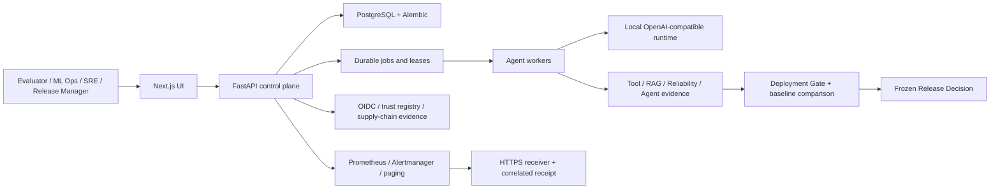
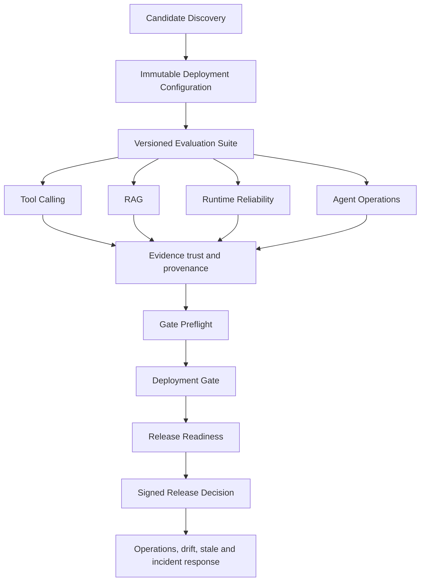

# Model Atlas 평가·사용·기술 가이드

문서 기준: Sprint 5H-H, 2026-08-04

## 1. 이 제출본은 무엇인가

Model Atlas는 로컬 AI 모델 자체를 새로 학습하는 프로젝트가 아니라, **특정 모델과 런타임,
하드웨어, 프롬프트, 워크로드 조합을 실제 배포해도 되는지 증거에 근거해 판단하는
EvalOps/MLOps 제어 시스템**이다.

일반적인 로컬 모델 추천 도구가 "이 하드웨어에서 어떤 모델이 실행될 수 있는가"를
답한다면, Model Atlas는 그 다음 질문을 다룬다.

- 이 구성이 목표 업무를 충분히 정확하게 수행하는가?
- Tool Calling, RAG, 장문 컨텍스트와 반복 실행에서도 안정적인가?
- 점수와 판정에 사용한 증거의 출처와 신뢰 수준을 확인할 수 있는가?
- 이전 승인 기준보다 성능이 퇴행하지 않았는가?
- 누가 어떤 근거로 배포를 승인하거나 보류했는가?
- 장애, 경보, 재시도, dead letter, 복구 과정이 감사 가능한가?

따라서 이 압축 파일에는 모델 가중치가 아니라 다음이 포함된다.

- FastAPI 백엔드, PostgreSQL 스키마와 Alembic 마이그레이션
- Next.js 평가·운영 UI
- 평가 및 릴리스 의사결정 로직과 테스트
- Docker Compose 기반 재현 환경
- 개발용 예시 데이터와 공개 검증 산출물
- 아키텍처, 운영, 보안, 검증 보고서

## 2. 해결하려는 문제

로컬 LLM 도입에서는 후보 선정과 배포 승인 사이에 큰 공백이 생긴다. 모델 크기, VRAM,
토큰 처리량과 공개 벤치마크만으로는 특정 조직의 실제 워크로드 품질, 런타임 안정성,
증거 신뢰도, 운영 복구 가능성을 함께 판단하기 어렵다. 결과가 문서와 수작업 승인에
흩어지면 재현성, 책임성, 변경 추적도 약해진다.

Model Atlas는 이 공백을 다음 구조로 줄인다.

| 관점 | 일반 토큰·하드웨어 추천 | Model Atlas |
| --- | --- | --- |
| 질문 | 무엇이 실행 가능한가 | 무엇을 어떤 근거로 배포 승인할 수 있는가 |
| 평가 단위 | 모델 또는 파일 | 모델 + 아티팩트 + 런타임 + 하드웨어 + 프롬프트 + 워크로드 구성 |
| 근거 | 사양, 공개 점수, 추정 처리량 | 버전이 고정된 실제 실행 결과, 정책, baseline, provenance |
| 기능 평가 | 일반 벤치마크 중심 | Tool Calling, RAG, Agent, 신뢰성, 컨텍스트 스트레스 |
| 결정 | 추천 순위 | Gate verdict와 서명된 Release Decision |
| 변경 대응 | 수동 재검토 | stale 처리, snapshot diff, 재평가 흐름 |
| 운영 | 대체로 범위 밖 | SLO, 경보, incident, paging receipt, retry/dead letter/requeue |
| 감사 | 제한적 | 해시, 서명자, 역할, 정책 상태, 동결 snapshot, 이벤트 이력 |

Candidate Discovery는 후보의 탐색 순위를 제공하지만 승인 권한은 갖지 않는다. 최종
승인은 구체적인 Deployment Configuration에 대해 실행된 증거와 정책을 Deployment Gate가
평가하고, Release Manager가 동결된 readiness snapshot을 확인해 Release Decision으로
남기는 별도 단계다.

## 3. 주요 사용자와 사용 목적

| 사용자 | 주요 작업 |
| --- | --- |
| 평가자·검토자 | 문제 정의, 구현 범위, 재현성, 테스트 결과와 한계를 검토 |
| ML Ops Lead | 후보·배포 구성·평가 suite·baseline·모델 검증 상태 관리 |
| SRE Lead | worker, SLO, incident, paging, dead letter와 복구 증거 점검 |
| Release Manager | Gate와 readiness를 검토하고 승인 또는 변경 요청을 서명 |
| Admin | IDP, browser session, trust source, 고권한 운영 작업 관리 |

역할에 따라 조회와 실행 권한이 분리된다. 예를 들어 ML Ops Lead는 운영 상태를 감사할 수
있지만 일부 paging 실행 제어는 사용할 수 없으며, 세션 정리 같은 관리 작업은 Admin에게
제한된다.

## 4. 전체 구조



### 핵심 컴포넌트

| 영역 | 구현 |
| --- | --- |
| API 및 도메인 | Python, FastAPI, Pydantic, SQLAlchemy |
| 데이터 저장 | PostgreSQL, Alembic additive migration |
| 비동기 실행 | PostgreSQL 기반 durable job, lease, retry, dead letter, requeue |
| 프론트엔드 | Next.js, React, TypeScript, Recharts, Lucide |
| 인증·인가 | JWT, OIDC discovery/JWKS, browser Authorization Code + PKCE, 역할 정책 |
| 관측성 | Prometheus, Alertmanager, 영속 metric snapshot과 incident |
| 로컬 런타임 | OpenAI-compatible endpoint, 선택적 Ollama profile |
| 실행 환경 | Docker Compose와 격리 평가 예제 |

## 5. 의사결정 흐름



1. 모델 아티팩트와 하드웨어 조건으로 평가할 후보를 좁힌다.
2. 실제 런타임과 프롬프트까지 포함한 불변 배포 구성을 만든다.
3. 버전이 고정된 평가 case와 metric, acceptance policy로 실행 증거를 수집한다.
4. Preflight에서 증거 누락, 신뢰도, baseline, 제한 사항을 먼저 확인한다.
5. Gate가 정책 결과와 scorecard를 저장한다.
6. Release Readiness가 Gate, regression, label coverage, lineage를 한 snapshot으로 묶는다.
7. 권한이 있는 사용자가 snapshot을 동결해 승인 또는 변경 요청을 서명한다.
8. 이후 증거·정책·구성이 바뀌면 기존 결정과의 차이와 stale 상태를 추적한다.

## 6. 빠른 실행

### 준비 사항

- Docker Desktop이 실행 중이어야 한다.
- Docker Compose v2의 `docker compose` 명령을 사용할 수 있어야 한다.
- 기본 데모에는 외부 모델 가중치나 GPU가 필요하지 않다.
- Ollama 실모델 검증은 선택 사항이며 모델 다운로드 용량과 실행 자원이 추가로 필요하다.

### 기본 데모

프로젝트 루트에서 실행한다.

```powershell
docker compose up -d --build
docker compose run --rm backend python -m app.seed.demo
```

브라우저 주소:

- UI: `http://localhost:3000`
- API: `http://localhost:18000`
- OpenAPI: `http://localhost:18000/docs`
- Health: `http://localhost:18000/api/v1/health`

`make`가 설치된 환경에서는 `make up`, `make seed`를 사용할 수 있다.

### 기능별 예시 데이터

```powershell
docker compose run --rm backend python -m app.seed.tool_calling
docker compose run --rm backend python -m app.seed.rag_evaluation
docker compose run --rm backend python -m app.seed.runtime_reliability
docker compose run --rm backend python -m app.seed.agent_operations
docker compose run --rm backend python -m app.seed.adaptive_agent_operations
```

데이터를 추가한 뒤 UI를 새로 고치면 각 evidence와 Gate 흐름을 확인할 수 있다.

### 종료

```powershell
docker compose down
```

`docker compose down -v`는 데이터베이스와 named volume까지 제거하므로, 평가 데이터를
보존해야 한다면 사용하지 않는다.

## 7. 권장 평가 시나리오

### 시나리오 A: 후보 추천과 승인 판단의 분리

1. `Candidate Discovery`에서 후보 순위와 근거를 확인한다.
2. `Deployments`에서 구체적인 배포 구성을 확인한다.
3. 추천 순위가 곧 배포 승인이 아니라는 UI 문구와 데이터 경계를 검토한다.

평가 포인트: 하드웨어 적합성 탐색과 업무 적합성 승인이 명확히 분리되어 있는가.

### 시나리오 B: Evidence 기반 Deployment Gate

1. `Deployment Gates`에서 새 Gate를 선택한다.
2. suite, policy, baseline을 지정하고 Preflight를 실행한다.
3. 누락된 증거, 신뢰 수준, baseline 비교와 제한 사항을 확인한다.
4. Gate를 실행하고 verdict, scorecard, decision explanation을 검토한다.

평가 포인트: 동일 입력으로 재현 가능하며, 판정 근거가 결과와 함께 보존되는가.

### 시나리오 C: Release Decision 상세 감사

1. `Release Readiness`에서 Gate와 regression, trust, review 상태를 확인한다.
2. 개발 환경 역할 정책에 따라 승인 또는 변경 요청을 생성한다.
3. `Release Decisions`에서 생성한 결정을 연다.
4. 서명자, 역할, Gate hash, decision hash, 동결 snapshot, action history를 확인한다.
5. snapshot JSON과 diff 기능으로 현재 상태와 결정 당시 상태를 비교한다.

평가 포인트: 결정의 책임 주체와 당시 근거가 사후에도 변경 불가능한 형태로 설명되는가.

### 시나리오 D: 평가 범위 확장성

Tool Calling, RAG, Runtime Reliability, Agent Operations 문서와 seed를 차례로 검토한다.
각 평가 방식은 공통 benchmark/evidence 계약으로 Gate에 연결되지만, metric과 실행기는
도메인별 모듈로 분리되어 있다.

평가 포인트: 새 평가 suite, metric, runner 또는 runtime adapter를 추가할 때 기존 Gate와
Release Decision 계약을 재작성하지 않아도 되는가.

### 시나리오 E: 운영 신뢰성과 복구

전체 로컬 운영 profile을 시작한다.

```powershell
docker compose --env-file deploy/observability/.env.observability.example `
  --profile observability --profile trust-source up -d --build `
  --scale agent-worker=2 `
  backend agent-worker frontend prometheus alertmanager alert-sink `
  paging-tls-init paging-secrets-init paging-sink trust-source-fixture
```

그 다음 readiness와 장애 복구를 검증한다.

```powershell
python tools/verify_operational_staging.py
powershell -ExecutionPolicy Bypass -File tools/run_operational_failure_drill.ps1
```

검증기는 Python 표준 라이브러리만 사용한다. Failure drill은 receiver 중단, bounded retry,
dead letter, receiver 복구, 권한 있는 requeue, 동일 job 완료와 receipt 상관관계를 확인한다.

키 회전 예시:

```powershell
docker compose --profile observability run --rm paging-secrets-init `
  python -m app.operations.paging_secrets rotate `
  --directory /paging-secrets --new-key-id evaluator-rotation --retain 2
```

평가 포인트: 비밀 값 노출 없이 무중단 키 회전, 공급자 receipt 검증, 실패 후 감사 가능한
복구가 연결되는가.

## 8. 테스트와 정적 검증

로컬 Python/Node 환경을 만들지 않고 Docker에서 실행할 수 있다.

```powershell
docker compose run --rm backend pytest
docker compose run --rm backend ruff check .
docker compose run --rm frontend npm run typecheck
docker compose run --rm frontend npm run lint
docker compose run --rm frontend npm run build
```

이 제출본 생성 전 확인된 결과:

- Backend: `186 passed, 1 warning`
- Backend와 tools Ruff: 통과
- Frontend typecheck, lint, production build: 통과
- Alembic head: `202608040001`
- Docker backend, frontend, PostgreSQL, Agent worker 2개, paging sink: 정상
- Staging readiness: 7/7 통과
- 회전 후 active paging key: `2026-08-04-rotated`
- 최종 운영 상태: `healthy`, open incident 0, dead letter 0
- Desktop 및 390 x 844 mobile UI 검증: overflow와 console error 없음

위 수치는 해당 개발 환경에서 얻은 최근 결과다. 평가자의 환경과 실행 시점에서 다시
실행한 결과가 최종 검증 기준이다.

## 9. 주요 기술 설계

### 불변 구성과 추적성

평가 결과는 단순 모델 이름이 아니라 deployment configuration, evaluation suite, prompt,
runtime, artifact identity에 연결된다. Gate와 Release Decision에는 snapshot과 hash가 남아
나중에 동일 조건을 확인하거나 drift를 비교할 수 있다.

### Evidence Trust

점수 값과 그 점수의 신뢰 수준을 분리한다. 로컬 fixture, 사람이 검토한 label, publisher
signature, SBOM, transparency proof, production receipt는 서로 다른 provenance와 eligibility를
갖는다. 개발용 서명 증거가 존재해도 production evidence로 자동 승격하지 않는다.

### Durable worker와 실패 복구

Agent 및 운영 작업은 PostgreSQL job, enqueue/execution lease, dedupe key, attempt receipt를
사용한다. bounded retry 이후 실패는 dead letter로 남고, 권한 있는 사용자가 동일 job을
requeue해 이력을 보존한 채 복구할 수 있다.

### 운영 경보와 paging

영속 metric snapshot으로 SLO와 paired burn rate를 계산하고 incident transition을 기록한다.
Paging은 allowlisted HTTPS, CA 검증, 회전 가능한 HMAC key, delivery UUID와 provider receipt의
엄격한 상관관계를 사용한다. 비밀 값은 런타임 projection 파일에서 요청마다 읽으며 로그와
API에는 key ID만 노출한다.

### 보안 경계

- OIDC/JWKS 기반 identity와 역할별 권한을 검증한다.
- Browser session은 opaque DB session, CSRF/Origin 검증, provider logout과 retention cleanup을
  지원한다.
- Tool/RAG 실행은 allowlist와 isolation preflight를 사용한다.
- 외부 trust source는 HTTPS 기본값, Preview/Apply 분리, freshness와 lineage를 적용한다.
- 오류 시 증거 또는 신뢰 조건을 임의로 완화하지 않고 fail-closed 판정을 우선한다.

## 10. 평가 체크리스트

| 항목 | 확인 질문 | 확인 위치 |
| --- | --- | --- |
| 문제 적합성 | 추천을 넘어 배포 승인 문제를 실제로 해결하는가 | 이 문서 1~2절, `README.md` |
| 재현성 | Compose와 seed만으로 핵심 흐름을 재현할 수 있는가 | 이 문서 6~8절 |
| 설명 가능성 | verdict가 metric, policy, baseline, 제한 사항과 연결되는가 | Gate 상세, Preflight |
| 감사 가능성 | 서명자, 역할, snapshot, hash와 action history가 남는가 | Release Decision 상세 |
| 증거 신뢰 | source와 score provenance, production eligibility가 분리되는가 | Trust/Supply Chain 문서 |
| 장애 대응 | retry, dead letter, requeue, receipt가 추적되는가 | Operations, staging drill |
| 확장성 | 평가 실행기와 공통 Gate 계약이 분리되어 있는가 | `docs/architecture.md`, backend 모듈 |
| 품질 | 테스트, lint, migration, UI build가 통과하는가 | 이 문서 8절 |
| 한계 인식 | 개발 fixture와 production 보장을 구분하는가 | 이 문서 11절 |

## 11. 명시적 한계와 비주장 범위

이 MVP는 아래 항목이 완료되었다고 주장하지 않는다.

- 새로운 LLM의 학습 또는 자체 모델 가중치 제공
- 실제 조직의 production 배포 승인이나 규제 인증
- Vault, AWS/GCP/Azure Secret Manager 같은 외부 secret manager 연동
- PagerDuty 등 상용 on-call 공급자와의 실계정 연동
- 조직 managed PKI, 다중 region HA, 외부 독립 transparency registry
- production 도구 호출, production RAG ingestion/vector serving
- 일반 목적 자율 Agent, multi-agent coordination, 무제한 장기 memory
- 실제 7B 이상 GPU 모델의 장기간 production traffic 검증

포함된 paging receiver, CA, trust source와 서명 키 생성기는 계약과 복구 흐름을 재현하기
위한 개발 fixture다. UI의 `PRODUCTION_READY` 같은 정책 상태도 현재 evidence가 설정된 정책을
충족했다는 의미이며, 실제 인프라 배포 권한이나 조직 승인 자체를 대신하지 않는다.

## 12. 권장 문서 검토 순서

1. `EVALUATOR_GUIDE_KO.md` - 문제, 사용법, 평가 기준, 기술 개요
2. `SUBMISSION_README.md` - 기능 범위와 최근 전체 검증 상태
3. `docs/reports/2026-08-04_model_atlas_sprint_5h_h_implementation_report.md` - 최신 구현 보고서
4. `docs/staging_paging_qualification.md` - 운영 readiness와 장애 drill
5. `docs/architecture.md` - 시스템 구조와 모듈 경계
6. `docs/data_contract.md` - 핵심 데이터 계약
7. `docs/golden_demo.md` - 데모 흐름
8. `docs/model_validation.md` - 로컬 모델 검증과 artifact identity
9. `docs/supply_chain_evidence.md`, `docs/trust_registry_transparency.md` - 증거 신뢰
10. `docs/agent_orchestration.md`, `docs/incident_response_and_burn_rate.md` - worker와 운영

## 13. 압축 파일 구성과 무결성

패키지에는 source, tests, migrations, Docker 설정, 예시 데이터, 문서와 공개 reference
artifact가 포함된다. 다음은 의도적으로 제외된다.

- `.venv`, `node_modules`, `.next`, cache, build output
- PostgreSQL과 Docker named volume, image, 실행 중 container
- Ollama 또는 다른 모델 가중치
- 실제 `.env`, runtime secret projection, private key
- `artifacts/supply-chain/demo-publisher-private.pem`

개발용 supply-chain 예시가 필요하면 private key를 배포하지 않고 아래 명령으로 새로 만든다.

```powershell
make supply-chain-demo
```

ZIP 옆의 `.sha256` 파일은 전체 압축 파일의 SHA-256이다. 압축 안의 `MANIFEST.sha256`은
모든 payload entry를 검증한다. 빌더는 생성 직후 manifest 전체를 다시 읽어 해시를 비교하고,
private key, 실제 `.env`, dependency/cache 디렉터리가 포함되지 않았는지도 확인한다.

Windows에서 외부 checksum 확인:

```powershell
Get-FileHash -Algorithm SHA256 .\model-atlas-sprint-5h-h-evaluation-package-20260804.zip
```

## 14. 평가 결론을 내릴 때의 권장 관점

이 프로젝트의 핵심 성과는 "가장 좋은 모델을 추천하는 알고리즘" 하나가 아니다. 후보 탐색,
실행 증거, 신뢰 provenance, 정책 Gate, 서명된 릴리스 결정, 운영 복구를 하나의 감사 가능한
흐름으로 연결했다는 점이다. 평가는 기능의 수뿐 아니라 다음 세 가지를 중심으로 보는 것이
적절하다.

1. 같은 조건과 정책으로 결과를 재현할 수 있는가.
2. 승인 또는 보류의 근거와 책임 주체를 사후에 설명할 수 있는가.
3. 개발 fixture와 production 보장 사이의 경계를 정직하게 유지하는가.
