# Model Atlas

Local-first EvalOps: evaluate a concrete AI deployment, trace the evidence, and explain
why a release is allowed or blocked. **Portfolio MVP; not a newly trained language model.**

- [한국어 평가·설치·사용 안내](MVP_REVIEW_GUIDE_KO.md)
- [Maintenance and extension guide](CONTRIBUTING.md)
- [Public review and refactoring report](docs/reports/2026-09-13_public_review_refactor_ko.md)
- [Review ZIP releases](https://github.com/kwoverflow/model-atlas/releases)


The repository contains source and selected verification receipts. The release ZIP also
contains historical non-secret evidence, a complete SHA-256 manifest, and review documentation.
Neither contains model weights, a populated database, local secrets, or installed dependencies.

## Current Evaluation Package (2026-09-13)

Start with [MVP_REVIEW_GUIDE_KO.md](MVP_REVIEW_GUIDE_KO.md) for the isolated Docker demo,
evaluation scope, measured limitations, and code-reading route.
The completion contract is [MVP_SCOPE_KO.md](MVP_SCOPE_KO.md).
Historical Sprint reports and `EVALUATOR_GUIDE_KO.md` describe their original checkpoints;
some are frozen corpus sources and must not be edited in place.
This is an EvalOps MVP, not a newly trained model or production release approval.

## Overview

Model Atlas is a local-first EvalOps control plane that turns model, prompt, runtime, workload, and benchmark evidence into auditable deployment decisions. Candidate Discovery helps select what to test; Deployment Gate decides whether a concrete configuration satisfies a versioned acceptance policy. Evidence trust is reported separately so synthetic or locally authored results cannot be mistaken for production readiness.

## The Problem

Token count, context length, benchmark averages, and local GPU fit are useful for choosing a model candidate. They do not answer the release question:

> Can this exact model artifact, runtime, hardware, prompt, context, and generation configuration be released for this versioned workload under this acceptance policy?

Model Atlas keeps candidate ranking and deployment authorization separate.

| Capability | Candidate Discovery | Deployment Gate |
| --- | --- | --- |
| Primary question | What should we test? | Can this concrete configuration be released? |
| Comparison | Relative score and Pareto trade-offs | Absolute, versioned policy rules |
| Unit | Model artifact | Deployment configuration + workload suite + policy |
| Output | Non-binding shortlist | `APPROVED`, `CONDITIONAL`, `BLOCKED`, or `INSUFFICIENT_EVIDENCE` |
| Release authority | None | Feeds readiness and signed release decisions |

## Product Flow

```mermaid
flowchart LR
    A["Define Workload"] --> B["Configure Deployment"]
    B --> C["Execute Evaluation"]
    C --> D["Attest And Validate Runtime"]
    D --> E["Review Labels And Gate Preflight"]
    E --> F["Evaluate Deployment Gate"]
    F --> G["Review Evidence Trust"]
    G --> H["Promote Baseline"]
    H --> I["Review Release Readiness"]
    I --> J["Sign Release Decision"]
    J --> K["Audit Lineage and Snapshot Drift"]
```



The UI follows the same structure through `Discover`, `Validate`, `Release`, and `Audit` navigation groups.

## Four Separate Statuses

Model Atlas does not collapse every concern into one `READY` label.

- **Gate Verdict** reports whether acceptance-policy rules pass.
- **Evidence Trust** reports source and score provenance quality.
- **Release Readiness** combines the gate, baseline, judge coverage, prompt regression, and lineage.
- **Production Readiness** indicates whether the evidence can be interpreted as production-ready.

For example, an `APPROVED` gate can still be `LOCAL_DEMO_READY`, `READY_TO_PROMOTE`, and `NOT_PRODUCTION_READY` at the same time.

## Evidence Trust

Source trust and score trust are calculated independently.

Source tiers:

- `synthetic_demo`
- `local_authored` (`captured_local` is mapped as a legacy alias)
- `production_captured`
- `external_benchmark`
- `unknown`

Score tiers:

- `heuristic`
- `candidate_judge_label`
- `applied_judge_label`
- `human_reviewed`
- `unknown`

Trust statuses are `synthetic_only`, `needs_judge_review`, `local_demo_ready`, `production_evidence_ready`, and `unknown`. Thresholds are centralized in backend settings instead of being scattered through routes or UI code.

## Executable Tool Calling

Sprint 4B turns tool-call JSON into executable evaluation evidence. For cases with an
`expected_tool_schema_json` contract, Model Atlas now:

1. parses single or multi-step tool calls;
2. checks expected selection and argument schemas;
3. executes only registered local tools;
4. records attempts, failures, retry recovery, outputs, and sequence order;
5. scores the resulting trace and exposes tool-specific Gate metrics.

The bundled registry contains deterministic in-memory tools. `create_ticket` produces a simulated
identifier and never calls an external ticket system. Unexpected, unregistered, or invalid calls are
not executed.

## RAG Evaluation

Sprint 4C adds a versioned local corpus and deterministic retrieval evaluation path. A RAG case now
runs retrieval before generation, sends only retrieved chunks to the adapter, and evaluates:

- relevant-chunk retrieval recall;
- citation precision and citation recall;
- claim groundedness against cited chunks;
- unsupported claim rate;
- corpus, retriever, and trace provenance.

Ground-truth relevant chunk IDs are never included in adapter context. The bundled lexical
retriever and corpus are deterministic evaluation fixtures, not a production vector database or
serving pipeline.

## Runtime Reliability

Sprint 4D turns repeated inference attempts into release evidence. Reliability mode creates an
independent result, metric, log, and versioned trace for every trial while bounding concurrency and
preserving timeout, OOM, and other runtime failures. Canonical summaries cover P50/P95/P99 latency,
TTFT, throughput, per-case variation, trial coverage, and high-context success. The same summary is
used by execution detail, runtime comparison, and seven Deployment Gate metrics.

## Bounded Agent Operations

Sprint 5A adds a plan-first bounded Agent evaluator, and Sprint 5B adds observations, guarded
checkpoints, and one-shot recovery. Sprint 5C adds authenticated policy-scoped approvers, durable
checkpoint state, expiry, revocation, separation of duties, resumable result revisions, a metered
live-replan callback boundary, and a verified production Agent evidence import contract. Sprint 5D
makes resume append-only, moves control work to a leased PostgreSQL job queue, automatically marks
Gate evidence stale, hardens JWT/proxy identity, and adds an OpenAI-compatible replanner plus signed
traffic ingestion. The executor still allows at most one replan and two recovery steps; pending,
denied, revoked, expired, bypassed, or malformed approvals fail closed. Operational memory remains
versioned and read-only, and writes remain task-local.

Sprint 5E adds OIDC discovery and rotating JWKS verification, worker heartbeat/dead-letter
operations, a replay-protected reference traffic collector, stale release-decision operational
actions, and durable local-model validation campaigns. Runtime validation reports actual adapter
evidence, source cohorts, judge calibration, and configured-versus-observed model identity without
claiming Gate or release approval.

Sprint 5F binds server-observed Ollama manifests and SHA-256 digests to immutable deployment
configurations, records append-only verified judge review decisions, adds browser OIDC PKCE
sessions, exports Prometheus metrics and alerts, and applies fail-closed Tool/RAG isolation
preflight. A matching `qwen2.5:0.5b` configuration now has actual local runtime evidence and two
human-reviewed cases while release and production authorization remain explicitly false.

Sprint 5G adds a distinct supply-chain trust layer. Publisher-signed in-toto-style JWS statements
bind an observed artifact digest, runtime attestation, manifest hash, and CycloneDX SBOM. Verified
statements support separated append-only revocation, while production-labeled benchmark runs count
as production evidence only after a configured collector signs an exact capture receipt. The
current `qwen2.5:0.5b` artifact has a verified development-key statement, but no production receipt;
production readiness and release authorization therefore remain false.

Sprint 5H-A adds a managed trust registry and signed transparency evidence. Public signing keys
are purpose-scoped, time-bounded, and governed by append-only rotation, retirement, and revocation
events. An RFC 6962-style Merkle inclusion proof and an active internal-CA or external key are now
required before supply-chain or collector evidence can contribute to production thresholds. The
bundled keys and proof remain development-scoped, so the current model is still not production
eligible or release authorized.

Sprint 5H-B adds federated JWKS trust sources. Operators can register an allowlisted HTTPS source,
Preview a snapshot without changing trust, and atomically Apply validated public keys with
append-only receipts. Imported roots retain source lineage; freshness, failed syncs, and remote
rotation now affect source-backed eligibility. The bundled Compose source uses development HTTP,
so it verifies the workflow without creating production trust.

Sprint 5H-C hardens browser identity for replicated deployments. Opaque sessions, CSRF hashes, and
shared discovery/JWKS documents live in PostgreSQL; provider ID tokens are encrypted for
RP-initiated logout. Unsafe cookie-authenticated requests require an allowed Origin and matching
CSRF cookie/header/server hash, and untrusted forwarding headers are rejected before identity
selection.

Sprint 5H-D automates federated trust-source freshness. PostgreSQL-backed policies enqueue due
syncs exactly once per schedule window across worker replicas, while durable execution leases,
deterministic jitter, bounded exponential retry, per-attempt receipts, and dead letters preserve an
auditable at-least-once workflow. The operator console supports policy editing and authenticated
Run now without changing the existing manual Preview/Apply path.

Sprint 5H-E governs the shared browser-session lifecycle. Verified auditors can inspect active,
expired, and revoked sessions plus a hash-linked event ledger; Admin and SRE roles can revoke one
session, a subject, or a provider-session scope. Revocation immediately minimizes provider token
material, while replica-deduplicated durable cleanup applies bounded retention and preserves audit
events after session deletion.

Sprint 5H-F makes control-plane reliability durable. Replica-deduplicated interval jobs persist
normalized metrics, evaluate missing-interval-aware identity and worker SLOs, preserve incident
transitions, and send allowlisted HMAC-signed pages through retryable durable jobs. The Operations
console exposes SLO/error-budget state, snapshot continuity, incidents, and delivery receipts.

Sprint 5H-G turns that evidence into an incident-response loop. Long and short SLO windows expose
paired burn rates, verified Admin/SRE actions create hash-linked acknowledgement, assignment, and
note history, and unacknowledged critical incidents escalate on schedule. Paging deliveries pin a
rotatable HMAC key ID and use CA-verified HTTPS in the observability profile.

Sprint 5H-H qualifies that paging boundary for external staging. Sender and receiver reload
runtime-projected key files, active keys rotate without restart while queued work retains its pinned
key identity, and strict provider receipts correlate the exact delivery UUID before HTTP 2xx is
accepted as success. A seven-check readiness gate, no-restart rotation verifier, and controlled
outage/dead-letter/requeue drill make the contract executable.

## Quick Start

Requirements: Docker Desktop with Docker Compose.

```bash
make up
```

In another terminal, load deterministic demo data:

```bash
make seed
make seed-tool-calling
make seed-rag
make seed-reliability
make seed-agent
make seed-agent-adaptive
docker compose run --rm backend python -m app.seed.captured_local
```

Open:

- Frontend: http://localhost:3000
- API: http://localhost:18000
- OpenAPI: http://localhost:18000/docs

`make up` starts PostgreSQL, runs Alembic migrations, and launches FastAPI, the Agent worker, and
Next.js.

Optional production-shape local profiles:

```bash
make idp-up
make observability-up
make isolation-test
```

Development-only remote JWKS synchronization:

```bash
make trust-source-up
```

Open `/trust-registry` to register the fixture endpoint, Preview or Apply its key set, configure an
automatic policy, run it immediately, and inspect source freshness and sync lineage. See
`docs/trust_source_sync.md` and `docs/trust_source_scheduling.md`.

Open `/operations` after `make observability-up` to inspect retained snapshots, SLOs, incidents,
signed development paging receipts, and staging readiness. Run `make operational-staging-verify`,
`make paging-key-rotate KEY_ID=<new-id>`, and `make operational-failure-drill` to exercise the
qualification path. See `docs/staging_paging_qualification.md`.

## Golden Demo

Two reproducible paths are maintained.

### Executable Tool Calling pack

```bash
make seed-tool-calling
```

From `/benchmark-executions/new`, select the **Executable Tool Calling Evaluation Suite**, the
**Tool calling** task, and the `mock` adapter. After execution, open **Inspect Tool Trace**, then use
the **Executable Tool Calling Policy** in Deployment Gates.

### RAG Evaluation pack

```bash
make seed-rag
```

From `/benchmark-executions/new`, select **Qwen2.5 7B Local RAG Assistant**, the
**RAG Grounded Answer Evaluation Suite**, the **Korean document QA** task, and the `mock` adapter.
After execution, open **Inspect RAG Trace**, then use the **RAG Grounded Answer Policy** in
Deployment Gates.

### Runtime Reliability pack

```bash
make seed-reliability
```

From `/benchmark-executions/new`, select **Qwen2.5 7B Reliability Runtime A**, the **Runtime
Reliability Evaluation Suite**, Reliability mode, five trials, concurrency four, a 2,000 ms timeout,
and the `mock` adapter. Inspect the trial table, execute the **Runtime Reliability Policy**, then run
Runtime B and compare both runs at `/runtime-reliability`.

### Bounded Agent Operations pack

```bash
make seed-agent
```

From `/benchmark-executions/new`, select **Qwen2.5 7B Bounded Operations Agent**, the **Bounded
Agent Operations Evaluation Suite**, the **Korean document QA** task, and the `mock` adapter. Execute
all eight cases, inspect Agent Trace and semantic replay, then evaluate the **Bounded Agent
Operations Policy** in Deployment Gates.

### Adaptive Agent Operations pack

```bash
make seed-agent-adaptive
```

Select **Qwen2.5 7B Adaptive Operations Agent**, **Adaptive Agent Operations Evaluation Suite**,
and the `mock` adapter. Execute all five cases. Two traces stop at persisted checkpoints and the
first Gate is blocked. A trusted identity provider or API client can approve and resume both
records; the execution detail then shows 5/5 successful tasks and the rerun **Adaptive Agent
Operations Policy** Gate is approved. See `docs/golden_demo.md` for the trusted-header sequence.

### Fast deterministic fixture demo

Use the bundled OpenAI-compatible fixture when an evaluator does not have Ollama or a local model.

```bash
.\.venv\Scripts\python.exe tools\openai_compatible_fixture.py --host 0.0.0.0 --port 1234
```

From `/benchmark-executions/new`, select the OpenAI-compatible adapter and use:

- Base URL from Docker: `http://host.docker.internal:1234`
- Data source: `local_authored`

### Real local Ollama demo

```bash
docker compose --profile runtime up -d ollama
docker compose exec ollama ollama pull qwen2.5:0.5b
docker compose run --rm backend python -m app.seed.captured_local
```

From `/benchmark-executions/new`, use:

- Adapter: `openai_compatible`
- Base URL: `http://ollama:11434`
- Model: `qwen2.5:0.5b`
- Data source: `local_authored`

Then follow the UI workflow:

1. Confirm the workflow and next actions on Overview.
2. Open **Model Validation** and queue a local runtime campaign.
3. Confirm runtime evidence, model identity, and judge calibration.
4. Select configuration, suite, policy, and optional baseline in Deployment Gates.
5. Run **Review Evidence** and inspect Preflight.
6. Run **Evaluate Gate**.
7. Review verdict, blockers, next actions, evidence trust, and critical cases.
8. Apply or review judge labels in Judge Review.
9. Reopen Release Readiness and sign or request changes.
10. Confirm the event chain in Experiment Lineage.

Small local models may fail structured-output, tool-selection, or grounded-answer cases. That is an expected and useful result: Model Atlas exposes and governs failures instead of hiding them behind an aggregate model ranking.

See [docs/golden_demo.md](docs/golden_demo.md) for the full walkthrough.

## Architecture

- `backend/`: FastAPI, Pydantic v2, SQLAlchemy 2.x, Alembic, PostgreSQL, pytest, and Ruff.
- `frontend/`: Next.js, React, TypeScript, Tailwind CSS, and Lucide icons.
- `data/`: seed inputs and local export space.
- `tools/`: deterministic OpenAI-compatible fixture.
- `docs/`: architecture, data contracts, gate semantics, extension contracts, status, and evaluator guides.

Important Sprint 4 through 5G services:

- `backend/app/services/evidence_trust.py`: canonical source/score classification and trust decisions.
- `backend/app/services/deployment_gate/preflight.py`: non-persisting Gate Preflight.
- `backend/app/services/deployment_gate/evaluator.py`: authoritative gate orchestration.
- `backend/app/services/control_plane_overview.py`: workflow state, blockers, and prioritized actions.
- `backend/app/services/release_readiness.py`: readiness and production-readiness interpretation.
- `backend/app/services/release_decisions.py`: frozen snapshots, signer policy, hashes, and drift diff.
- `backend/app/services/tool_execution.py`: bounded local registry, schema validation, actual execution, retry, and multi-step trace.
- `backend/app/seed/tool_calling.py`: reproducible executable suite, metrics, and acceptance policy.
- `backend/app/services/rag_evaluation.py`: versioned corpus registry, retrieval, citation, and claim evaluation.
- `backend/app/seed/rag_evaluation.py`: reproducible RAG configuration, suite, metrics, and policy.
- `backend/app/services/runtime_reliability.py`: trial traces, aggregate statistics, and runtime
  comparison.
- `backend/app/seed/runtime_reliability.py`: reproducible repeated-trial suite, runtime pair, metrics,
  and policy.
- `backend/app/services/agent_execution/`: bounded action execution, operational memory,
  approval checkpoints, observation-driven recovery, summaries, and semantic replay.
- `backend/app/services/operational_reliability/`: snapshots, SLO and burn-rate evaluation,
  incident escalation, paging delivery, and staging readiness.
- `backend/app/models/`: domain-owned SQLAlchemy entities with `entities.py` compatibility exports.
- `frontend/types/api/`: domain API types with the stable `@/types/api` barrel export.
- `backend/app/services/agent_control_plane.py`: persistent decisions and append-only resume
  revisions.
- `backend/app/services/agent_jobs.py`: durable job dedupe, leasing, retries, and reconciliation.
- `backend/app/services/deployment_gate/staleness.py`: Gate evidence revision reconciliation.
- `backend/app/services/operator_identity.py`: strict JWT and trusted identity normalization.
- `backend/app/services/agent_live_replan_provider.py`: bounded OpenAI-compatible recovery calls.
- `backend/app/services/agent_traffic_ingestion.py`: signed, atomic traffic evidence batches.
- `backend/app/collectors/agent_traffic_collector.py`: reference gzip/HMAC traffic collector.
- `backend/app/services/model_validation.py`: durable runtime validation reports and comparisons.
- `backend/app/services/model_artifact_attestation.py`: server-observed manifests, digests,
  attestations, and matching configurations.
- `backend/app/services/signed_evidence.py`: fail-closed compact JWS and configured-JWKS verifier.
- `backend/app/services/supply_chain.py`: signed model provenance, CycloneDX binding, revocation,
  and production capture receipts.
- `backend/app/services/trust_registry.py`: managed public keys, append-only lifecycle state,
  signed transparency checkpoints, Merkle proofs, and production eligibility.
- `backend/app/services/judge_label_decisions.py`: append-only reviewed-label decisions and RBAC.
- `backend/app/services/browser_oidc.py`: Authorization Code + PKCE and signed browser sessions.
- `backend/app/services/operational_metrics.py`: JSON/Prometheus metrics and derived alerts.
- `backend/app/services/workload_isolation.py`: Tool/RAG policy registry and execution preflight.
- `backend/app/services/release_decisions.py`: stale review, revocation, and replacement operations.
- `backend/app/seed/agent_operations.py`: reproducible Agent suite, deployment configuration,
  metrics, and policy.
- `backend/app/seed/adaptive_agent_operations.py`: Sprint 5B approval and recovery suite, metrics,
  and policy.

No evidence-trust enum change was required. Additive Alembic revisions add Agent
checkpoint, execution-job, revision-lineage, Gate-staleness, worker-operation, traffic-receipt,
release-action, validation-job, artifact-attestation, reviewed-label, and traffic timestamp fields
plus supply-chain attestation, revocation-action, production-receipt, trust-root, key-action, and
transparency-proof tables while preserving existing records and route paths.

## Key APIs

All API routes below use `/api/v1`. Prometheus exposition is available separately at root
`GET /metrics`.

- `GET /analytics/overview`: legacy inventory overview.
- `GET /analytics/control-plane-overview`: workflow, blockers, trust counts, and next actions.
- `POST /benchmark-executions`: adapter-driven local benchmark execution.
- `GET /benchmark-executions/tool-registry`: versioned local tool descriptors.
- `GET /benchmark-executions/{id}`: execution counts and Tool, RAG, Reliability, or Agent traces.
- `GET /agents/runtime`: bounded Agent runtime limits and dependency versions.
- `GET /agents/memory-registry`: operational-memory descriptors and content hashes.
- `POST /agents/replay/{benchmark_result_id}`: non-persisting semantic Agent replay.
- `GET /agents/checkpoints`: persistent checkpoint lifecycle records.
- `POST /agents/checkpoints/{id}/resume-jobs`: queue an append-only resume.
- `GET /agents/jobs/{id}`: inspect durable worker state and result.
- `GET /agents/jobs/overview`: inspect queue, worker, lease, retry, and dead-letter health.
- `POST /agents/jobs/{id}/requeue`: verified-role dead-letter requeue.
- `POST /agents/jobs/reconciliation`: queue checkpoint and Gate reconciliation.
- `POST /agents/evidence/traffic-batches`: verify and queue signed production evidence.
- `GET /agents/evidence/traffic-sources`: collector receipt and key status.
- `POST /model-validation/campaigns`: queue a local-model validation campaign.
- `POST /model-validation/observed-runtime-configurations`: attest a server-observed runtime and
  create a digest-pinned deployment configuration.
- `GET /model-validation/artifact-attestations`: inspect verified model artifact attestations.
- `GET /model-validation/report`: compare source cohorts and runtime evidence.
- `GET /model-validation/report.md`: export the same validation report.
- `GET /supply-chain/overview`: trust configuration and signed evidence counts.
- `GET|POST /supply-chain/model-attestations`: inspect or verify signed model provenance and SBOM.
- `POST /supply-chain/model-attestations/{id}/revocations`: append a separated revocation action.
- `GET|POST /supply-chain/production-receipts`: inspect or verify signed production captures.
- `GET /trust-registry/overview`: managed key, proof, and production-eligibility counts.
- `GET|POST /trust-registry/roots`: inspect or register purpose-scoped public signing keys.
- `POST /trust-registry/roots/{id}/actions`: append retirement or separated revocation.
- `GET|POST /trust-registry/transparency-proofs`: inspect or verify signed Merkle inclusion.
- `GET|POST /trust-registry/sources`: inspect or register federated JWKS sources.
- `POST /trust-registry/sources/{id}/sync`: manually Preview or Apply a source snapshot.
- `GET /trust-registry/source-syncs`: inspect append-only manual and scheduled receipts.
- `GET /trust-registry/source-schedules`: inspect automatic synchronization policies.
- `PUT /trust-registry/sources/{id}/schedule`: create or update a policy.
- `POST /trust-registry/sources/{id}/schedule/run`: enqueue an authenticated immediate run.
- `GET /runtime-reliability/compare`: same-suite two-run reliability comparison.
- `GET /rag/corpora`: versioned local corpus registry.
- `GET /rag/corpora/{id}`: corpus descriptor and chunks.
- `GET /rag/retriever`: deterministic retriever descriptor.
- `POST /deployment-gates/preflight`: evidence review without persisting a gate.
- `POST /deployment-gates/evaluations`: persist an authoritative gate decision.
- `GET /deployment-gates/evaluations/{id}`: scorecard, trust, explanation, and provenance.
- `POST /deployment-gates/evaluations/{id}/promote-baseline`: baseline promotion.
- `GET /judge-labels/review`: score provenance and review coverage.
- `POST /judge-labels/import`: dry-run or apply judge labels.
- `GET|POST /judge-labels/review-decisions`: inspect or append verified human decisions.
- `GET /operator-identity/browser-config`: inspect browser login state.
- `GET /operator-identity/login|callback` and `POST /operator-identity/logout`: browser OIDC PKCE
  session flow.
- `GET /operator-identity/sessions/overview|sessions|session-events`: audit browser-session
  lifecycle and retention state.
- `POST /operator-identity/sessions/{id}/revoke`: revoke one non-current browser session.
- `POST /operator-identity/subjects/{id}/sessions/revoke`: contain one identity subject.
- `POST /operator-identity/provider-sessions/{hash}/revoke`: contain one provider-session scope.
- `POST /operator-identity/sessions/cleanup`: queue durable retention cleanup.
- `GET /operations/metrics`: operational JSON metrics and derived alerts.
- `GET /operations/alerts`: active operational alerts.
- `GET /operations/reliability`: durable snapshots, latest SLOs, incidents, delivery receipts,
  policy, and permission state.
- `POST /operations/reliability/cycles`: verified Admin/SRE immediate capture.
- `POST /operations/reliability/test-pages`: verified Admin/SRE signed paging test.
- `GET /isolation/policies`: Tool/RAG isolation registry.
- `POST /isolation/preflight`: fail-closed policy preflight.
- `GET /release-readiness/snapshot`: release and production readiness.
- `POST /release-decisions`: frozen, signed decision record.
- `GET|POST /release-decisions/{id}/actions`: operational review, acknowledgement, and revocation.
- `GET /release-decisions/{id}/snapshot-diff`: current state versus frozen state.
- `GET /experiment-lineage/report`: end-to-end operational audit trail.

Existing route paths and legacy response fields remain available. Sprint 4 and 5B fields are additive.

## Verification

Backend:

```bash
.\.venv\Scripts\pytest.exe backend\tests -q
.\.venv\Scripts\ruff.exe check backend
```

Frontend:

```bash
cd frontend
npm run typecheck
npm run lint
npm run build
```

Latest Sprint 5H-H verification:

- Backend: 186 tests passed, with one upstream TestClient deprecation warning.
- Backend Ruff: passed.
- Frontend typecheck: passed.
- Frontend lint: passed.
- Frontend production build: passed.
- Backend/frontend Docker image build and Compose configuration: passed.
- Docker migration: `202608040001` head.
- Two live workers, the HTTPS paging receiver, and the trust-source fixture were healthy; TLS and
  secret initialization exited 0.
- Projected runtime keyring, rolling rotation, strict provider correlation, and recent receipt
  checks passed as part of the 7-of-7 staging readiness gate.
- A no-restart rotation selected `2026-08-04-rotated`; the next delivery stored that key ID and a
  matching provider event and receipt.
- A controlled receiver outage reached dead letter; verified SRE requeue recovered the same job,
  a final capture reconciled transient incidents, dead-letter count returned to zero, and
  operational health returned to `healthy`.
- Twenty-six historical trust-source sync failures were requeued after restoring the fixture;
  three open incidents resolved and the final open-incident count was zero.
- A test page returned HTTP 202 over private-CA-verified TLS and the receiver recorded active key
  ID `2026-08-primary`; migrated historical deliveries remained readable as `legacy`.
- Verified Admin acknowledgement and assignment produced a two-event action hash chain and updated
  current owner state.
- Desktop and 390px mobile Operations QA had zero document-level horizontal overflow, zero clipped
  interactive controls, and zero browser console errors.
- At the replica-dedupe checkpoint, 12 snapshots, 12 unique buckets, 12 cycle jobs, and 12 unique
  dedupe keys matched exactly across two workers.
- Prometheus target was `up`, with all 10 alert rules loaded.
- Signed test-page delivery returned HTTP 202 with a matching receiver payload hash.
- A controlled receiver outage exhausted four attempts; verified Admin requeue completed after
  recovery and produced the expected event-id receipt.
- Keycloak `ML Ops Lead` audit access passed while capture and test-page controls stayed disabled.
- Desktop Operations QA had zero document-level horizontal overflow and zero browser
  warnings/errors.
- Two Agent workers observed one OIDC cleanup bucket and produced exactly one durable job; it
  completed on attempt 1 and purged provider token material from three inactive sessions.
- Cleanup ended with retention due 0 and inactive provider token 0.
- Verified `ML Ops Lead` could audit but received HTTP 403 for cleanup; an Admin manual cleanup job
  completed on attempt 1.
- Browser session state after final login: active 1, expired 1, revoked 2, audit events 7.
- Two Agent worker replicas scanned the same due window and produced exactly one durable sync job
  and one scheduled receipt; the job completed on its first attempt and cleared its schedule lease.
- Schedule metrics after completion were enabled 1, due 0, retrying 0, and failed 0.
- Live Keycloak PKCE login, `ML Ops Lead` role mapping, CSRF-protected POST logout, server-side
  revocation, IdP logout, and frontend return: passed.
- Session/CSRF values were hash-only in PostgreSQL; provider ID tokens were encrypted.
- Desktop 1440px and mobile 390px session-administration QA passed with no page-level horizontal
  overflow; final console had 0 warnings or errors.
- Attested Ollama campaign: 5 results and 5 metrics, completed on the first worker attempt with a
  verified matching digest and two human-reviewed cases.
- Supply-chain evidence: one verified development-key RS256 statement for `qwen2.5:0.5b`, with a
  matching CycloneDX 1.6 SBOM, managed development root, and valid development transparency proof.
- Trust registry: three active development roots, one verified proof, and zero
  production-eligible roots, proofs, or attestations.
- Production receipts: zero; no local evidence was relabeled as production evidence.

## Current Limitations

- Bundled evidence is primarily synthetic or operator-authored; it is not production evidence.
- Heuristic scorers are deterministic and useful for repeatability, but they are not a substitute for calibrated judge or human review.
- `PRODUCTION_READY` is an evidence and policy interpretation; this MVP does not deploy infrastructure.
- HS256 and RS256 JWTs support discovery/JWKS caching and key rotation. Browser PKCE now includes
  shared revocable sessions, CSRF/Origin enforcement, RP-initiated provider logout, verified-role
  administration, token minimization, and retention cleanup, but production TLS, back-channel
  logout, secret-rotation drills, and external identity lifecycle are not included.
- Executable tools are deterministic local fixtures; production credentials, network tools, and irreversible side effects are not included.
- RAG uses a deterministic local corpus and lexical retriever; production ingestion, embeddings, vector databases, rerankers, and online serving are not included.
- Runtime Reliability uses in-process bounded workers and deterministic fixtures; it is not a
  distributed load generator, production traffic replay system, or live GPU monitor.
- Adapter code must honor its timeout contract; Python threads cannot forcibly terminate arbitrary
  third-party code that ignores cancellation.
- Agent recovery selects one predeclared branch or one optional live callback result; it does not
  run an open-ended autonomous loop or repeatedly call a model after every observation.
- Agent checkpoint state is persisted with verified identity, role policy, separation of duties,
  expiry, revocation, append-only resume, and transition hashes. The PostgreSQL worker is durable
  but is not a general distributed workflow engine.
- Agent memory writes are task-local simulations; multi-agent coordination and production system
  operation are not included.
- Signed traffic ingestion includes a reference HTTP/outbox collector; Kafka, Spark, fleet
  deployment, and live model registry ingestion are not included.
- Durable operational snapshots, multi-window burn rates, response actions, automatic escalation,
  projected rotating-key TLS paging, strict provider receipt correlation, staging readiness, and
  failure drills are included. The bundled receiver, generated CA, and secret volume remain
  development fixtures rather than an external HA paging platform, managed PKI, or secret manager.
- Model Validation now requires a matching server-observed artifact digest for verified status and
  reports signed supply-chain and production-capture state separately. The bundled signer is a
  development key; external publisher identity, transparency logs, timestamp authorities, OCI
  registry verification, and online revocation distribution remain future work.
- Scheduled trust-source Apply uses PostgreSQL enqueue and execution leases with at-least-once
  semantics. It is an interval-based control-plane scheduler, not calendar cron, multi-region
  consensus, or an external workflow service; the bundled HTTP publisher remains development-only.
- Tool/RAG execution applies policy preflight and includes hardened Docker examples; the main
  worker does not yet create a fresh OS sandbox for every benchmark.
- Snapshot diff is structural JSON-path diff, not a domain-semantic diff engine.

The next recommended hardening unit is deployment of the completed qualification contract against
an external secret manager, managed PKI, and real staging paging provider, retaining verifier and
failure-drill output as release evidence. Staging publisher provenance, target 7B GPU evidence with
reviewed production captures, and per-job OS or Kubernetes isolation follow.

## Documentation

- [Architecture](docs/architecture.md)
- [Data Contract](docs/data_contract.md)
- [Deployment Gate](docs/deployment_gate.md)
- [Extension Contracts](docs/extension_contracts.md)
- [Executable Tool Calling Evaluation](docs/tool_calling_evaluation.md)
- [RAG Evaluation](docs/rag_evaluation.md)
- [Runtime Reliability](docs/runtime_reliability.md)
- [Bounded Agent Operations](docs/agent_operations.md)
- [Adaptive Agent Recovery and Approval](docs/agent_recovery_and_approval.md)
- [Agent Control Plane 5C](docs/agent_control_plane.md)
- [Agent Orchestration 5D](docs/agent_orchestration.md)
- [Local Model Validation 5F](docs/model_validation.md)
- [Model Artifact Attestation](docs/model_artifact_attestation.md)
- [Signed Supply-Chain And Production Evidence](docs/supply_chain_evidence.md)
- [Browser OIDC](docs/browser_oidc.md)
- [Browser Session Administration And Retention](docs/browser_session_administration.md)
- [Operational Observability](docs/operational_observability.md)
- [Operational SLO, Incident, And Paging Contract](docs/operational_slo_and_paging.md)
- [Multi-Window SLO, Incident Response, And Rotating Paging Keys](docs/incident_response_and_burn_rate.md)
- [Staging Paging Qualification](docs/staging_paging_qualification.md)
- [Scheduled Trust-Source Synchronization](docs/trust_source_scheduling.md)
- [Tool And RAG Workload Isolation](docs/workload_isolation.md)
- [Golden Demo](docs/golden_demo.md)
- [Project Status](docs/project_status.md)
- [Sprint 4A Evaluator Guide](docs/reports/2026-07-10_model_atlas_sprint_4a_evaluator_guide.md)
- [Sprint 4A Implementation Report](docs/reports/2026-07-10_model_atlas_sprint_4a_implementation_report.md)
- [Sprint 4B Implementation Report](docs/reports/2026-07-10_model_atlas_sprint_4b_implementation_report.md)
- [Sprint 4C Implementation Report](docs/reports/2026-07-10_model_atlas_sprint_4c_implementation_report.md)
- [Sprint 4D Implementation Report](docs/reports/2026-07-11_model_atlas_sprint_4d_implementation_report.md)
- [Sprint 5A Implementation Report](docs/reports/2026-07-12_model_atlas_sprint_5a_implementation_report.md)
- [Sprint 5B Implementation Report](docs/reports/2026-07-12_model_atlas_sprint_5b_implementation_report.md)
- [Sprint 5C Implementation Report](docs/reports/2026-07-13_model_atlas_sprint_5c_implementation_report.md)
- [Sprint 5D Implementation Report](docs/reports/2026-07-13_model_atlas_sprint_5d_implementation_report.md)
- [Sprint 5E Implementation Report](docs/reports/2026-07-17_model_atlas_sprint_5e_implementation_report.md)
- [Sprint 5F Implementation Report](docs/reports/2026-07-20_model_atlas_sprint_5f_implementation_report.md)
- [Sprint 5G Implementation Report](docs/reports/2026-07-20_model_atlas_sprint_5g_implementation_report.md)
- [Sprint 5H-A Implementation Report](docs/reports/2026-07-20_model_atlas_sprint_5h_a_implementation_report.md)
- [Sprint 5H-B Implementation Report](docs/reports/2026-07-21_model_atlas_sprint_5h_b_implementation_report.md)
- [Sprint 5H-C Implementation Report](docs/reports/2026-07-22_model_atlas_sprint_5h_c_implementation_report.md)
- [Sprint 5H-D Implementation Report](docs/reports/2026-07-23_model_atlas_sprint_5h_d_implementation_report.md)
- [Sprint 5H-E Implementation Report](docs/reports/2026-07-27_model_atlas_sprint_5h_e_implementation_report.md)
- [Sprint 5H-F Implementation Report](docs/reports/2026-07-27_model_atlas_sprint_5h_f_implementation_report.md)
- [Sprint 5H-G Implementation Report](docs/reports/2026-08-03_model_atlas_sprint_5h_g_implementation_report.md)
- [Sprint 5H-H Implementation Report](docs/reports/2026-08-04_model_atlas_sprint_5h_h_implementation_report.md)
- [Browser OIDC And Shared Session Security](docs/browser_oidc.md)
- [Trust Registry And Transparency Evidence](docs/trust_registry_transparency.md)
- [Technical Report](docs/reports/2026-07-09_model_atlas_technical_report.md)
