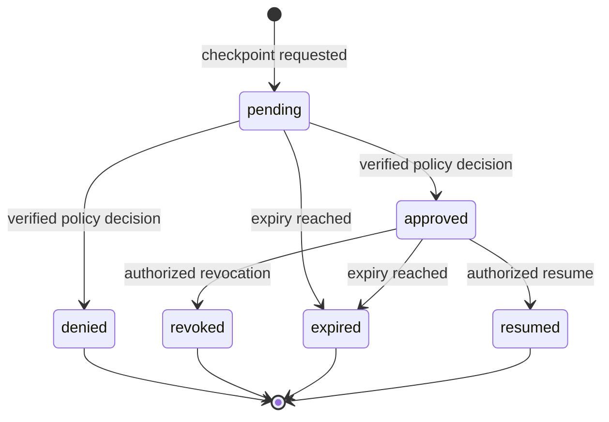

# Agent Control Plane 5C

Status note: this document preserves the Sprint 5C control-plane baseline. Sprint 5D replaces
in-place resume with append-only child revisions and adds durable jobs, Gate staleness, JWT/proxy
hardening, production live replanning, and signed traffic ingestion. See
`docs/agent_orchestration.md` for the current contract.

## Purpose

Sprint 5C turns the Sprint 5B request-scoped approval fixture into a durable control plane for
bounded Agent execution. It addresses four operational gaps:

1. a model request must not self-approve a guarded action;
2. approval state must survive the original benchmark request;
3. approver identity, role, expiry, revocation, and separation of duties must be enforceable;
4. resumed and externally captured evidence must remain measurable and auditable.

An Agent checkpoint authorizes only the guarded Agent step. It does not replace the Deployment
Gate, Release Readiness, or Signed Release Decision.

## Versioned Contracts

| Contract | Version |
| --- | --- |
| Control-plane link | `agent-control-plane-link-v1` |
| Approval request | `agent-approval-request-v1` |
| Approval RBAC | `agent-control-approval-rbac-v1` |
| Resume event | `agent-resume-event-v1` |
| Live replan callback | `agent-live-replan-callback-v1` |
| Production evidence import | `production-agent-evidence-import-v1` |
| Production evidence import RBAC | `agent-evidence-import-rbac-v1` |

The Agent execution trace remains `agent-execution-trace-v2`. Sprint 5C adds optional live-replan
fields and control-plane links without changing the existing step, recovery, Gate, or replay
contract.

## Checkpoint Lifecycle



Only `pending` can be decided. Only `approved` can be resumed or revoked. Expiry is evaluated
lazily on checkpoint reads and mutations. Every mutation increments `version`; clients must send
the current value as `expected_version`.

## Persistent Record

`agent_approval_checkpoints` stores:

- benchmark run and result ownership;
- logical checkpoint ID and lifecycle status;
- requester identity and subject ID;
- frozen request and policy snapshots;
- request, decision, revocation, and resume SHA-256 hashes;
- expiry, decision, revocation, and resume timestamps;
- approver, revoker, and resumer identity snapshots;
- identity-verification state and optimistic-lock version.

`(benchmark_result_id, checkpoint_id)` is unique. Foreign keys cascade when the owning benchmark
evidence is deleted.

## Policy Resolution

The secure default requires a verified identity, an approved role, separation of duties, and a
one-hour expiry. A workload may narrow or override policy in its Agent contract:

```json
{
  "agent": {
    "approval_policy": {
      "allowed_roles": ["ML Ops Lead", "Model Governance"],
      "resume_roles": ["ML Ops Lead", "SRE Lead"],
      "requires_verified_identity": true,
      "separation_of_duties": true,
      "expires_in_seconds": 3600
    },
    "approval_policies": {
      "release-change": {
        "allowed_roles": ["Model Governance"]
      }
    }
  }
}
```

The middleware reads trusted identity headers only when trusted-header support is enabled. A local
self-attested identity may inspect checkpoints but cannot decide, revoke, resume, or import
production evidence under the default policy.

## API

| Method | Route | Purpose |
| --- | --- | --- |
| `GET` | `/api/v1/agents/checkpoints` | List and filter checkpoint state |
| `GET` | `/api/v1/agents/checkpoints/{id}` | Read one checkpoint |
| `POST` | `/api/v1/agents/checkpoints/{id}/decision` | Approve or deny with reason and version |
| `POST` | `/api/v1/agents/checkpoints/{id}/revoke` | Revoke an unused approval |
| `POST` | `/api/v1/agents/checkpoints/{id}/resume` | Re-execute the stored plan with persisted decisions |
| `POST` | `/api/v1/agents/evidence/import` | Import validated production-captured Agent evidence |

The benchmark form no longer sends a UI-authored wildcard approval. It executes the plan until a
checkpoint becomes pending. The execution detail page then renders the durable records and enables
only operations allowed for the current middleware identity.

## Resume Semantics

Resume does not invoke the original inference adapter again. It uses the stored normalized plan,
rebuilds `AgentPreparation`, injects only persisted checkpoint decisions, and re-runs the bounded
executor. It then:

1. replaces the Agent trace and deterministic Agent score on the existing result;
2. updates latency and retry evidence without double-counting the previous executor pass;
3. increments `agent_control_plane.result_revision`;
4. marks consumed approvals as `resumed`;
5. creates a new pending record if the resumed plan reaches a later checkpoint;
6. emits transition and step logs.

Repeated resume calls on an already resumed record return the current result revision and trace.
This provides HTTP retry idempotency. A stale version on an active record is rejected.

Resume updates the existing benchmark result rather than creating an append-only child run. Any
Gate or Release snapshot created before resume remains a frozen record of its earlier evidence and
is not automatically re-evaluated. Run the Deployment Gate again after every resumed revision.

## Live Replan Callback

The executor exposes an optional `AgentLiveReplanCallback`. It can run only when all of these are
true:

- the workload enables both `allow_replanning` and `allow_live_replanning`;
- no predeclared recovery branch matches the failed observation;
- the one-replan budget is still available;
- the one-model-call live-replan budget is still available.

Returned recovery steps still pass normal action allowlists, argument checks, approval guards,
expected recovery sequence checks, recovery-step limits, and total execution-step limits.

Each callback event records provider and model identity, token counts, model-call latency,
estimated cost, callback duration, and a semantic response hash. Summary fields aggregate call
count, tokens, latency, and cost. `mock_fixture` mode exists only for deterministic tests and cannot
be imported as production-captured live-replan evidence. A production model callback is an
extension point, not a bundled external model integration.

## Production Evidence Import

The import endpoint targets an existing `production_captured` benchmark run and a case in that
run's suite. It requires a verified identity with one of these roles:

- `ML Ops Lead`;
- `SRE Lead`;
- `Model Governance`;
- `Admin`.

The contract validates:

- canonical trace hash and supported trace version;
- run, suite, case, and external-case identity;
- trace step count and bounded replan counts;
- absence of unresolved pending checkpoints;
- persisted verified provenance for approved checkpoints;
- non-fixture provider provenance for production live replans;
- valid replayable normalized plan JSON;
- unique sample ID and source event ID.

Accepted evidence is stored as `production_captured` `BenchmarkResult`, `InferenceMetric`, and
`BenchmarkExecutionLog` records with importer identity, collector metadata, source trace hash, and
an envelope evidence hash.

## Security Invariants

- Adapter input never receives checkpoint decisions.
- Requester and approver must differ when separation of duties is enabled.
- Approval cannot run a guarded action unless the checkpoint step itself executed.
- Revoked, denied, expired, or pending records cannot resume execution.
- A live replan cannot increase the one-replan or two-recovery-step ceiling.
- Production import cannot relabel fixture or mock live-replan provenance as production evidence.
- Agent approvals never authorize a deployment release.

## Verification

Sprint 5C tests cover authenticated policy decisions, separation of duties, optimistic conflicts,
approval and resume, idempotent resume, expiry, revocation, denial trace updates, semantic replay,
one-shot live replan metering, source-trace integrity, production import RBAC, and duplicate import
rejection.

## Sprint 5C Historical Boundaries

The first five items below were the 5C boundary and are closed or superseded by Sprint 5D. They are
retained here so reviewers can see why the orchestration sprint was necessary.

- Trusted headers are an integration boundary, not a bundled OIDC server.
- Expiry is lazy; there is no background scheduler.
- Resume updates an existing result revision instead of producing an append-only child run.
- The bundled live-replan provider is a deterministic fixture; no production model is called.
- Production evidence import targets a pre-created run and does not ingest traffic automatically.
- Tools, retrieval, and memory remain bounded local implementations unless replaced through their
  existing extension contracts.
