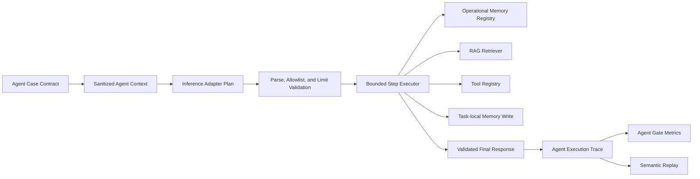

# Bounded Agent Operations

Status note: This document preserves the Sprint 5A plan-first baseline. Sprint 5B approval,
observation, and recovery contracts are documented in `agent_recovery_and_approval.md`.

Sprint 5A adds a plan-first Agent Operations evaluation layer to Model Atlas. It answers:

> Can this concrete model/runtime configuration produce and execute a bounded operational plan
> using only approved memory, retrieval, and tool capabilities, while preserving enough evidence to
> review, replay, gate, and audit the outcome?

This is not an unrestricted autonomous agent or a production automation server. The model emits one
bounded plan, Model Atlas validates and executes it, and every action becomes immutable benchmark
evidence.

## Supported Actions

| Action | Behavior | Side effect boundary |
| --- | --- | --- |
| `memory_read` | Reads one allowlisted, versioned operational-memory fixture | read-only |
| `retrieve` | Runs the versioned local lexical retriever | read-only |
| `tool` | Executes one allowlisted Tool Registry handler | none or simulated |
| `memory_write` | Creates a deterministic task-local record | simulated, never persisted |
| `respond` | Validates the final operator-facing response | none |

The global hard limits are:

- six total steps;
- three tool actions;
- two retrieval actions;
- two memory reads;
- one task-local memory write.

Each case may declare lower limits and a smaller action/tool/memory allowlist. Missing contracts fail
closed to the `respond` action only.

## Execution Flow



The stored case retains hidden expected steps. Adapter input receives `agent-context-v1`, which
contains only allowed capabilities, versions, and bounds. `mock_agent_plan` is included only for the
deterministic mock adapter and is removed from real OpenAI-compatible adapter input.

## Plan Contract

The adapter returns one JSON object:

```json
{
  "steps": [
    {"action": "memory_read", "memory_id": "memory-release-guardrails"},
    {"action": "retrieve", "query": "approved deployment gate verified evidence"},
    {
      "action": "tool",
      "tool_name": "lookup_policy",
      "arguments": {"query": "production release approval"}
    },
    {
      "action": "respond",
      "content": "Release requires an approved deployment gate and verified evidence."
    }
  ]
}
```

The executor rejects invalid JSON, missing step arrays, excessive steps, unknown actions, action
limit breaches, non-allowlisted memory or tools, argument-schema failures, action-order mismatch,
and invalid final responses.

## Operational Memory

`operational-memory-registry-v1` contains four deterministic internal fixtures. Each descriptor has
a stable ID, behavior version, title, tags, data classification, and SHA-256 content hash.

Memory reads record:

- memory and registry versions;
- content hash;
- exact fixture content used by the task.

Memory writes return `scope=task_local_simulated` and `persisted=false`. The generated task memory
ID is deterministic, but no global registry or database row is modified. Durable user or agent
memory requires a separate retention, authorization, deletion, and privacy design.

## Tool And Retrieval Reuse

Agent tool actions use the existing Tool Registry validation and handlers. Argument schemas,
attempt bounds, transient failure recovery, output validation, and simulated side-effect rules are
unchanged.

Agent retrieval actions use the existing corpus and retriever versions. Expected relevant chunk IDs
are used only after model generation to evaluate retrieval success; they are not present in adapter
context.

## Trace Contract

`BenchmarkResult.metadata_json.agent_execution` stores `agent-execution-trace-v1` with:

- context, runtime dependency, memory, tool, corpus, and retriever versions;
- parse and plan validity;
- expected and actual action sequences;
- step and action counts against bounds;
- task, step, response, and policy outcomes;
- retry and recovery counts;
- memory provenance counts;
- one record for every step, including input, output, errors, violations, retries, and duration.

`agent-execution-summary-v1` aggregates task success, plan validity, step success, sequence accuracy,
policy violation, final response, memory provenance, and retry recovery.

## Semantic Replay

`POST /api/v1/agents/replay/{benchmark_result_id}` re-executes the stored normalized plan without
persisting a new result. It compares the original and replay traces after removing volatile timing
fields:

- `duration_ms`;
- `retrieval_latency_ms`;
- `total_duration_ms`.

The response includes version compatibility, original/replay SHA-256 semantic signatures,
`deterministic_match`, and exact changed JSON paths. Replay uses current registries and the immutable
deployment configuration, so a version drift is visible rather than silently accepted.

Replay runs local fixture handlers, including simulated side effects. It does not call external
systems or create benchmark evidence.

## Gate Metrics

| Metric | Default pack rule | Samples |
| --- | ---: | ---: |
| `agent_task_success_rate` | `>= 1.0` | 8 cases |
| `agent_plan_validity_rate` | `>= 1.0` | 8 cases |
| `agent_step_success_rate` | `>= 1.0` | at least 20 steps |
| `agent_action_sequence_accuracy` | `>= 1.0` | 8 cases |
| `agent_policy_violation_rate` | `<= 0.0` | 8 cases |
| `agent_final_response_rate` | `>= 1.0` | 8 cases |
| `agent_memory_provenance_rate` | `>= 1.0` | at least 5 actions |
| `agent_tool_retry_recovery_rate` | `>= 1.0` warning | at least 1 retry |

A failed critical Agent trace blocks the Gate regardless of aggregate averages. Gate evidence
snapshot v6 records Agent runtime, Agent trace, and operational-memory registry versions.

## Reproducible Pack

```bash
make seed
make seed-agent
```

The pack creates one immutable bounded-agent deployment configuration, eight locally authored
cases, one Acceptance Policy, and eight metric definitions. The cases cover release governance,
incident response, customer review, rollback, retry recovery, task-local memory, simulated ticket
creation, and monitoring.

Use the mock adapter and execute all eight cases. The deterministic expected Gate verdict is
`APPROVED`. Replacing an allowlisted memory read with a memory write produces a policy violation,
failed critical task, and `BLOCKED` Gate.

## APIs And UI

- `GET /api/v1/agents/runtime`
- `GET /api/v1/agents/memory-registry`
- `POST /api/v1/agents/replay/{benchmark_result_id}`
- `POST /api/v1/benchmark-executions`
- `GET /api/v1/benchmark-executions/{benchmark_run_id}`

The benchmark form displays Agent bounds and memory versions. Execution detail presents a
case-by-case step table and provides semantic replay controls. Gate critical outcomes link to the
originating Agent trace.

## Current Boundaries

- Execution is plan-then-execute; the model does not receive intermediate tool/retrieval
  observations and cannot revise later steps from them.
- All tools, memory, and retrieval data are local deterministic fixtures.
- Memory writes are task-local simulations and are not durable.
- No external credentials, network tools, subprocesses, filesystem actions, or irreversible side
  effects are allowed.
- No distributed worker, scheduler, multi-agent coordination, human approval pause, or production
  traffic replay is included.
- Local-authored Agent evidence still requires calibrated judge or human review before production
  claims.

Sprint 5B now adds versioned observations, predeclared one-shot recovery branches, and external
human checkpoint evidence while preserving the same trace, Gate, release, and replay boundaries.
See `agent_recovery_and_approval.md` for the current contract and remaining limitations.
