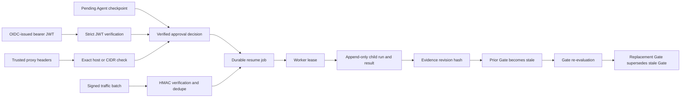

# Agent Orchestration 5D Through 5H-A

Updated: 2026-07-20

## Purpose

Sprint 5D turns the durable Sprint 5C Agent control plane into an asynchronous, revision-aware
orchestration layer. It closes six operational gaps:

1. resumed evidence must be append-only instead of rewriting the original result;
2. long-running resume and ingestion work must survive the HTTP request lifecycle;
3. a Gate must stop being authoritative when its evidence changes;
4. operator identity headers must only be trusted behind an explicit proxy boundary;
5. live replanning must support a bounded production transport without storing credentials;
6. production traffic evidence must enter through an authenticated, idempotent worker path.

These controls do not turn Model Atlas into an autonomous deployment system. Agent execution,
Deployment Gate, Release Readiness, and signed Release Decision remain separate authorization
layers.

## Versioned Contracts

| Contract | Version |
| --- | --- |
| Control-plane link | `agent-control-plane-link-v2` |
| Resume event | `agent-resume-event-v2` |
| Evidence revision | `agent-evidence-revision-v1` |
| Durable job | `agent-durable-job-v1` |
| Traffic batch | `production-agent-traffic-batch-v1` |
| Traffic signature | `hmac-sha256-v1` |
| Gate evidence snapshot | `gate-evidence-snapshot-v8` |
| Live replan provider | `openai-compatible-live-replan-v1` |
| Worker operations | `agent-job-operations-v1` |
| Traffic signature v2 | `hmac-sha256-v2` |
| Model validation job | `model-validation-campaign-v1` |
| Model validation report | `model-validation-report-v4` |
| Artifact manifest | `model-artifact-manifest-v1` |
| Artifact attestation | verified append-only record |
| Browser login | `browser-oidc-pkce-v1` |
| Operational metrics | `model-atlas-operational-metrics-v1` |
| Isolation registry | `workload-isolation-registry-v1` |

Alembic revision `202607130002` is additive and follows `202607130001`.
Sprint 5E follows with revisions `202607170001` through `202607170004`.
Sprint 5F follows with revisions `202607200001` through `202607200003`.
Sprint 5G follows with revision `202607200004`.
Sprint 5H-A follows with revision `202607200005`.

## End-To-End Flow



## Append-Only Revision Lineage

Resume never overwrites the parent `BenchmarkRun`, `BenchmarkResult`, or `InferenceMetric`.
Instead, it creates a child run and child result with:

- `parent_benchmark_run_id` and `parent_benchmark_result_id`;
- stable `root_benchmark_run_id` and `root_benchmark_result_id`;
- monotonically increasing `revision_number`;
- `revision_reason` on the run;
- `evidence_revision_hash` on run and result.

The original pending trace remains readable. The child trace contains persisted approval decisions
and the resumed execution outcome. The checkpoint stores the transition run/result IDs, making an
HTTP retry idempotent. Gate aggregation selects only the latest result revision for each logical
root so the parent and child are never double-counted.

## Durable Job Queue

`agent_execution_jobs` stores resume, reconciliation, traffic import, and model-validation work.
Job states are:

```text
queued -> leased -> running -> completed
                         |-> failed
queued/leased/running -> cancelled
```

Each job has a unique dedupe key, priority, availability time, requested identity snapshot,
attempt budget, lease owner/token/expiry, heartbeat state, result payload, bounded error text,
dead-letter metadata, and requeue audit state. Claims use a row lock with `SKIP LOCKED`. Expired
leases are recovered, transient failures are retried with bounded backoff, and domain validation
failures fail closed. The default lease is 300 seconds and is bounded to 900 seconds. A dedicated
heartbeat thread renews long-running leases.

The Docker Compose `agent-worker` service waits for the backend health check, periodically enqueues
checkpoint/Gate reconciliation, and continuously claims jobs. Direct synchronous resume remains
available for API compatibility; the UI and recommended integration use the asynchronous job API.

`agent_worker_states` records registration, last-seen, current job, and outcome counters.
`GET /agents/jobs/overview` calculates worker online/offline state, queue depth, retry/dead-letter
counts, expired leases, recent success rate, and queue/execution latency. Verified maintenance
roles can requeue a failed job with a recorded reason and identity snapshot.

## Gate Staleness

Gate evidence snapshot v8 includes a canonical revision manifest and
`evidence_revision_hash`. When benchmark completion, Agent resume, or production evidence import
changes a deployment configuration and suite scope:

- the previous completed Gate changes to `stale`;
- `stale_at` and `stale_reason` explain why;
- Release Readiness returns `BLOCKED` for that Gate;
- baseline promotion rejects it;
- a replacement Gate links the old record through `superseded_by_gate_evaluation_id`.

Gate reads also reconcile the stored hash against current evidence, so missed event-time updates
are repaired. Historical Gate snapshots and signed Release Decisions are not rewritten.

## Identity Boundary

Bearer authentication takes precedence over operator headers. The JWT verifier accepts only the
configured subset of `HS256` and `RS256`, requires `exp`, checks `nbf` and `iat`, optionally
enforces issuer and audience, and maps configurable name/role claims into a verified identity.
HS256 uses static `kid` keyed secrets. RS256 uses OpenID Connect discovery or a direct JWKS URI
with bounded caches; an unknown `kid` triggers one refresh for provider key rotation. Invalid or
expired bearer tokens return `401` and never fall back to headers.

Operator headers are accepted only when the direct request client matches an exact host or CIDR in
`TRUSTED_PROXY_NETWORKS`. Supplying those headers from an untrusted client returns `401`. The
repository includes the verifier integration but not an identity-provider server or browser SSO
flow.

## Production Live Replan

`openai_compatible` replan mode calls `/v1/chat/completions` once with temperature zero, bounded
timeout, bounded output tokens, and a strict `{ "steps": [...] }` response. Returned steps still
pass normal recovery/action/tool/approval limits. The trace records provider, model, token usage,
latency, estimated cost, and semantic response hash. API keys are read from a named environment
variable and are never persisted in runtime configuration or trace evidence.

Semantic replay uses the already recorded recovery steps and model-call provenance. It does not
call the external provider again.

## Signed Traffic Evidence

`POST /agents/evidence/traffic-batches` supports the legacy signature and `hmac-sha256-v2`.
Version 2 signs source, key ID, nonce, sent time, and canonical Pydantic JSON. Active and retiring
keys are configured per source. Clock skew, compressed/decompressed size, batch/nonce replay, and
signature conflicts are validated before queueing. The API stores only signature/receipt
provenance and queues the normalized envelope under a verified machine identity.

The worker reuses the existing production evidence validator for trace bounds, approval
provenance, source hash, RBAC, and duplicate checks. All events in one batch commit atomically. If
any event fails validation, no result from that batch remains persisted.

The reference collector preserves the same nonce and sent time across retries, supports gzip,
persists a state file, and moves payloads through pending/sent/failed outbox directories.

## API Surface

All paths use `/api/v1`.

| Method | Path | Purpose |
| --- | --- | --- |
| `POST` | `/agents/checkpoints/{id}/resume-jobs` | Queue append-only resume |
| `POST` | `/agents/jobs/reconciliation` | Queue checkpoint/Gate reconciliation |
| `GET` | `/agents/jobs` | Filter and list durable jobs |
| `GET` | `/agents/jobs/{id}` | Read job state and output |
| `GET` | `/agents/jobs/overview` | Read queue, lease, worker, and dead-letter health |
| `POST` | `/agents/jobs/{id}/requeue` | Requeue a dead letter with verified identity |
| `POST` | `/agents/evidence/traffic-batches` | Verify and queue traffic evidence |
| `GET` | `/agents/evidence/traffic-sources` | Read collector receipt/key health |
| `POST` | `/model-validation/campaigns` | Queue local-model validation |
| `POST` | `/model-validation/observed-runtime-configurations` | Attest runtime and create matching configuration |
| `GET` | `/model-validation/report` | Build validation cohorts and calibration |
| `GET` | `/operations/metrics` | Read worker/collector/release/Gate metrics |
| `GET` | `/isolation/policies` | Read Tool/RAG isolation policies |
| `POST` | `/agents/checkpoints/{id}/resume` | Compatibility synchronous resume |

## Configuration

Important environment variables are documented in `.env.example`:

- `TRUSTED_PROXY_NETWORKS`;
- `OIDC_JWT_ENABLED`, issuer, audience, algorithms, discovery/JWKS URLs, cache TTLs, HS256 key map,
  and claim names;
- `AGENT_WORKER_POLL_SECONDS`, lease/heartbeat/offline thresholds, and reconciliation interval;
- `AGENT_TRAFFIC_HMAC_KEYS_JSON`;
- traffic signature clock-skew, source-stale, and body-size bounds;
- `AGENT_REPLAN_BASE_URL` and `AGENT_REPLAN_API_KEY`.
- `OPENAI_COMPATIBLE_BASE_URL` and `OPENAI_COMPATIBLE_API_KEY`.
- browser OIDC client, redirect, session, and endpoint settings;
- `MODEL_ATTESTATION_ALLOWED_HOSTS` and attestation timeout;
- observability and isolation Compose profiles.

## Sprint 5F Integration

Model-validation campaigns now execute a deployment configuration created from a server-observed
manifest. The configuration carries model digest and attestation hash into `BenchmarkRun` runtime
configuration, so worker retries cannot silently switch artifact identity. Report v2 verifies the
run's observed digest against that configuration.

Judge review decisions are performed outside the worker and remain append-only. Their applied
score provenance is consumed by Evidence Trust and the next report/readiness calculation without
rewriting a historical job result snapshot.

Browser OIDC supplies the same normalized `SignerIdentity` consumed by durable-job enqueue,
attestation, review, and release RBAC. Operational metrics read worker/queue/collector/release/Gate
tables; they do not mutate jobs or evidence. Isolation preflight runs inside benchmark preparation
before Tool/RAG execution and is persisted as audit context.

## Remaining Boundaries

- The worker is durable through PostgreSQL but is not a distributed workflow engine.
- Discovery/JWKS and browser session state are process-local; a Keycloak development profile is
  included, while multi-replica shared state and production IdP lifecycle are not.
- The reference collector does not include Kafka or fleet deployment. Metrics and Alertmanager
  examples exist, but durable external notification delivery does not.
- Live replan transport is production-shaped, while model quality and policy suitability still
  require calibrated evidence.
- Agent memory writes remain task-local simulations and production tool side effects are excluded.
- Stale historical signed decisions remain auditable. Sprint 5E adds review, revocation, and
  replacement actions, but external notification delivery remains an integration concern.
- Model Validation now reports a verified matching digest and reviewed local evidence. Publisher
  signatures, broad production calibration, and target 7B execution remain future work.
