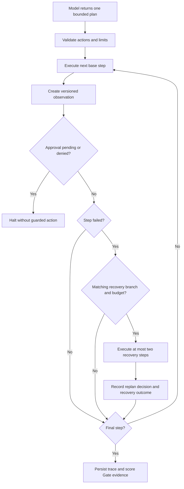

# Adaptive Agent Recovery And Approval

Status note: this document preserves the Sprint 5B request-scoped baseline. Sprint 5C durable
identity, checkpoint, resume, live-replan, and import contracts are documented in
`agent_control_plane.md`.

Sprint 5B extends the Sprint 5A plan-first Agent evaluator without introducing an unrestricted
autonomous loop. It adds three evaluation concerns:

1. Does each executed step produce a versioned observation?
2. Can one bounded recovery branch resolve a real execution failure?
3. Does a guarded action run only after an explicit human checkpoint decision?

## Runtime Contract

Current versions:

| Contract | Version |
| --- | --- |
| Runtime | `bounded-agent-runtime-v2` |
| Context | `agent-context-v2` |
| Trace | `agent-execution-trace-v2` |
| Summary | `agent-execution-summary-v2` |
| Observation | `agent-observation-v1` |
| Recovery policy | `bounded-recovery-policy-v1` |
| Approval policy | `human-checkpoint-policy-v1` |
| Gate snapshot | `gate-evidence-snapshot-v7` |

Global limits are six base steps, one replan, three candidate recovery branches, two executed
recovery steps, two approval checkpoints, three tool calls, two retrievals, two memory reads, and
one task-local memory write. A case may lower any limit but cannot exceed the global bound.

The allowlisted actions are:

- `approval_checkpoint`
- `memory_read`
- `retrieve`
- `tool`
- `memory_write`
- `respond`

## Execution Flow



The model is not called repeatedly by this runtime. It may include candidate `recovery_plans` in
its original output. The executor selects one only when the observed `error_type`, triggering plan
index, allowlists, expected recovery sequence, and remaining budget all match.

## Plan Shape

```json
{
  "steps": [
    {
      "action": "approval_checkpoint",
      "checkpoint_id": "release-change",
      "reason": "Production policy access"
    },
    {
      "action": "tool",
      "tool_name": "lookup_policy",
      "arguments": {"query": "release policy"},
      "requires_approval": "release-change"
    },
    {"action": "respond", "content": "The approved action completed."}
  ],
  "recovery_plans": [
    {
      "trigger_step_index": 1,
      "on_error_types": ["permanent_tool_error"],
      "strategy": "fallback_tool",
      "steps": [
        {
          "action": "tool",
          "tool_name": "lookup_policy",
          "arguments": {"query": "fallback policy"},
          "requires_approval": "release-change"
        }
      ]
    }
  ]
}
```

`requires_approval` is enforced by the executor. Supplying an approved decision without executing
the corresponding checkpoint step does not satisfy the requirement.

## Approval Input

`POST /api/v1/benchmark-executions` accepts an additive decision map:

```json
{
  "agent_approval_decisions": {
    "release-change": {
      "decision": "approved",
      "decided_by": "release-manager@example.local",
      "reason": "CAB-204 approved"
    }
  }
}
```

The `*` key applies one deterministic decision to all checkpoints in a benchmark request and is
used by the local demo UI. Decision values are limited to `approved` and `denied`; omission means
`pending`. Actor and reason are required for explicit decisions.

Approval decisions are not included in adapter input. They are stored in the benchmark run config
for evidence and replay, while each checkpoint trace records:

- checkpoint ID and decision
- actor and reason
- decision source and approval policy version
- SHA-256 decision hash
- provenance validity

Pending and denied checkpoints halt immediately. A tool or memory write naming an unapproved
checkpoint is a policy violation and also halts immediately.

## Observation And Recovery Evidence

Every executed base or recovery step receives an `agent-observation-v1` envelope containing status,
success, error type, policy-violation count, and a semantic output digest. Timing-only fields are
removed before the digest is calculated.

A replan event records:

- triggering plan index and error type
- triggering observation
- selected strategy
- expected and actual recovery action sequences
- recovery step indices
- recovery policy version and outcome

The original failed step remains in the trace. A successful recovery sets
`recovered_by_replan=true`; it does not rewrite the original step as successful. This preserves raw
failure evidence while allowing task success when no unrecovered failure remains.

Overlapping branches for the same plan index and error type are rejected before execution so branch
selection cannot depend on declaration order.

## Gate Metrics

Sprint 5B adds seven metrics to the existing Agent metrics:

| Metric | Meaning |
| --- | --- |
| `agent_replan_success_rate` | Triggered replans that complete successfully |
| `agent_recovery_step_success_rate` | Successful recovery steps |
| `agent_approval_compliance_rate` | Checkpoints receiving approval |
| `agent_approval_provenance_rate` | Checkpoints with decision provenance |
| `agent_pending_approval_rate` | Checkpoints still pending |
| `agent_observation_coverage_rate` | Executed steps with observations |
| `agent_unrecovered_failure_rate` | Cases retaining a failure after recovery |

Critical pending, denied, policy-violating, or unrecovered Agent cases block the Deployment Gate.
Critical outcomes include Agent status, halt reason, replan count, and pending approval count.

Gate snapshot v7 adds observation, recovery-policy, and approval-policy versions. The Deployment
Gate remains the release authority; an Agent checkpoint alone cannot authorize deployment.

## Deterministic Pack

```bash
make seed-agent-adaptive
```

The pack creates:

- `Qwen2.5 7B Adaptive Operations Agent`
- `Adaptive Agent Operations Evaluation Suite`
- `Adaptive Agent Operations Policy`
- five cases covering guarded tool access, guarded task-local memory, tool fallback, retrieval query
  recovery, and standard observation coverage

The legacy request contract can still supply an approved wildcard decision for deterministic 5B
compatibility tests. The current UI sends no inline decision, produces two durable
`pending_approval` traces, and completes the golden path through the 5C checkpoint APIs.

## Replay

`POST /api/v1/agents/replay/{benchmark_result_id}` reloads the decisions stored on the original run,
executes the stored plan without persisting another result, removes volatile timings, and compares
semantic signatures and changed JSON paths. Approval and recovery evidence therefore participate in
determinism checks.

## Sprint 5B Boundaries

- Checkpoint actor strings are not authenticated SSO/OIDC identities.
- The synchronous benchmark request does not persist a paused execution for later resumption.
- Decisions do not expire and are scoped only by checkpoint key in the request.
- Recovery branches are predeclared in the original plan; there is no live second model call.
- Tools, retrieval, and memory remain deterministic local fixtures.
- Memory writes remain task-local and non-persistent.

Sprint 5C closes the first four boundaries through `agent-control-approval-rbac-v1`, persistent
checkpoint records, expiry/revocation transitions, resumable result revisions, and an optional
one-call live-replan provider boundary. See `agent_control_plane.md` for current behavior and
remaining limitations.
