# Architecture

Model Atlas is a local-first monorepo for evidence-driven local AI deployment approval. Sprint 1 created the traceable benchmark foundation, Sprint 2 added non-binding Candidate Discovery, and Sprint 3A adds the authoritative Deployment Gate decision layer.

## Frontend

The Next.js dashboard reads the FastAPI API through `NEXT_PUBLIC_API_URL`. It provides:

- overview metrics and recent benchmark visibility;
- model and artifact catalog exploration;
- hardware compatibility context;
- benchmark run filtering;
- charts for quality, latency, throughput, VRAM, JSON validity, and tool-call validity.
- deterministic recommendation reports with eligibility, editable scoring weights, evidence-confidence penalties, saved scenario management, Markdown/PDF export, and Pareto tradeoff context.
- workload, deployment configuration, and deployment gate report views.
- baseline history and judge-label calibration views.
- prompt-version regression comparison with active-baseline deltas.
- experiment lineage timeline across prompts, benchmark runs, gates, baselines, and release decisions.
- release readiness snapshot view for release review, release decision signing, and Markdown export.
- signed release decision history with frozen snapshot hashes, snapshot JSON export, snapshot diff, and export links.

The frontend does not call external APIs and does not execute model inference. Gate creation is a synchronous API call that evaluates stored benchmark evidence.

## Backend

The FastAPI backend owns:

- typed API request and response schemas;
- reusable validation rules;
- service-layer domain checks;
- SQLAlchemy persistence;
- analytics aggregation endpoints;
- deterministic recommendation scoring;
- evidence-confidence adjustment for sparse benchmark coverage;
- recommendation scenario persistence and curation;
- Markdown and PDF recommendation report rendering;
- workload contracts, evaluation suites, cases, metric definitions, acceptance policies, deployment configurations, gate evaluations, and rule results;
- policy-rule evaluation with absolute thresholds;
- inference adapter protocol and benchmark execution orchestration;
- scorer registry for deterministic local quality, groundedness, and faithfulness fill-ins;
- baseline regression calculation;
- approved baseline promotion and active baseline lookup;
- judge-label review summaries for scorer calibration;
- prompt-version regression summaries over stored benchmark evidence;
- experiment lineage event recording and materialization across benchmark, gate, baseline, and release sign-off records;
- release readiness snapshot orchestration across gate, baseline, calibration, regression, and lineage evidence;
- operator identity middleware for local self-attestation and trusted-header auth handoff;
- signed release decision creation with RBAC policy validation, readiness validation, frozen snapshot hashes, current snapshot diff, signature hashes, and Markdown/JSON export;
- Markdown and PDF Deployment Gate report rendering;
- synthetic seed data insertion.

Route handlers stay thin and delegate business logic to services and repositories.

## Database

PostgreSQL stores the durable Sprint 1 data model:

- hardware profiles;
- logical models;
- model artifacts;
- benchmark tasks;
- prompt versions;
- benchmark runs;
- benchmark results;
- inference metrics;
- recommendation scenarios.
- workload profiles;
- evaluation suites;
- evaluation cases;
- metric definitions;
- acceptance policies and policy rules;
- deployment configurations;
- gate evaluations and gate rule results.
- deployment baselines.
- benchmark execution logs.
- experiment lineage events.
- release decisions.

UUID primary keys make records portable across local and future distributed workflows. UTC timestamps keep runs comparable across systems.

## Data Flow

1. Alembic creates the schema in PostgreSQL.
2. The seed command inserts synthetic demonstration data.
3. FastAPI validates requests with Pydantic and service rules.
4. SQLAlchemy persists catalog and benchmark records.
5. Analytics services aggregate model-artifact and task performance.
6. Recommendation scenarios persist replayable request JSON, not frozen score snapshots.
7. Export endpoints render Markdown or PDF from the current generated recommendation report.
8. Deployment Gate collects completed benchmark runs attached to a deployment configuration and suite.
9. Metrics are calculated from suite-linked active cases and compared with policy thresholds.
10. Gate evaluations persist evidence snapshots, scorecards, rule results, verdicts, and decision hashes.
11. Approved gate evaluations can be promoted as active baselines for their configuration, suite, and policy scope.
12. Benchmark execution can generate new suite-linked benchmark evidence through an adapter.
13. The scorer registry fills missing quality labels and records scorer provenance in benchmark result metadata.
14. Prompt regression reports group completed benchmark evidence by prompt version and compare it with active baselines when the selected scope is complete.
15. Experiment lineage events connect prompts, benchmark runs, gate decisions, baseline promotions, supersession, and release sign-offs into an operational timeline.
16. Release readiness snapshots compose gate, baseline, judge calibration, prompt regression, and lineage summaries for operator review.
17. Operator identity middleware normalizes trusted reverse-proxy headers before release signing.
18. Operators can sign readiness snapshots as release decisions; approvals require `READY` or `READY_TO_PROMOTE`, verified identity, and an approved release role.
19. Release signing records signer identity, verification source, RBAC policy result, signature statement, signature hash, and decision hash.
19. Next.js renders dashboards from `/api/v1` endpoints.

## Deployment Gate Flow

```text
DeploymentConfiguration
  + EvaluationSuite
  + AcceptancePolicy
  + completed BenchmarkRun evidence
      -> metrics
      -> policy rule results
      -> verdict
      -> immutable GateEvaluation report
      -> optional active DeploymentBaseline
```

The gate uses absolute policy thresholds instead of relative recommendation scores. Candidate Discovery may identify promising artifacts, but approval requires a configuration-specific gate evaluation.

## Benchmark Execution Flow

```text
InferenceAdapter
  -> EvaluationCase execution
  -> BenchmarkRun
  -> BenchmarkResult raw output
  -> InferenceMetric latency/resource record
  -> BenchmarkExecutionLog runtime trace
  -> Deployment Gate evidence collection
```

Sprint 3B currently includes a deterministic `mock` adapter and an `openai_compatible` adapter for local OpenAI-style runtimes.

The OpenAI-compatible adapter resolves base URLs in this order:

1. request-level `adapter_config_json.base_url`;
2. deployment configuration `runtime_config_json.base_url`;
3. `OPENAI_COMPATIBLE_BASE_URL`;
4. common LM Studio and Ollama candidates, including Docker `host.docker.internal`.

The mock adapter is for development and tests; real approval still depends on non-synthetic case evidence and meaningful scoring.

## Why PostgreSQL Instead Of Kafka Or Spark

Sprint 1 needs correctness, traceability, local setup reliability, and clean analytics over structured records. PostgreSQL is enough for the MVP because the data is relational, queryable, and small enough for local development.

Kafka and Spark become useful when benchmark execution is distributed, event volume is high, or batch feature pipelines are needed. Those are later concerns and would add operational weight before the data contract is stable.

## Sprint 4A Workflow Architecture

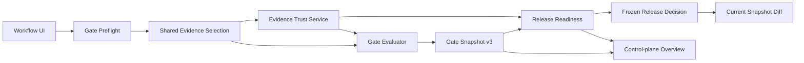

The frontend is organized around the user workflow rather than a flat feature list:

1. Discover candidates.
2. Validate workload evidence and deployment gates.
3. Review baselines, readiness, and release decisions.
4. Audit experiment lineage and frozen snapshot drift.

## Evidence Trust Service

`app/services/evidence_trust.py` is the authoritative location for:

- legacy source normalization;
- source trust classification;
- score and judge-label provenance classification;
- applied-label and critical-case review coverage;
- trust status and production evidence interpretation;
- user-facing reasons and limitations.

Gate snapshots, Preflight, Release Readiness, Judge Review, and Overview reuse this service. Routes and React components do not independently reimplement trust thresholds.

## Gate Preflight

`POST /api/v1/deployment-gates/preflight` reuses `collect_evidence()` from the Gate domain. It reads configuration, suite, policy, matching completed runs, results, metrics, trust, and baseline state. It does not evaluate policy rules, claim a final verdict, or persist a `GateEvaluation`.

This preserves one evidence-selection contract while giving the operator a safe review point before an immutable gate decision is created.

## Snapshot Provenance

Gate evidence snapshot v2 introduced:

- snapshot schema version;
- metric calculation version;
- evidence trust version;
- policy engine version;
- scorer registry and scorer versions;
- adapter versions;
- the complete evidence trust summary.

Release readiness snapshot v2 carries the same trust interpretation into frozen release decisions. Canonical JSON hashing remains sorted and deterministic. Legacy snapshots without Sprint 4A fields remain readable and are displayed as unknown or legacy evidence.

Sprint 4B advances Gate evidence to `gate-evidence-snapshot-v3` and adds
`tool_registry_versions` plus `tool_execution_versions`. Existing v2 fields remain unchanged.

Sprint 4C advances Gate evidence to `gate-evidence-snapshot-v4` and adds
`rag_corpus_versions`, `retriever_versions`, and `rag_evaluation_versions`. Existing v2/v3 fields
remain unchanged.

Sprint 4D advances Gate evidence to `gate-evidence-snapshot-v5` and adds
`runtime_reliability_versions`. Existing v2/v3/v4 fields remain unchanged.

Sprint 5A advances Gate evidence to `gate-evidence-snapshot-v6` and adds Agent runtime, execution,
and operational-memory registry versions. Existing v2 through v5 fields remain unchanged.

## Sprint 4B Tool Execution Architecture

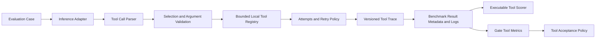

`app/services/tool_execution.py` owns parsing, validation, execution, retry limits, output
validation, and trace summaries. The benchmark service remains the orchestrator and persists the
trace using existing JSON metadata and log records.

Only registered in-process handlers can execute. Calls that are unregistered, out of sequence, or
schema-invalid are skipped. The registry has no network, filesystem, subprocess, credential, or
production side-effect capability. The simulated ticket tool returns a deterministic fixture ID.

## Sprint 4C RAG Architecture

```mermaid
flowchart LR
    RC["Immutable Retrieval Config"] --> CR["Versioned Corpus Registry"]
    CR --> DR["Deterministic Retriever"]
    DR --> SC["Sanitized Retrieved Context"]
    SC --> IA["Inference Adapter"]
    IA --> RE["Citation and Claim Evaluation"]
    RE --> BR["Benchmark Metadata and Logs"]
    BR --> RM["RAG Gate Metrics"]
    RM --> GP["RAG Acceptance Policy"]
```

The benchmark service builds a sanitized adapter snapshot while keeping the stored case unchanged,
then evaluates the result against the original ground truth. Relevant chunk IDs never cross into
adapter input.

The corpus and retriever are deterministic local fixtures. The architecture deliberately leaves
document ingestion, chunking, embeddings, vector storage, hybrid retrieval, and reranking to future
implementations behind the versioned contracts.

## Sprint 4D Runtime Reliability Architecture

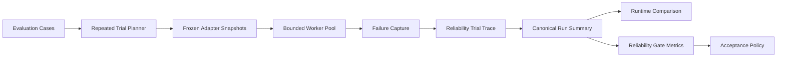

RAG preparation and adapter snapshot construction happen on the database thread. Workers receive
only deep-copied value objects; SQLAlchemy entities are not shared across threads. Adapter execution
may be concurrent, while Tool/RAG trace attachment, scoring, and persistence remain serial and
deterministic.

The canonical summary is reused by benchmark responses, execution detail, Gate metric calculation,
and runtime comparison. Failure states remain separate rather than collapsing timeout, OOM, and
other runtime errors into one success rate.

The OpenAI-compatible adapter enforces the timeout at the HTTP boundary. Third-party adapters must
honor the same contract because an in-process Python worker cannot safely terminate arbitrary code
that ignores cancellation.

## Sprint 5A Agent Operations Architecture

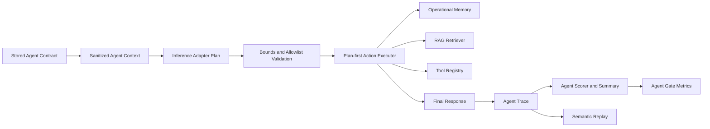

The Agent layer composes existing registries rather than duplicating them. It calls the public Tool
Registry single-call boundary and the same versioned RAG retriever used by RAG evaluation.
Operational-memory reads are content-addressed fixtures; writes return task-local simulated records
and cannot mutate global state.

Expected steps stay in the stored case. Real adapter snapshots receive only action limits,
allowlists, and dependency versions. The deterministic mock plan is explicitly removed for real
adapters.

Semantic replay re-executes a stored normalized plan without persistence. It removes volatile
timing fields, hashes the remaining structured trace, and reports changed JSON paths. Gate and
release snapshots remain the authority; replay cannot approve a deployment.

## Sprint 5B Adaptive Agent Architecture

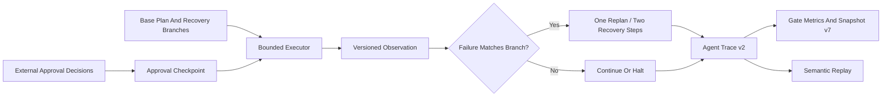

Approval decisions are validated on the benchmark request, excluded from adapter input, and stored
on the run for replay. A checkpoint must execute before its guarded action; a decision alone cannot
bypass the checkpoint. Pending, denied, and policy-violating steps halt before side effects.

Every executed step receives a semantic observation digest. A failed step remains failed in raw
evidence even when a matching predeclared recovery branch succeeds. Task success therefore depends
on the absence of unrecovered failures, while raw step success and recovery success remain separate
metrics.

## Extension Boundary

Adapters and scorers expose compact descriptors instead of using a marketplace or dynamic plugin loader. Future `EvidenceImporter`, `MetricCalculator`, `PolicyRuleEvaluator`, and `ReportRenderer` contracts are documented in `docs/extension_contracts.md`.

The stable dependency direction is:

```text
extension implementation -> descriptor/protocol -> existing execution or gate service
```

Extension code may add evidence or calculations, but it may not bypass Gate policy, Release Readiness, signer authorization, or frozen snapshot hashing.

## Sprint 5C Agent Control Plane

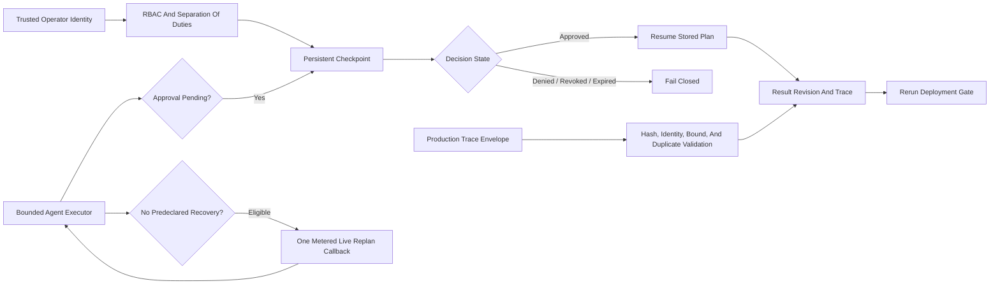

The control plane persists checkpoint ownership, policy, expiry, identity snapshots, transition
hashes, and optimistic versions. The adapter never receives those decisions. Resume rebuilds the
same bounded preparation from the stored plan and applies only persisted decisions. A later
checkpoint creates a new record instead of silently inheriting authorization.

The optional live-replan provider has independent one-call, token, latency, cost, and provenance
evidence. Returned steps remain subject to the normal recovery, action, tool, and approval limits.
The bundled implementation is a deterministic provider fixture, not a production model call.

Production Agent evidence import is a verified ingestion boundary for a pre-created
`production_captured` run. It validates canonical trace hash, case identity, bounds, approval and
live-replan provenance, source-event uniqueness, and replayable plan shape before adding result,
metric, and log evidence.

This section preserves the Sprint 5C baseline. Sprint 5D supersedes the mutation path with the
append-only orchestration architecture below.

## Sprint 5D Agent Orchestration

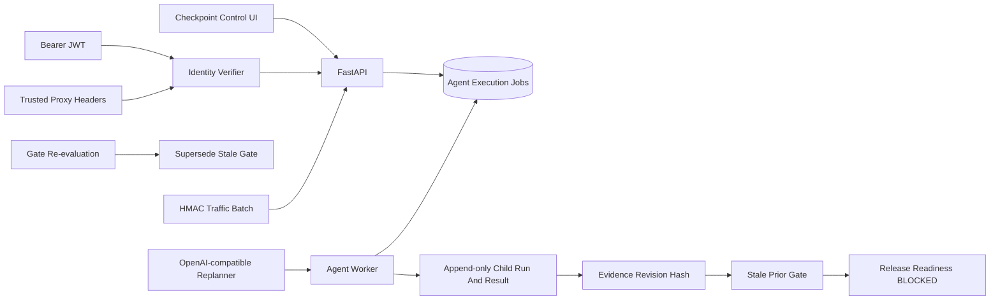

The write path is split into API enqueue and worker execution. A unique dedupe key gives retry
idempotency; a lease token gives one worker temporary ownership; parent/root links preserve the
logical execution lineage. Reconciliation repairs expired checkpoints, abandoned leases, and Gate
hash drift without rewriting historical evidence.

Gate evidence v8 selects the latest result per root revision and hashes a canonical manifest. A
changed hash changes the previous Gate status to `stale`; Release Readiness and baseline promotion
then fail closed until a replacement Gate is evaluated. Signed decisions keep their frozen
snapshots for audit rather than being mutated.

Bearer JWT verification takes precedence over trusted headers. Headers are accepted only from an
explicit direct-client host/CIDR. Traffic collectors use a separate per-source HMAC boundary and
are represented as verified machine identities. Neither identity path can bypass checkpoint RBAC,
Gate policy, or release signer authorization.

## Sprint 5E Production Hardening

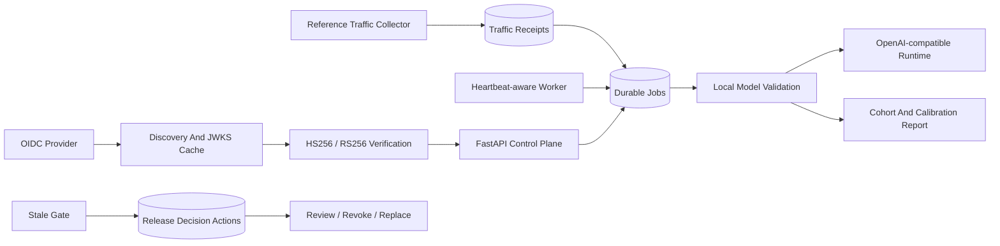

Sprint 5E keeps one execution authority: model-validation jobs call the existing benchmark
execution service, and reports consume the same evidence bundle and Evidence Trust services used by
Deployment Gate. This avoids a second scoring or provenance path.

OIDC discovery and JWKS keys are cached in one persistent middleware verifier. Unknown key IDs
force one refresh so provider key rotation does not require process restart. HTTPS is required
unless an explicit development override is enabled.

Workers publish durable state independently from jobs. Lease heartbeats prevent long local-model
calls from being reclaimed, while offline interpretation, dead-letter metadata, and verified-role
requeue make queue failures inspectable without mutating completed evidence.

Traffic signature v2 binds key ID, nonce, sent timestamp, and normalized content. Receipts preserve
replay and key-rotation evidence. The collector retries the same signed identity and moves sent or
failed payloads through a local outbox.

Release decisions remain immutable signed records. Append-only operational actions express stale
review, acknowledgement, revocation, and replacement without rewriting the original signature or
snapshot.

Model Validation compares configured and observed parameter-size tokens when available. This is a
guardrail against obvious runtime substitution, not a replacement for digest or model-registry
attestation.

## Sprint 5F Artifact Identity And Operations

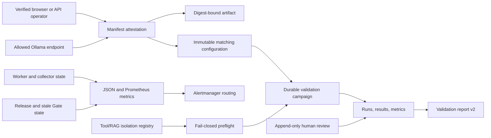

Artifact attestation is a separate service boundary. It performs a bounded server-side runtime
query, normalizes the exact model digest and manifest, records verified actor provenance, and
creates an immutable configuration pinned to the attestation hash. Validation report v2 requires
the runtime-observed digest to match that configured artifact before actual runtime evidence can
reach `validated`.

Judge decisions are append-only audit records. The service uses row locking, verified-role RBAC,
separation of duties, candidate/prior hashes, explicit rationale, and one applied decision per
result. Result labels can change, while the review record preserves what changed and who approved
it.

Browser identity wraps the existing OIDC verifier with Authorization Code + PKCE. State, nonce,
issuer, audience, signature, and expiry are checked server-side. The browser receives only a
short-lived Model Atlas HttpOnly session, not provider tokens. Bearer identity retains precedence.

Operational metrics remain read models over authoritative tables. The API and Prometheus renderer
consume one aggregation, preventing UI and alert semantics from drifting. Tool/RAG isolation uses
a versioned policy registry and pre-execution admission control; the deployment example adds
read-only filesystems, internal/no network, capability dropping, and bounded tmpfs.

Sprint 5F does not merge Model Validation, Deployment Gate, Release Readiness, and Release
Decision. A digest-matched `validated` report can still be `not_production_ready` and
`release_authorized=false`.

## Sprint 5G Supply-Chain Trust

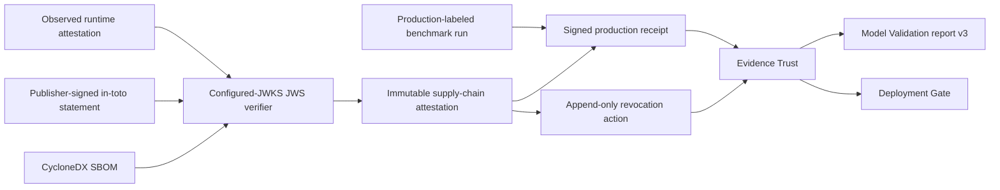

`signed_evidence.py` is the shared cryptographic boundary. It requires an operator-configured JWKS
file, issuer allowlist, and algorithm allowlist, resolves one `kid`, verifies the compact JWS, and
enforces `iss`, `iat`, `jti`, age, and size policy. No trust configuration means verification fails
closed.

`supply_chain.py` then validates domain claims. A model statement must bind exactly one SHA-256
subject to the stored runtime digest and match both runtime hashes plus the canonical CycloneDX
SBOM hash. A production receipt must bind a completed production-captured run, exact result and
metric counts, source environment and capture window, artifact digest, and active attestation
chain. Reusing a statement ID with different content is rejected.

Supply-chain and production-capture status are inputs to Evidence Trust, not release authority.
Revocation is an append-only action and removes linked receipts from effective production trust
without deleting historical evidence. A plain `production_captured` label without an active signed
receipt is exposed as unverified and cannot satisfy a production evidence threshold.

## Sprint 5H-A Managed Trust Plane

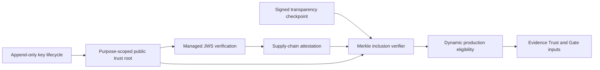

`trust_registry.py` owns key registration, lifecycle derivation, purpose isolation, managed JWS
resolution, transparency proof verification, and eligibility. Raw evidence remains immutable;
effective trust is recalculated from current key and attestation actions. This keeps release and
Gate paths consistent after rotation, expiry, or revocation.

Static configured JWKS is retained as a development compatibility adapter. It cannot satisfy the
managed production chain. Model Validation report v4 surfaces the trust tier, transparency state,
and production eligibility separately from local runtime validation.

## Sprint 5H-B Federated Trust Sources

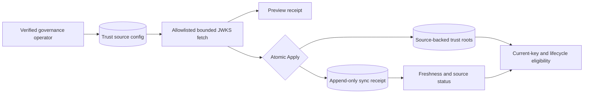

`trust_source_sync.py` owns source registration, URL policy, bounded transport, remote-key
validation, candidate classification, Preview/Apply receipts, and root import. It delegates root
status and downstream evidence reconciliation to `trust_registry.py`, preserving one eligibility
authority.

Source configuration, sync attempts, and imported roots are separate records. This allows a
failed attempt to be audited without overwriting the last good snapshot, and allows old remote
keys to remain historical records while becoming non-current. Production source-backed trust
requires both a fresh successful Apply and the existing active production-tier root rules.

The network boundary is deliberately narrow: no redirects, proxy environment, URL credentials,
query strings, or fragments; allowlisted hosts; HTTPS by default; bounded time/body; and strict
content type. Docker's HTTP fixture is enabled only through explicit development configuration.

## Sprint 5H-C Shared Browser Identity State

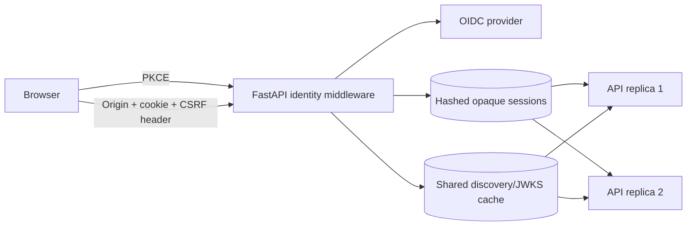

The browser cookie is now an opaque lookup secret rather than an identity assertion. PostgreSQL
owns validity, expiry, normalized identity, and revocation. Session and CSRF tokens are stored only
as SHA-256 hashes; the provider ID token is AES-GCM encrypted for RP-initiated logout.

Cookie-authenticated unsafe methods require an allowed Origin plus matching cookie/header/server
CSRF state. An invalid database session fails closed instead of falling back to local identity.
Forwarding metadata from an untrusted direct client is rejected before any credential precedence
is evaluated.

OIDC discovery and JWKS use an in-process first level and a PostgreSQL second level. Shared reads
preserve the provider fetch's original expiry, while an unknown key ID bypasses both levels for one
direct refresh. This supports replicated APIs without making the shared cache a signature-policy
authority.

## Sprint 5H-D Scheduled Trust Source Operations

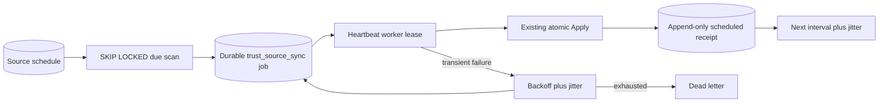

`trust_source_scheduler.py` owns policy mutation, due-row ownership, schedule lease fingerprints,
job enqueue, retry classification, and next-run calculation. It deliberately delegates fetch,
validation, root import, and receipts to `trust_source_sync.py`, and delegates execution ownership
to `agent_jobs.py`.

Source configuration stays immutable while its one-to-one operating policy is mutable. Every Agent
worker may scan due policies. PostgreSQL `FOR UPDATE SKIP LOCKED`, a monotonic run sequence, and a
unique job dedupe key allow multiple replicas without a leader process. The schedule lease protects
enqueue; the existing heartbeat lease protects execution.

Success and every failure remain trust-source receipts rather than only worker logs. This preserves
the distinction between delivery state and evidence state, and makes crash recovery at-least-once
while Apply remains idempotent for unchanged key material.

## Sprint 5H-E Governed Browser Session Lifecycle

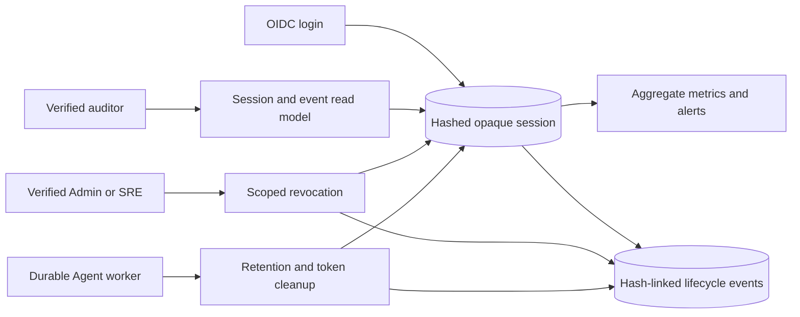

`oidc_session_administration.py` is the lifecycle policy boundary. It derives active, expired, and
revoked state; enforces verified-role audit and administration; and applies single, subject, or
provider-session-hash containment. Bulk actions preserve the current operator session. Current
session termination remains in the existing CSRF-protected browser logout path.

Provider logout material is minimized before long-lived audit state. Revocation clears encrypted
ID-token ciphertext and raw provider `sid` data in the same transaction. Cleanup clears any
residual inactive token material, deletes session rows after the configured inactive retention
window, and preserves independent lifecycle events. Provider and client correlation use SHA-256
and keyed HMAC-SHA256 fingerprints instead of raw descriptors.

All Agent workers may enqueue the same interval bucket. The existing durable-job dedupe constraint
creates one `oidc_session_cleanup` job, after which normal claim leases, heartbeats, retries, and
dead-letter behavior apply. Cleanup uses bounded `FOR UPDATE SKIP LOCKED` scans, so multiple
executors do not require a new leader or scheduler service.

The per-session event chain binds each canonical event to its predecessor. It provides
application-level tamper evidence and ordering, but is not an externally anchored transparency
log or a database write-once guarantee.

## Sprint 5H-F Operational Reliability Evidence

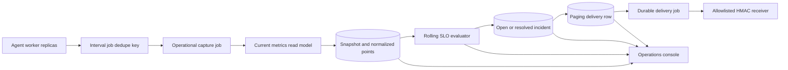

The `operational_reliability/` package separates snapshots, SLO evaluation, burn-rate policy,
incident reconciliation, escalation, paging, and staging readiness behind the original service
imports. It reads the existing `operational_metrics.py` model rather than duplicating metric
definitions.

Every Agent worker can enqueue the current interval. The durable job's unique dedupe key prevents
duplicate execution requests, while the snapshot bucket constraint prevents duplicate evidence if
execution is replayed. Metric points use a metric name plus canonical labels hash, allowing new
metrics and label sets without widening the snapshot table.

The SLO evaluator distinguishes actual samples from expected scheduled samples. Missing intervals
after the first retained baseline reduce compliance, so collector failure cannot look like perfect
availability. Identity-session hygiene and worker availability are separate scopes with separate
targets and hashes.

Incident state is derived from current alerts and breached SLOs. The nullable unique `active_key`
allows one open incident per signal while preserving any number of resolved historical incidents.
Opened and resolved transitions create outbox rows in the same database workflow; HTTP delivery is
then isolated in the existing retryable Agent job system.

Paging uses HTTPS by default, destination allowlisting, redirect denial, canonical JSON,
HMAC-SHA256, event-id idempotency, bounded response reading, retry classification, and durable
response hashes. It is an owned transport boundary, not a release-authorization or Evidence Trust
boundary.

## Sprint 5H-G Incident Response And Rotating Paging Trust

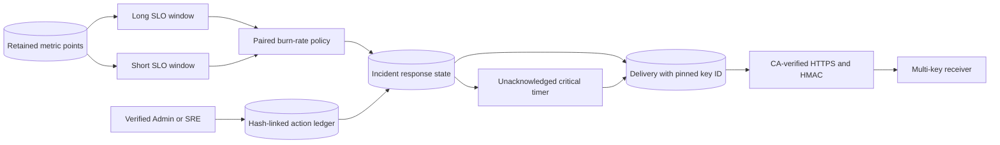

The SLO evaluator uses one retained point set to calculate independent long and short windows.
Missing scheduled intervals consume both windows after each window's first retained baseline.
Warning or critical burn requires both rates to cross the configured threshold, preventing a
single-window transient from silently raising severity while preserving ordinary breach incidents.

Incident lifecycle state and response audit state are separate. The incident row keeps current
acknowledgement, assignee, and escalation level; append-only action rows retain actor identity,
reason, occurrence time, and predecessor hash. The capture loop evaluates automatic escalation so
replica-safe scheduling, incident reconciliation, and paging outbox creation remain in one durable
control path.

Delivery creation pins the active key ID. Retries use that stored ID instead of whichever key is
currently active, allowing old and new keys to overlap during rotation. The receiver accepts a
configured keyring and records the verified ID. The observability profile's development CA proves
hostname and certificate verification, but production certificate and secret lifecycle remain an
external deployment responsibility.

## Sprint 5H-H Projected Secrets And Provider Receipts

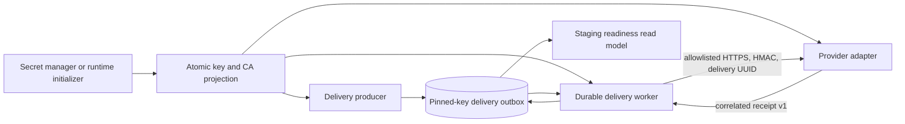

`secret_projection.py` is the bounded parsing boundary. Projected files take precedence over
environment keyrings and are reloaded for each delivery. `paging_secrets.py` supplies a local
runtime initializer and rotation tool, while production deployments can replace that writer with
Vault, cloud secret managers, or an orchestrator without changing the delivery service.

Delivery success now has two independent proofs: transport/authentication success and a strict
provider acceptance receipt for the same delivery UUID. The durable row stores the provider's
identity, event correlation, receipt ID, and acceptance time. Invalid 2xx responses remain in the
existing retry path. Temporary key or CA projection loss also remains retryable, while invalid
destinations and provider configuration stay permanent policy failures.

The operational overview composes configuration inspection and persisted receipt evidence into a
seven-check readiness gate. The gate verifies the current deployment boundary only. It neither
changes model evidence trust nor grants release authorization.
