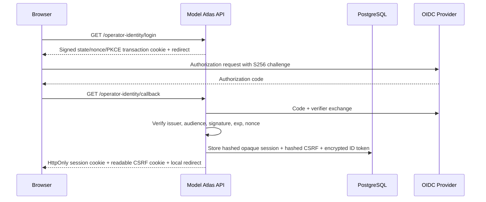
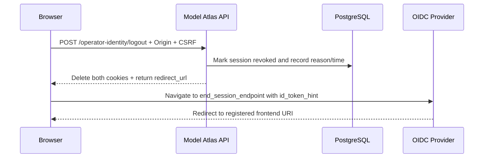

# Browser OIDC And Shared Session Security

Updated: 2026-07-27, Sprint 5H-E

## Purpose

Sprint 5F added Authorization Code + PKCE, but its application session was a self-contained
signed cookie and discovery/JWKS state lived in one process. That was adequate for a local
single-instance demo, but it could not centrally revoke a session, share sessions across API
replicas, or coordinate provider metadata caching.

Sprint 5H-C moved browser authentication state to PostgreSQL, added CSRF and direct-proxy boundary
enforcement, and performed RP-initiated logout at the configured OIDC provider. Sprint 5H-E adds
verified-role session administration, token minimization, bounded retention cleanup, and a
hash-linked lifecycle ledger. Bearer JWT and trusted-header integrations remain available.

## Login Flow



The browser receives a high-entropy opaque session token. The database stores only its SHA-256
hash, so a database read does not reveal a reusable cookie. The CSRF token follows the same
hash-only rule. The provider ID token is retained only to support standards-shaped logout and is
encrypted with AES-GCM using a key derived from `OIDC_SESSION_SECRET`.

The signed ten-minute transaction cookie remains callback-scoped, HttpOnly, SameSite Lax, and
contains only state, nonce, PKCE verifier, and a validated local return path.

## Request Trust Boundary

Identity precedence is:

```text
Bearer JWT > database browser session > trusted proxy headers > local unverified identity
```

Rules:

- a present but unknown, expired, or revoked database session fails with `401`; it does not
  downgrade to local identity;
- browser-authenticated `POST|PUT|PATCH|DELETE` requests require an exact allowed `Origin`;
- the CSRF header, readable CSRF cookie, and server-side CSRF hash must all match;
- bearer and trusted-header clients do not use the browser CSRF contract;
- `Forwarded`, `X-Forwarded-For`, `X-Forwarded-Host`, and `X-Forwarded-Proto` from an
  untrusted direct client fail with `400`, even if another credential is present;
- trusted forwarding headers are not used to construct public callback or logout URLs;
- production deployments must narrow `TRUSTED_PROXY_NETWORKS` to their real ingress addresses.

The allowed browser origins are the configured CORS origins plus `OIDC_FRONTEND_URL`. Cookie and
header names are configurable, but the frontend build values must match the backend values.

## Logout Flow



`GET /logout` no longer changes state. The frontend uses a disabled/loading button while the
`POST` is running. If the provider has no usable `end_session_endpoint`, Model Atlas still
revokes the local session and returns the validated frontend URL. If an older encrypted ID token
cannot be decrypted after a secret rotation, local revocation still succeeds and provider logout
continues without an ID-token hint where supported.

This is RP-initiated logout. Sprint 5H-E separately supports local subject-wide and
provider-session-hash revocation, but provider back-channel logout is not claimed.

## Shared OIDC Documents

`OIDCJWTVerifier` keeps a fast in-process first-level cache and uses `oidc_cache_entries` as the
shared second level:

1. use the local document while its original TTL remains;
2. otherwise read a fresh shared discovery or JWKS document;
3. otherwise fetch from the provider and update the shared row;
4. on an unknown `kid`, bypass both caches once and refresh directly from the provider.

The shared cache returns the original expiry timestamp. A replica cannot extend a nearly expired
shared document by treating it as newly fetched. Cache failures fall back to the provider, while
signature, issuer, audience, and document validation still fail closed.

## Data Model

Alembic revision `202607220001` adds the shared session and document stores. Revision
`202607270001` adds governed lifecycle state:

| Table | Purpose |
| --- | --- |
| `oidc_browser_sessions` | Opaque-token hash, CSRF hash, normalized identity, provider-session and keyed-client fingerprints, encrypted ID token, expiry, last seen, purge time, and revocation audit. |
| `oidc_browser_session_events` | Issuance, migration, revocation, provider-token purge, and retention-deletion events with actor snapshots and per-session hash links. |
| `oidc_cache_entries` | Shared discovery/JWKS JSON, source URL, content hash, original fetch/expiry time, refresh count, and writer instance. |

No access token, raw session token, raw CSRF token, raw client descriptor, client secret, or
session secret is persisted. Raw provider `sid` and encrypted ID-token material are cleared when a
session becomes inactive; bounded fingerprints remain for investigation.

## API Contract

| Method | Path | Purpose |
| --- | --- | --- |
| `GET` | `/api/v1/operator-identity/browser-config` | Login availability, POST logout contract, CSRF names, session store, and current expiry. |
| `GET` | `/api/v1/operator-identity/login` | Start Authorization Code + PKCE. |
| `GET` | `/api/v1/operator-identity/callback` | Verify transaction and issue a database session. |
| `POST` | `/api/v1/operator-identity/logout` | CSRF-protected local revocation and provider logout target. |
| `GET` | `/api/v1/operator-identity/me` | Normalized identity and release permissions. |
| `GET` | `/api/v1/operator-identity/sessions/overview` | Role-scoped lifecycle, retention, cleanup, and permission state. |
| `GET` | `/api/v1/operator-identity/sessions` | Filtered session audit list. |
| `GET` | `/api/v1/operator-identity/session-events` | Hash-linked lifecycle event list. |
| `POST` | `/api/v1/operator-identity/sessions/{id}/revoke` | Revoke one non-current session. |
| `POST` | `/api/v1/operator-identity/subjects/{id}/sessions/revoke` | Revoke active sessions for one subject. |
| `POST` | `/api/v1/operator-identity/provider-sessions/{hash}/revoke` | Revoke active sessions sharing one provider `sid` hash. |
| `POST` | `/api/v1/operator-identity/sessions/cleanup` | Queue a durable bounded cleanup job. |

Only local absolute `return_to` paths are accepted. Scheme-relative paths, backslashes, control
characters, and external URLs are rejected. Provider URLs require HTTPS unless
`OIDC_ALLOW_INSECURE_HTTP=true` is explicitly enabled for development.

## Configuration

Core settings:

| Setting | Production expectation |
| --- | --- |
| `OIDC_SESSION_SECRET` | At least 32 characters, secret-managed, and rotated with a session invalidation plan. |
| `OIDC_SESSION_SECURE` | `true` behind HTTPS. |
| `OIDC_CSRF_COOKIE_NAME` / `OIDC_CSRF_HEADER_NAME` | Match frontend build arguments. |
| `OIDC_SHARED_CACHE_ENABLED` | `true` for replicated APIs. |
| `OIDC_SESSION_RETENTION_DAYS` | Retain inactive session rows for the approved investigation window; default 30. |
| `OIDC_SESSION_CLEANUP_ENABLED` | Keep `true` when Agent workers are running. |
| `OIDC_SESSION_CLEANUP_INTERVAL_SECONDS` | Shared periodic cleanup bucket; default 3600. |
| `OIDC_SESSION_CLEANUP_BATCH_SIZE` | Bounded rows per pass; default 200. |
| `MODEL_ATLAS_INSTANCE_NAME` | Stable replica identity for cache audit. |
| `OIDC_END_SESSION_ENDPOINT` | Optional explicit provider logout URL. |
| `REJECT_UNTRUSTED_FORWARDED_HEADERS` | Keep `true`. |
| `TRUSTED_PROXY_NETWORKS` | Exact ingress hosts or narrow CIDRs. |

The Keycloak Compose profile is development-only. It uses HTTP, a public client, and repository
test credentials. Its realm registers the callback, web origin, PKCE S256, and
`http://localhost:3000/*` post-logout redirect. Start it with:

```bash
docker compose --env-file deploy/idp/.env.keycloak.example --profile idp up -d --build
```

Replace both example secrets first. Production needs TLS, external user lifecycle, owned IdP
configuration, database backups, tested retention/recovery operations, and tested secret rotation.

## Observability

The operational metrics API and Prometheus endpoint expose:

- `model_atlas_browser_session_active`;
- `model_atlas_browser_session_revoked`;
- `model_atlas_browser_session_expired`;
- `model_atlas_browser_session_retention_due`;
- `model_atlas_browser_session_inactive_provider_token`;
- `model_atlas_browser_session_audit_event_total`;
- `model_atlas_oidc_shared_cache_fresh`;
- `model_atlas_oidc_shared_cache_stale`.

They report counts only and never expose subjects, cookies, CSRF values, or provider tokens.

## Verified Evidence

On 2026-07-27:

- backend suite: `175 passed`, with one upstream Starlette deprecation warning;
- Ruff, frontend typecheck, ESLint, and Next.js production build: passed;
- PostgreSQL migration: `202607270001 (head)`;
- live Keycloak PKCE login normalized `evaluator` to `ML Ops Lead`;
- two workers produced one periodic cleanup job for one shared interval bucket;
- cleanup purged provider material from three inactive historical sessions and left zero overdue
  rows and zero inactive encrypted provider tokens;
- an audit-only ML Ops identity received `403` for cleanup while an Admin manual job completed;
- the live console showed one active, one expired, two revoked, zero retention-due sessions, and
  seven lifecycle events;
- desktop and `390 x 844` UI QA passed with no page-level horizontal overflow or console errors.

These checks establish the local integration and security contract. They do not establish a
production IdP, production TLS, high-availability database SLO, or independent penetration test.
The complete lifecycle contract is documented in
[Browser Session Administration And Retention](browser_session_administration.md).
