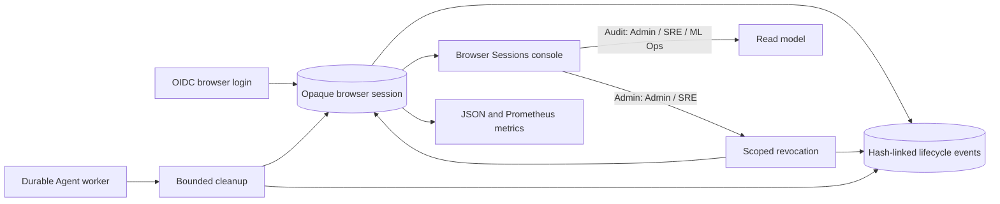

# Browser Session Administration And Retention

Updated: 2026-07-27, Sprint 5H-E

## Purpose

Sprint 5H-C made browser identity horizontally shareable and server-revocable, but it did not
provide an operating lifecycle for accumulated sessions. Expired and revoked rows could remain
indefinitely, encrypted provider logout material could outlive the session that needed it, and an
operator could not investigate or contain a subject-wide or provider-session incident.

Sprint 5H-E adds a governed session lifecycle without turning identity state into release
authorization. It provides:

- verified-role audit and administration;
- single-session, subject-wide, and provider-session revocation;
- immediate minimization of inactive provider token material;
- bounded retention cleanup through the existing durable worker;
- per-session hash-linked lifecycle events;
- metrics, alerts, and a responsive operator console.

The existing bearer-token precedence, browser CSRF contract, and release approval policy remain
unchanged.

## Architecture



`oidc_session_administration.py` owns permission evaluation, filters, read models, scoped
revocation, cleanup, and event hashing. The browser session store still owns login issuance,
resolution, CSRF verification, and current-session logout. The durable Agent worker supplies
replica-safe job dedupe, claim leases, heartbeats, retries, and result storage.

## Session States

Session state is derived at read time:

```text
revoked_at is not null            -> revoked
revoked_at is null and expired    -> expired
revoked_at is null and unexpired  -> active
```

The lifecycle does not silently reactivate an expired or revoked row. A new OIDC login creates a
new opaque session and a new `issued` event.

### Stored Correlation Values

| Value | Storage rule | Purpose |
| --- | --- | --- |
| Browser cookie | SHA-256 hash only | Resolve an opaque session without storing a reusable cookie. |
| CSRF token | SHA-256 hash only | Enforce cookie/header/server equality for unsafe methods. |
| Provider `sid` | Raw only while useful; SHA-256 retained | RP logout while active and incident correlation after purge. |
| Client descriptor | Keyed HMAC-SHA256 only | Correlate a local client without retaining IP/User-Agent text. |
| Provider ID token | AES-GCM ciphertext while active | Supply an `id_token_hint` for RP-initiated logout. |

The API and UI expose bounded fingerprints, never browser cookies, CSRF values, raw client
descriptors, raw provider `sid` values, or provider tokens.

## Provider Token Minimization

Provider ID-token ciphertext exists only to support RP-initiated logout. Sprint 5H-E applies these
rules:

1. current-session logout decrypts the hint in memory, revokes the row, and immediately clears the
   ciphertext and raw provider `sid`;
2. administrative revocation clears both fields in the same transaction;
3. the cleanup worker clears residual ciphertext on any expired or revoked row, even when the row
   is still inside its audit-retention window;
4. the provider-session hash and lifecycle event remain available for correlation;
5. a decryption failure after secret rotation does not prevent local revocation or token purge.

An inactive row with retained ciphertext raises a critical operational alert until cleanup
removes it.

## Retention Contract

The cleanup cutoff is based on the last authoritative inactive timestamp:

```text
revoked session: revoked_at <= now - retention_days
expired session: revoked_at is null AND expires_at <= now - retention_days
```

Each cleanup invocation:

- locks at most the configured batch size with `FOR UPDATE SKIP LOCKED`;
- appends a `retention_deleted` event before deleting an overdue session row;
- purges provider token material from recent inactive rows in a separately bounded pass;
- commits the row changes and events together;
- returns deleted, purged, and remaining counts in the durable job result.

Lifecycle events intentionally have no foreign key to the session table, so audit history survives
retention deletion. Cleanup is therefore data minimization, not audit erasure.

## Lifecycle Event Chain

Event types are:

- `issued`;
- `migrated`;
- `revoked`;
- `provider_token_purged`;
- `retention_deleted`.

Each event stores a canonical SHA-256 `event_hash` and the prior event hash for the same session.
The payload binds the session hash, subject, identity provider, provider-session hash, event type,
reason, actor snapshot, verification state, metadata, prior hash, and occurrence time.

This is application-level tamper evidence and ordering support. It is not an externally anchored
transparency log, a database write-once control, or a substitute for database access governance
and backups.

## Role Policy

All session-management endpoints require a verified identity.

| Capability | Roles |
| --- | --- |
| Audit sessions, overview, and events | `Admin`, `SRE Lead`, `ML Ops Lead` |
| Revoke and queue cleanup | `Admin`, `SRE Lead` |
| Execute cleanup job | Verified `System Worker` or session administrator |

An unverified local development identity receives neither capability. The UI consumes the same
permission object returned by `/operator-identity/me` and the overview API.

Bulk subject and provider-session actions preserve the operator's current browser session. Direct
revocation of the current session is rejected; the operator must use the CSRF-protected logout
flow so browser cookies and provider logout are handled together.

## API Contract

All paths below are under `/api/v1/operator-identity`.

| Method | Path | Required capability | Purpose |
| --- | --- | --- | --- |
| `GET` | `/sessions/overview` | audit | Counts, policy, health, last cleanup, and permissions. |
| `GET` | `/sessions` | audit | Filter by status, subject, or provider-session hash. |
| `GET` | `/session-events` | audit | Filter lifecycle evidence by session, subject, or type. |
| `POST` | `/sessions/{session_id}/revoke` | administer | Revoke one non-current active session. |
| `POST` | `/subjects/{subject_id}/sessions/revoke` | administer | Revoke active sessions for one subject. |
| `POST` | `/provider-sessions/{hash}/revoke` | administer | Revoke active sessions sharing one provider `sid` hash. |
| `POST` | `/sessions/cleanup` | administer | Queue a durable bounded cleanup job and return `202`. |

Revocation and manual cleanup require a normalized reason of 8 to 160 characters. List endpoints
are paginated and cap a request at 500 rows. A bulk revocation locks and examines at most 1,000
rows.

## Scheduled Cleanup

Every Agent worker may evaluate the cleanup interval bucket:

```text
schedule key = floor(unix_time / cleanup_interval_seconds)
dedupe key   = oidc-session-cleanup:{schedule key}
```

The database unique dedupe contract allows multiple workers to enqueue the same bucket while
creating one durable job. Job execution uses the existing claim lease and heartbeat machinery.
The worker result is visible in Agent Jobs and the session overview.

Manual cleanup uses a unique manual schedule key and therefore does not suppress the periodic
bucket. Both paths execute the same cleanup service.

## Configuration

| Setting | Default | Meaning |
| --- | ---: | --- |
| `OIDC_SESSION_RETENTION_DAYS` | `30` | Days to retain inactive session rows. |
| `OIDC_SESSION_CLEANUP_ENABLED` | `true` | Allow workers to enqueue periodic cleanup. |
| `OIDC_SESSION_CLEANUP_INTERVAL_SECONDS` | `3600` | Shared periodic bucket width. |
| `OIDC_SESSION_CLEANUP_BATCH_SIZE` | `200` | Maximum rows per cleanup pass. |

Retention is bounded to 1 through 3,650 days, interval to at least 60 seconds, and batch size to 1
through 1,000. Backend and worker containers must receive the same settings.

## Observability

The shared metrics read model exports:

- `model_atlas_browser_session_active`;
- `model_atlas_browser_session_expired`;
- `model_atlas_browser_session_revoked`;
- `model_atlas_browser_session_retention_due`;
- `model_atlas_browser_session_inactive_provider_token`;
- `model_atlas_browser_session_audit_event_total`.

Retention due is a warning. Inactive provider token material is critical. Metrics are aggregate
counts without identity labels.

The operator console is available at:

```text
http://localhost:3000/session-administration
```

It shows lifecycle counts, retention policy, last cleanup, role-aware controls, exact-subject
filtering, session fingerprints, provider/client correlation fingerprints, provider token state,
and the hash-linked audit ledger.

## Incident Runbook

1. Open Browser Sessions and confirm the identity is verified and has the expected permission.
2. Filter by exact subject or inspect the provider-session fingerprint.
3. Review event lineage and active-session count before mutation.
4. Use the narrowest revocation scope that contains the incident and provide a durable reason.
5. Confirm the current operator session was preserved for bulk actions.
6. Queue cleanup if retention is due or inactive provider token material remains.
7. Inspect the returned Agent job, overview health, metrics, and newly appended events.
8. Use normal browser logout for the current operator session.

## Migration And Compatibility

Alembic revision `202607270001`:

- adds provider-session hash, client fingerprint, and token-purge time to browser sessions;
- creates `oidc_browser_session_events`;
- backfills provider-session hashes and one `migrated` baseline event for existing rows;
- adds `oidc_session_cleanup` to the durable job type constraint.

The migration does not change evidence, Gate, release, trust-root, or identity precedence
contracts. Existing sessions remain resolvable until their original expiry or revocation.

## Deliberate Boundaries

- No provider back-channel logout endpoint is implemented.
- No IdP user disablement or SCIM lifecycle is implemented.
- No cross-region session database or multi-region consensus is claimed.
- The event chain is not externally notarized.
- Retention applies to Model Atlas session rows, not provider-side sessions or external logs.
- Development Keycloak HTTP and fixture credentials are not production SSO.
- Production TLS, secret-rotation drills, database backup/restore tests, and independent security
  review remain deployment responsibilities.
