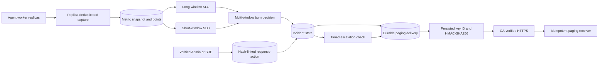

# Multi-Window SLO, Incident Response, and Rotating Paging Keys

Updated: 2026-08-04, Sprint 5H-H

## Purpose

Sprint 5H-G extends the durable operational reliability evidence introduced in 5H-F. It answers
four operational questions that a current-state dashboard cannot answer alone:

1. Is an SLO consuming its error budget quickly in both a recent and a sustained window?
2. Has a verified operator acknowledged and accepted ownership of an incident?
3. Did an unacknowledged critical incident escalate on schedule?
4. Which HMAC key and TLS trust chain protected each durable paging delivery?

Sprint 5H-H adds runtime-projected keys, strict provider receipt correlation, staging readiness,
and executable rotation and outage-recovery qualification to this incident-response base.

This is operational control-plane evidence. It does not authorize a model release and it does not
promote local evidence to production evidence.

## Flow



## Multi-Window SLO Contract

The default long window is one hour and the default short window is five minutes. Both windows
use the same normalized snapshots and evaluate independently.

For each window:

```text
expected = max(
  snapshots observed in the window,
  scheduled intervals since the first retained snapshot in the window
)

observed = good samples / expected samples
burn rate = (1 - observed) / (1 - target)
```

Missing intervals after the first retained baseline are treated as not-good. A collector gap
therefore consumes the budget instead of appearing as perfect availability. Before the minimum
sample count is reached, status is `insufficient` and burn alert level is `none`.

The persisted evaluation includes:

- long and short window durations;
- long and short observed ratios;
- long and short burn rates;
- `none`, `warning`, or `critical` burn alert level;
- expected, actual, good, and missing sample counts;
- canonical evaluation hash.

The alert level requires agreement between both windows:

```text
long burn >= critical threshold AND short burn >= critical threshold -> critical
long burn >= warning threshold  AND short burn >= warning threshold  -> warning
otherwise                                                        -> none
```

Default warning and critical thresholds are `6.0x` and `14.4x`. A breached SLO still opens an
incident when the multi-window level is `none`; that incident is warning severity. A critical
multi-window burn creates or updates a critical incident.

## Incident Response Contract

An incident retains its existing open/resolved lifecycle and adds response state:

- `acknowledged_at` and the verified acknowledging identity snapshot;
- current `assigned_to` value;
- `escalation_level`, from 0 through 3;
- append-only response actions.

Supported operator actions are:

| Action | Open incident required | Effect |
| --- | --- | --- |
| `acknowledged` | yes | Records verified actor and stops automatic escalation |
| `assigned` | yes | Sets the current bounded assignee |
| `note` | no | Adds an audit note without changing lifecycle state |
| `escalated` | generated by controller | Advances level and creates an escalation page when paging is enabled |

Only verified `Admin` and `SRE Lead` identities may mutate response state. `ML Ops Lead` and
`Release Manager` retain audit-only access.

Every action hashes a canonical payload containing the incident, action, actor, timestamp,
assignee, and previous action hash. The newest action points to its predecessor. This provides
application-level tamper evidence and order; it is not an external transparency anchor or a
database write-once guarantee.

## Automatic Escalation

The operational capture loop also evaluates open incidents. A critical incident is eligible when:

```text
status = open
severity = critical
acknowledged_at IS NULL
age >= escalation interval
```

The target level is `floor(age / interval)`, capped at 3. The controller advances directly to the
eligible level, appends one `escalated` action, increments the transition version, and creates one
unique escalation delivery. Acknowledgement prevents later escalation. Resolution continues to
create the normal resolved transition.

Escalation is evaluated during operational capture, so its timing accuracy is bounded by the
capture interval. The default escalation interval is 15 minutes and the capture interval is one
minute.

## Paging Key Rotation

New configuration accepts a keyring and one active key ID:

```text
OPERATIONAL_PAGING_HMAC_KEYS_JSON={"primary":"...","retiring":"..."}
OPERATIONAL_PAGING_ACTIVE_KEY_ID=primary
```

The legacy single-secret setting remains readable as key ID `legacy`. A delivery persists its
signing key ID when its outbox row is created. Retries and operator requeues therefore continue to
use the same key even when the active key changes.

Safe rotation sequence:

1. Add the new key to both sender and receiver keyrings while retaining the old key.
2. Roll out the receiver so it accepts both IDs.
3. Change the sender active key ID and roll out senders.
4. Verify new delivery receipts show the new key ID.
5. Wait until queued/dead-lettered deliveries using the old ID are completed or intentionally
   retired.
6. Remove the old key from both keyrings.

Removing a key while an outbox row still references it causes an explicit retryable delivery
failure and can eventually dead-letter the job after its bounded attempts. Restore the retained key
before requeueing. Secrets are never stored in delivery rows or returned by the API.

## TLS Transport

Paging remains destination-allowlisted, redirect-denied, and HTTPS-by-default. A private CA path
may be configured with:

```text
OPERATIONAL_PAGING_CA_BUNDLE_PATH=/etc/model-atlas/paging-tls/ca.crt
```

The HTTP client verifies the receiver hostname and certificate against that bundle. A temporarily
missing projected bundle is a retryable delivery failure and fails staging readiness. The
observability Compose profile includes a one-shot
`paging-tls-init` service that creates a development CA and a `paging-sink` certificate in a named
volume. The backend and workers mount only the CA; the receiver mounts its certificate and private
key.

The generated CA is a local integration fixture. Staging and production deployments must inject
managed certificates and keys rather than reuse this development material.

## API

```text
GET  /api/v1/operations/reliability
POST /api/v1/operations/reliability/cycles
POST /api/v1/operations/reliability/test-pages
POST /api/v1/operations/reliability/incidents/{incident_id}/actions
```

The current overview schema is `model-atlas-operational-reliability-v3`. The v2 additions remain
unchanged, while v3 adds:

- projected secret source and available key count;
- configured provider and strict receipt state;
- seven staging readiness checks and the latest qualifying receipt delivery;
- persisted provider event, receipt, and acceptance fields on each delivery.

The changes are additive at the route level. Existing metrics and alerts endpoints remain
unchanged.

## Operations UI

The Operations console now exposes:

- long and short SLO compliance side by side;
- paired burn rates and alert level;
- paging TLS and active-key state;
- acknowledgement, assignment, and note controls for administrators;
- current owner and escalation level;
- response action history with actor, time, and action-hash prefix;
- signing key ID for each paging receipt;
- projected secret, key-count, and provider badges;
- a full-width seven-check staging readiness band;
- provider receipt correlation in the delivery table.

Wide evidence tables use local horizontal scrolling on small viewports. The page itself does not
create document-level horizontal overflow.

## Configuration

| Variable | Default | Purpose |
| --- | --- | --- |
| `OPERATIONAL_SLO_WINDOW_SECONDS` | `3600` | Sustained SLO window |
| `OPERATIONAL_SLO_SHORT_WINDOW_SECONDS` | `300` | Recent SLO window |
| `OPERATIONAL_SLO_MIN_SAMPLES` | `3` | Minimum samples for a decision |
| `OPERATIONAL_SLO_WARNING_BURN_RATE` | `6.0` | Both-window warning threshold |
| `OPERATIONAL_SLO_CRITICAL_BURN_RATE` | `14.4` | Both-window critical threshold |
| `OPERATIONAL_INCIDENT_ESCALATION_SECONDS` | `900` | Unacknowledged critical escalation interval |
| `OPERATIONAL_PAGING_HMAC_KEYS_JSON` | empty | Accepted sender keyring |
| `OPERATIONAL_PAGING_HMAC_KEYS_FILE` | empty | Runtime-projected sender keyring |
| `OPERATIONAL_PAGING_ACTIVE_KEY_ID` | empty | Key ID for new delivery rows |
| `OPERATIONAL_PAGING_ACTIVE_KEY_ID_FILE` | empty | Runtime-projected active key ID |
| `OPERATIONAL_PAGING_CA_BUNDLE_PATH` | empty | Private CA bundle for HTTPS verification |
| `OPERATIONAL_PAGING_PROVIDER` | `generic-webhook` | Correlated provider identity |
| `OPERATIONAL_PAGING_REQUIRE_RECEIPT` | `false` | Require strict provider acceptance proof |
| `OPERATIONAL_PAGING_RECEIPT_MAX_AGE_SECONDS` | `86400` | Maximum accepted receipt age |

## Local Verification

```bash
make observability-up
```

The profile starts PostgreSQL, backend, two Agent workers, frontend, Prometheus, Alertmanager,
alert sink, TLS initializer, and HTTPS paging sink.

Sprint 5H-H verification completed with:

- 186 backend tests passed;
- Ruff, TypeScript, ESLint, and Next.js production build passed;
- PostgreSQL migration `202608040001` at head;
- two Agent workers, HTTPS paging receiver, and trust-source fixture healthy;
- all seven staging readiness checks passed;
- no-restart rotation to key `2026-08-04-rotated` and correlated receipt persistence passed;
- controlled outage, dead letter, SRE requeue, same-job recovery, and incident reconciliation
  passed;
- final operational health healthy, open incidents zero, and dead letters zero;
- desktop and 390px mobile browser QA without document-level horizontal overflow;
- zero browser console errors.

## Boundaries

- The bundled paging sink stores receipts in memory and is not an HA on-call service.
- The keyring supports runtime file projection, but an external secret manager is not bundled.
- The development CA is not production trust material.
- Strict receipts prove the adapter contract, but the bundled sink is not a commercial paging
  provider.
- Burn thresholds are configurable policy defaults, not a claim that every workload should use the
  same SLO or alert tuning.
