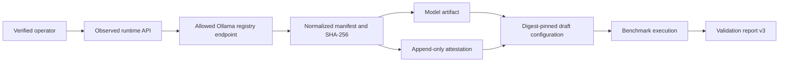

# Model Artifact Attestation

Updated: 2026-07-20, Sprint 5G

## Purpose

Model Atlas must prove that the runtime used the artifact named by the deployment configuration.
Model names alone are weak evidence: aliases can be retagged, names can omit parameter size, and a
runtime can load a different quantization under the same display name. Sprint 5F therefore binds
the observed runtime manifest, SHA-256 digest, model artifact, and deployment configuration.

Runtime attestation is an identity and configuration control. It does not prove model quality or
authorize a release. Sprint 5G can independently bind it to a configured publisher signature and
SBOM; that separate claim does not change what this record proves.

## Flow

`POST /api/v1/model-validation/observed-runtime-configurations` performs the observation on the
server. The client cannot supply a digest. The service reads Ollama `/api/tags`, selects the exact
model name, normalizes its registry digest, records the bounded manifest, and creates or reuses:

- a logical `Model`;
- a `ModelArtifact` with its checksum;
- a verified `ModelArtifactAttestation`;
- an immutable draft `DeploymentConfiguration` with `model`, `model_digest`, and
  `artifact_attestation_hash` in runtime configuration.

Exact repeated requests are idempotent.

## Security Boundary

- A verified maintenance identity and allowlisted role are required.
- `MODEL_ATTESTATION_ALLOWED_HOSTS` restricts runtime hosts.
- URL scheme, hostname, redirects, timeout, and response size are bounded.
- The digest is accepted only from the server-observed registry response.
- The attestation stores actor identity, verification method, normalized manifest hash, and a
  stable attestation hash.
- Raw credentials are never accepted or persisted.

For production, use HTTPS and a private registry allowlist. The bundled Ollama integration proves
server observation and audit binding. Sprint 5G separately verifies configured publisher JWS and
CycloneDX hashes. Sprint 5H-A adds managed key lifecycle and signed Merkle inclusion, but the
bundled development key and proof are not external publisher endorsement or independent public-log
evidence. See `docs/supply_chain_evidence.md` and `docs/trust_registry_transparency.md`.

## Report Semantics

The runtime identity fields introduced in `model-validation-report-v2` remain in
`model-validation-report-v4`:

- `observed_model_digests`;
- `configured_artifact_digest`;
- `artifact_attestation_id`;
- `artifact_attestation_status`;
- digest-aware `configuration_model_match`.

Attestation status is `missing`, `verified`, `digest_mismatch`, or `model_mismatch`. Actual runtime
evidence can become `validated` only when the configured digest and observed digest match a
verified attestation. `validated` still means local validation, and the report always keeps
`release_authorized=false`.

## Verified Local Record

| Field | Value |
| --- | --- |
| Runtime model | `qwen2.5:0.5b` |
| Format | GGUF |
| Quantization | `Q4_K_M` |
| Size | 397,821,319 bytes |
| Digest | `sha256:a8b0c51577010a279d933d14c2a8ab4b268079d44c5c8830c0a93900f1827c67` |
| Attestation ID | `ffb3c1bb-4ac1-49bc-a50f-940d28ce6c47` |
| Configuration ID | `c3dd6a74-1772-4e50-9d86-49273cebb502` |

## APIs

| Method | Path | Purpose |
| --- | --- | --- |
| `POST` | `/api/v1/model-validation/observed-runtime-configurations` | Observe a runtime and create a digest-pinned configuration. |
| `GET` | `/api/v1/model-validation/artifact-attestations` | List attestation records. |
| `GET` | `/api/v1/model-validation/report` | Build digest- and supply-chain-aware validation report v3. |
