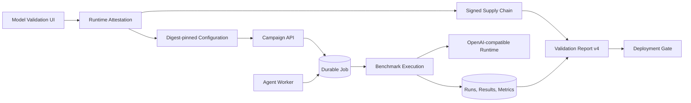

# Local Model Validation

Updated: 2026-07-20, Sprint 5H-A

## Purpose

Model Validation turns an OpenAI-compatible local runtime execution into a durable, reviewable
evidence report. It answers a narrower question than Deployment Gate:

> Did a real runtime execute this evaluation scope, what evidence did it produce, and is that
> evidence trustworthy enough to move to policy evaluation?

It does not authorize release. The report always sets `release_authorized=false`; Deployment Gate,
Release Readiness, and a signed Release Decision remain separate controls.

## Flow



`model_validation_campaign` uses the same PostgreSQL queue, lease heartbeat, retry, dead-letter,
and worker-state mechanisms as other control-plane work. The worker delegates inference to the
existing benchmark execution service instead of creating a second execution engine.

## Report Contract

The current report schema is `model-validation-report-v4`. It includes:

- deployment configuration and evaluation suite scope;
- optional focus benchmark run;
- configured model artifact plus observed runtime model names and digests;
- verified artifact attestation ID and status;
- signed supply-chain attestation ID and effective status;
- managed publisher trust tier, transparency status, and production eligibility;
- signed production-capture status and verified production run/result counts;
- digest-aware configuration/model identity match;
- actual-runtime evidence flag;
- evidence revision and report hashes;
- source-specific cohorts;
- source comparisons;
- judge-label calibration;
- canonical Evidence Trust;
- recommendations and limitations.

Each cohort reports:

- run, result, and metric counts;
- adapters and observed model names;
- quality, exact match, JSON validity, tool validity, groundedness, and faithfulness;
- error and OOM rates;
- P50/P95 latency and P50 throughput;
- reviewed-label count and coverage;
- cohort trust status.

## Status Semantics

| Status | Meaning |
| --- | --- |
| `no_evidence` | No completed evidence exists for the selected scope. |
| `fixture_only` | The focus run is mock or all selected evidence is synthetic. |
| `insufficient_real_evidence` | Evidence exists, but no non-synthetic OpenAI-compatible runtime result was found. |
| `needs_calibration` | Candidate judge labels exist and quality deltas exceed tolerance. |
| `needs_attention` | Attestation is missing/mismatched, review coverage is weak, or error/OOM evidence exists. |
| `validated` | Actual-runtime evidence uses a verified matching digest, calibration is acceptable, and trust/error checks do not require attention. |

`validated` means the validation workflow is clear to proceed. It is not equivalent to
`APPROVED`, `READY`, or `PRODUCTION_READY`.

## Model Identity And Attestation

The server observes an Ollama registry manifest and SHA-256 digest, then creates a draft deployment
configuration pinned to that digest. A report compares the configured artifact, runtime model, and
observed digest. For example:

```text
configured model: qwen2.5:0.5b
configured digest: sha256:a8b0...
observed model: qwen2.5:0.5b
observed digest: sha256:a8b0...
attestation: verified
match: true
```

Attestation states are `missing`, `verified`, `digest_mismatch`, and `model_mismatch`. The legacy
parameter-size comparison remains a conservative fallback for old configurations without digests;
it cannot produce a verified attestation state. See `docs/model_artifact_attestation.md`.

Supply-chain status is reported separately from runtime attestation and can be `missing`,
`verified`, or `revoked`. Production capture is `verified` only when a configured collector JWS
binds the exact completed run, counts, capture window, artifact digest, and active attestation
chain. A production label alone is unverified. See `docs/supply_chain_evidence.md`.

## APIs

All paths use `/api/v1`.

| Method | Path | Purpose |
| --- | --- | --- |
| `POST` | `/model-validation/campaigns` | Queue a durable validation campaign. |
| `POST` | `/model-validation/observed-runtime-configurations` | Observe a manifest and create a digest-pinned configuration. |
| `GET` | `/model-validation/artifact-attestations` | List verified artifact attestations. |
| `GET` | `/model-validation/report` | Build the current JSON report for a scope. |
| `GET` | `/model-validation/report.md` | Render the same report as Markdown. |
| `GET` | `/agents/jobs/{id}` | Poll campaign state and result. |
| `GET` | `/agents/jobs/overview` | Inspect workers, queue health, and dead letters. |

Campaign creation requires a verified maintenance identity with an allowed role. Raw API keys,
tokens, passwords, authorization headers, and nested secret fields are rejected. The only accepted
credential reference is:

```json
{
  "api_key_env": "OPENAI_COMPATIBLE_API_KEY"
}
```

The environment variable name is persisted; its value is not.

## UI

Open:

```text
http://localhost:3000/model-validation
```

The page supports:

- deployment, suite, task, and prompt selection;
- actual local runtime or fixture mode;
- runtime URL and model override;
- server-side runtime attestation and automatic matching configuration creation;
- standard or reliability execution;
- verified-operator state;
- queued job polling;
- source cohort and comparison tables;
- model/digest identity, attestation, judge calibration, recommendations, and limitations;
- supply-chain, production-capture, and verified production evidence state;
- Markdown report access.

## CLI

The direct CLI is useful for controlled local or CI execution:

```powershell
docker compose run --rm agent-worker python -m app.validation.local_model_validation `
  --deployment-configuration-id DEPLOYMENT_CONFIGURATION_ID `
  --evaluation-suite-id EVALUATION_SUITE_ID `
  --benchmark-task-id BENCHMARK_TASK_ID `
  --prompt-version-id PROMPT_VERSION_ID `
  --base-url http://ollama:11434 `
  --model qwen2.5:0.5b `
  --max-cases 5 `
  --output-dir /artifacts/model-validation
```

The CLI writes one JSON and one Markdown report. `make validate-local-model` wraps the same command
when the required IDs are provided as Make variables.

## Ollama

```bash
make pull-local-model OLLAMA_MODEL=qwen2.5:0.5b
```

Equivalent commands:

```bash
docker compose --profile runtime up -d ollama
docker compose exec ollama ollama pull qwen2.5:0.5b
```

The model weights remain in the Docker `ollama-data` volume and are not part of the source tree or
submission package.

## Verified Sprint 5H-A State

Focus run:

```text
161d4ee8-498a-41b0-882b-ae1360a99091
```

Observed focus cohort:

| Field | Value |
| --- | --- |
| Runtime | Ollama, OpenAI-compatible API |
| Model | `qwen2.5:0.5b` |
| Digest | `sha256:a8b0c51577010a279d933d14c2a8ab4b268079d44c5c8830c0a93900f1827c67` |
| Runtime attestation | verified |
| Supply-chain attestation | verified with managed development key |
| Transparency | valid development proof; not production eligible |
| Production capture | not applicable; no signed receipt |
| Cases | 5 captured-local cases |
| Results / metrics | 5 / 5 |
| Human-reviewed cases | 2, including 1 critical |
| Average quality | 1.0000 over this bounded local sample |
| P50 latency | 1,992.097 ms |
| P95 latency | 2,886.165 ms |
| P50 throughput | 70.63 tokens/s |
| Error rate | 0 |
| OOM rate | 0 |

The report status is `validated` because the runtime is actual, model and digest match a verified
attestation, errors/OOM are absent, and local-demo review coverage is met. The report still states:

- `release_authorized=false`;
- `supply_chain_production_eligible=false`;
- production readiness is `not_production_ready`;
- production-captured evidence is absent;
- critical review coverage is 25%;
- three of five scores remain heuristic.

Configuration ID: `c3dd6a74-1772-4e50-9d86-49273cebb502`.
Attestation ID: `ffb3c1bb-4ac1-49bc-a50f-940d28ce6c47`.
Supply-chain attestation ID: `4b8c6826-04e1-4d06-872f-90be73e5dda4`.
Transparency proof ID: `a16fc052-27e5-42b4-b875-1126d7e7bec1`.

The additive `model-validation-report-v4` fields are:

- `supply_chain_trust_tier`;
- `transparency_status`;
- `supply_chain_production_eligible`.

They distinguish a valid local signature from a production-governed trust chain while leaving the
runtime validation result intact.

## Next Evidence Work

1. Run the originally targeted 7B artifact on representative GPU hardware.
2. Obtain an external publisher or internal CA-backed registry signature.
3. Capture at least 20 reviewed production cases through a configured signed collector.
4. Run reliability trials with target hardware telemetry.
5. Evaluate the acceptance policy, promote a baseline, and sign a release decision only after the
   production evidence threshold is satisfied.
