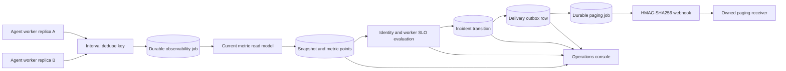

# Operational SLO, Incident, And Paging Contract

Updated: 2026-08-04, Sprint 5H-H

Sprint 5H-G extends this base contract with paired-window burn rates, hash-linked response actions,
automatic escalation, rotating HMAC key IDs, and CA-verified HTTPS. See
`incident_response_and_burn_rate.md` for the additive v2 contract and runbook.

Sprint 5H-H adds runtime-projected secrets, strict correlated provider receipts, and a seven-check
staging qualification gate. See `staging_paging_qualification.md` for the additive v3 contract and
executable staging runbook.

## Purpose

Sprint 5H-F turns Model Atlas operational metrics from a current-state view into durable,
reviewable reliability evidence. It adds:

- interval-bucketed metric snapshots and normalized metric points in PostgreSQL;
- explicit identity-session and worker-control-plane SLO evaluations;
- missing-interval accounting after the first retained baseline;
- durable open/resolved incident transitions;
- signed, retryable, idempotent paging delivery with bounded receipts;
- an Admin/SRE test-page path and an audit-oriented Operations console.

This layer monitors the Model Atlas control plane. It does not change benchmark scores, Evidence
Trust, Deployment Gate verdicts, release authorization, or production evidence classification.

## Architecture



Every worker may enqueue the current interval. A unique durable job key and a unique snapshot
bucket make the operation replica-safe without a leader. The existing Agent worker owns claim
leases, heartbeats, exponential retry, dead-letter handling, and verified-role requeue.

## Stored Evidence

Alembic revision `202607270002` adds five tables.

| Table | Responsibility |
| --- | --- |
| `operational_metric_snapshots` | One immutable summary per configured interval bucket |
| `operational_metric_points` | Normalized metric name, value, labels, help text, and timestamp |
| `operational_slo_evaluations` | Window, target, observed ratio, sample counts, error budget, and hash |
| `operational_alert_incidents` | Durable open/resolved alert lifecycle and occurrence count |
| `operational_alert_deliveries` | Delivery payload hash, destination fingerprint, attempts, response, and result |

Snapshot and evaluation rows have canonical SHA-256 hashes. Delivery records retain only a
destination hash/fingerprint, response status, bounded response hash, and bounded error message.
Webhook secrets and raw response bodies are not stored.

Expired snapshots are deleted in bounded batches. Metric points and SLO evaluations cascade from
their snapshot. Incident and delivery history is independent of snapshot retention.

## SLO Definitions

The first version defines two explicit objectives.

### Identity session hygiene

```text
good interval =
  browser_session_retention_due == 0
  AND browser_session_inactive_provider_token == 0
```

This detects sessions that should have been deleted and inactive sessions that still retain
provider logout material.

### Worker control-plane availability

```text
good interval =
  worker_online >= 1
  AND job_expired_lease_count == 0
```

This detects an unavailable durable execution plane or jobs abandoned beyond their lease.

The default target for both objectives is `0.99` over a one-hour window with at least three
expected samples.

## Missing Interval Semantics

Expected samples begin at the first retained snapshot in the active SLO window. There is no
synthetic penalty before Model Atlas has established a baseline.

```text
expected samples =
  max(
    snapshots carrying the required points,
    floor((window end - first retained sample) / interval) + 1
  )

observed ratio = good samples / expected samples
```

A missing expected interval therefore counts as not-good. This prevents a stopped collector from
reporting an artificially perfect SLO. Before `OPERATIONAL_SLO_MIN_SAMPLES`, the status is
`insufficient`; afterward it is `met` or `breached`.

## Incident Lifecycle

Every active derived alert and every breached SLO has one `active_key`.

- A new key creates an `opened` incident and transition version 1.
- A continuing key updates last-seen state and occurrence count without opening another incident.
- A key absent from a later capture is resolved, clears `active_key`, and increments transition
  version.
- A later recurrence creates a new incident, preserving the earlier resolved history.
- Test pages create resolved `test` incidents so they never pollute the active incident set.

When paging is enabled, opened and resolved transitions create one delivery outbox row. The
delivery payload hash is unique, so the same transition cannot create duplicate delivery
evidence.

## Paging Security And Reliability

Production-safe defaults require:

- paging explicitly enabled;
- an HTTPS URL;
- no URL credentials, query string, fragment, or redirect following;
- an exact/suffix allowlisted destination host;
- an HMAC secret of at least 32 characters;
- bounded connect/read timeout and response size.

Development HTTP is available only with
`OPERATIONAL_PAGING_ALLOW_INSECURE_HTTP=true`.

The sender signs:

```text
HMAC-SHA256(secret, unix_timestamp + "." + canonical_json_payload)
```

Headers include:

```text
Idempotency-Key: <delivery UUID>
X-Model-Atlas-Event-Id: <delivery UUID>
X-Model-Atlas-Timestamp: <unix timestamp>
X-Model-Atlas-Signature: sha256=<hex signature>
```

The receiver must verify clock skew, event ID, payload schema, and signature before accepting the
event. Replaying a delivered Model Atlas job does not send again. The bundled development sink
also suppresses repeated event IDs.

Transport errors, HTTP 5xx, 408, and 429 are retryable. Configuration errors, oversized responses,
and other HTTP 4xx failures are permanent and immediately dead-letter the job. Every actual
delivery execution increments the durable lifetime attempt count, including attempts after an
operator requeue.

## API And Permissions

| Method | Path | Permission |
| --- | --- | --- |
| `GET` | `/api/v1/operations/reliability` | Readable; response includes current permission flags |
| `POST` | `/api/v1/operations/reliability/cycles` | Verified Admin or SRE Lead |
| `POST` | `/api/v1/operations/reliability/test-pages` | Verified Admin or SRE Lead |

Audit roles are verified `Admin`, `SRE Lead`, `ML Ops Lead`, and `Release Manager`. Administration
is restricted to verified `Admin` and `SRE Lead`.

The current overview schema is `model-atlas-operational-reliability-v3`; the RBAC policy remains
`operational-reliability-rbac-v1`; new paging events use `model-atlas-paging-event-v2`; strict
provider responses use `model-atlas-paging-provider-receipt-v1`.

## Operations Console

`http://localhost:3000/operations` exposes:

- retained snapshot, breach, incident, and delivered-page summaries;
- configured interval, targets, paging state, and destination fingerprint label;
- latest SLO status, observed ratio, target, error budget, and sample counts;
- snapshot continuity and recent normalized control-plane values;
- incident lifecycle and paging receipt tables;
- staging readiness and provider receipt correlation;
- active current-state derived alerts;
- Admin/SRE capture and test-page controls.

Audit-only users can inspect every view but cannot mutate operational state.

## Configuration

```text
OPERATIONAL_SNAPSHOT_ENABLED=true
OPERATIONAL_SNAPSHOT_INTERVAL_SECONDS=60
OPERATIONAL_SNAPSHOT_RETENTION_DAYS=30
OPERATIONAL_SLO_WINDOW_SECONDS=3600
OPERATIONAL_SLO_MIN_SAMPLES=3
OPERATIONAL_IDENTITY_SLO_TARGET=0.99
OPERATIONAL_WORKER_SLO_TARGET=0.99
OPERATIONAL_PAGING_ENABLED=false
OPERATIONAL_PAGING_WEBHOOK_URL=https://paging.example.internal/model-atlas
OPERATIONAL_PAGING_ALLOWED_HOSTS=paging.example.internal
OPERATIONAL_PAGING_ALLOW_INSECURE_HTTP=false
OPERATIONAL_PAGING_HMAC_KEYS_FILE=/var/run/secrets/model-atlas/paging-hmac-keys.json
OPERATIONAL_PAGING_ACTIVE_KEY_ID_FILE=/var/run/secrets/model-atlas/paging-active-key-id
OPERATIONAL_PAGING_CA_BUNDLE_PATH=/var/run/secrets/model-atlas/paging-ca.crt
OPERATIONAL_PAGING_PROVIDER=staging-paging-provider
OPERATIONAL_PAGING_REQUIRE_RECEIPT=true
OPERATIONAL_PAGING_RECEIPT_MAX_AGE_SECONDS=86400
OPERATIONAL_PAGING_TIMEOUT_SECONDS=5
OPERATIONAL_PAGING_MAX_RESPONSE_BYTES=4096
```

Prometheus retention defaults to 30 days through `PROMETHEUS_RETENTION_TIME`. PostgreSQL snapshot
retention and Prometheus TSDB retention are separate policies.

## Local Verification

```bash
make observability-up
```

This command uses `deploy/observability/.env.observability.example`, starts two worker replicas,
the trust-source fixture, the runtime paging-secret initializer, and the development paging sink.

Local endpoints:

- Operations UI: `http://localhost:3000/operations`
- reliability API: `http://localhost:18000/api/v1/operations/reliability`
- Prometheus: `http://localhost:9090`
- Alertmanager: `http://localhost:9093`
- paging sink health: `http://localhost:9100/health`
- paging sink receipts: `http://localhost:9100/receipts`

The generated keys, private CA, and in-memory sink are not production credentials, PKI, or paging
infrastructure.

## Failure Runbook

### Snapshot stale

1. Check Agent worker health and queue depth.
2. Inspect the latest `operational_observability_cycle` job.
3. Check expired leases and dead letters.
4. Restore workers, then queue an Admin/SRE capture if immediate evidence is required.

### SLO breached

1. Inspect expected, actual, missing, and good sample counts.
2. Check the latest normalized metric points.
3. Correct the identity cleanup or worker lease issue.
4. Wait for a later capture to resolve the incident; do not delete historical evidence.

### Paging failed

1. Confirm the destination allowlist, HTTPS policy, secret, and receiver health.
2. Distinguish permanent destination/provider policy failures from retryable transport, 5xx,
   invalid strict-receipt, and temporary key/CA projection failures.
3. Restore the receiver.
4. Requeue the failed durable Agent job with a verified maintenance identity and reason.
5. Confirm a delivered receipt, response hash, provider event ID, and provider receipt ID.

## Verified Evidence

Latest Sprint 5H-H verification produced:

- backend: 186 tests passed with one upstream Starlette TestClient warning;
- backend and tools Ruff: passed;
- frontend typecheck, ESLint, and production build: passed;
- PostgreSQL migration: `202608040001 (head)`;
- two live workers, paging sink, trust-source fixture, and observability services healthy;
- seven of seven staging readiness checks passed;
- no-restart rotation to `2026-08-04-rotated` produced a matching provider receipt;
- controlled receiver outage, bounded dead letter, verified SRE requeue, and same-job recovery;
- final operational health healthy, open incidents zero, and dead letters zero;
- desktop and 390px mobile UI with zero document-level overflow and zero console errors.

## Boundaries

- The bundled paging sink is an in-memory development verifier, not an HA paging provider.
- HMAC establishes shared-secret authenticity, not public-key non-repudiation.
- SLO evaluation is interval-based control-plane evidence, not a general PromQL SLO engine.
- PostgreSQL retention is local unless backups and restore drills are configured.
- No multi-region scheduler, external time authority, managed PKI, on-call roster, external secret
  manager, commercial provider, or provider acknowledgement callback is included.
