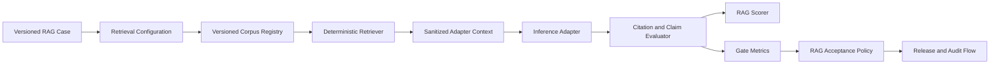

# RAG Evaluation Pack

Sprint 4C evaluates a concrete retrieval configuration and grounded answer contract through the
same benchmark, Gate, readiness, release, and audit flow used by other Model Atlas packs.

It is an evaluation pack, not a production RAG serving stack.

## Evaluation Flow



Retrieval runs before the adapter. The adapter receives the query, corpus/retriever version, and
retrieved chunks. It does not receive the case's expected relevant chunk IDs.

## Corpus Registry

The bundled registry is `rag-corpus-registry-v1`. Its deterministic corpus is:

```text
corpus_id: model-atlas-ops-handbook
corpus_version: ops-handbook-v1
chunks: 12
documents: 12
```

Each chunk has:

- stable `chunk_id`;
- stable `document_id`;
- title and text;
- optional metadata.

The corpus hash is a canonical SHA-256 hash of the ordered chunk contracts. Benchmark results and
Gate snapshots preserve corpus version and hash provenance.

## Retrieval Configuration

The RAG deployment configuration uses the existing immutable
`DeploymentConfiguration.retrieval_config_json` field:

```json
{
  "corpus_id": "model-atlas-ops-handbook",
  "corpus_version": "ops-handbook-v1",
  "corpus_hash": "...",
  "retriever_id": "lexical_overlap",
  "retriever_version": "lexical-overlap-v1",
  "top_k": 3,
  "min_score": 0.05
}
```

Changing this contract creates a different deployment configuration hash.

## Retriever

`lexical-overlap-v1` is local and deterministic. It:

1. normalizes lowercase alphanumeric and Korean tokens;
2. removes a small stable stopword set;
3. scores query-token coverage plus chunk-token density;
4. filters below `min_score`;
5. orders by descending score and stable chunk ID;
6. returns at most `top_k` chunks.

This implementation is intentionally inspectable. It is not an embedding model, vector database,
hybrid retriever, or reranker.

## Case Contract

RAG ground truth is stored under `EvaluationCase.reference_context_json.rag`:

```json
{
  "rag": {
    "corpus_id": "model-atlas-ops-handbook",
    "corpus_version": "ops-handbook-v1",
    "query": "approved deployment gate verified evidence baseline promotion",
    "relevant_chunk_ids": ["ops-release-001"]
  }
}
```

The adapter-facing copy removes `relevant_chunk_ids` and contains only retrieved context.

## Generation Contract

The adapter returns one JSON object:

```json
{
  "answer": "A release requires an approved deployment gate and verified evidence.",
  "citations": ["ops-release-001"],
  "claims": [
    "A release requires an approved deployment gate and verified evidence before baseline promotion."
  ]
}
```

`claims` are evaluated as atomic support units. Citation IDs must match retrieved chunk IDs exactly.

## Stored Trace

`BenchmarkResult.metadata_json.rag_evaluation` stores `rag-evaluation-trace-v1`:

- output validity and final status;
- answer, citation IDs, and claims;
- invalid and correct citation IDs;
- citation precision and citation recall;
- claim support scores and groundedness;
- unsupported claim count and rate;
- nested `rag-retrieval-trace-v1`.

The retrieval trace stores query, top-k, minimum score, retrieved ranks/scores/text, expected and
retrieved relevant IDs, recall, latency, corpus hash/version, and retriever version.

## Metrics

| Metric | Meaning | Direction |
| --- | --- | --- |
| `rag_retrieval_recall` | Relevant chunks returned by retrieval | higher |
| `rag_citation_precision` | Citations that are retrieved and relevant | higher |
| `rag_citation_recall` | Relevant chunks covered by citations | higher |
| `rag_groundedness_score` | Claim support from cited chunk text | higher |
| `rag_unsupported_claim_rate` | Claims below support threshold | lower |

The deterministic claim evaluator uses token support against chunks actually cited by the answer.
It is an explainable heuristic and requires judge/human calibration before stronger evidence claims.

## Gate Policy

The seeded `RAG Grounded Answer Policy` requires:

- retrieval recall `>= 1.0`;
- citation precision `>= 1.0`;
- citation recall `>= 1.0`;
- groundedness `>= 0.85`;
- unsupported claim rate `<= 0.0`;
- at least 10 RAG case samples for each rule.

Critical RAG cases also fail the existing critical-case blocker when retrieval, citation, or claim
support is incomplete.

## APIs

- `GET /api/v1/rag/corpora`
- `GET /api/v1/rag/corpora/{corpus_id}`
- `GET /api/v1/rag/retriever`
- `POST /api/v1/benchmark-executions`
- `GET /api/v1/benchmark-executions/{benchmark_run_id}`
- `POST /api/v1/deployment-gates/preflight`
- `POST /api/v1/deployment-gates/evaluations`

## Reproducible Run

```bash
make seed
make seed-rag
```

In Benchmark Execution select:

- configuration: `Qwen2.5 7B Local RAG Assistant`;
- suite: `RAG Grounded Answer Evaluation Suite`;
- task: `Korean document QA`;
- adapter: `mock` for deterministic verification or `openai_compatible` for a local model;
- data source: `local_authored`;
- max cases: at least 10.

Open **Inspect RAG Trace**, then evaluate the same configuration and suite with
`RAG Grounded Answer Policy`.

## Failure Semantics

- Unknown corpus or retriever versions produce an `invalid_config` trace.
- Empty retrieval produces recall zero and a failed RAG case.
- Citations outside retrieved context are invalid.
- Relevant retrieved chunks that are not cited lower citation recall.
- Claims unsupported by cited chunk text raise unsupported claim rate.
- Critical failures are visible in the Gate report and link to the benchmark trace.

## Current Limits

- One bundled static corpus.
- One deterministic lexical retriever.
- No document ingestion or chunking pipeline.
- No embeddings, vector database, hybrid search, or reranker.
- No conversational retrieval or model follow-up loop.
- No semantic judge; groundedness is token-support evidence.
- Retrieval runs synchronously inside benchmark execution.
