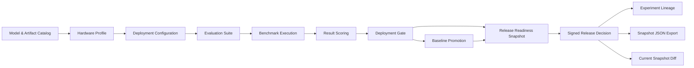
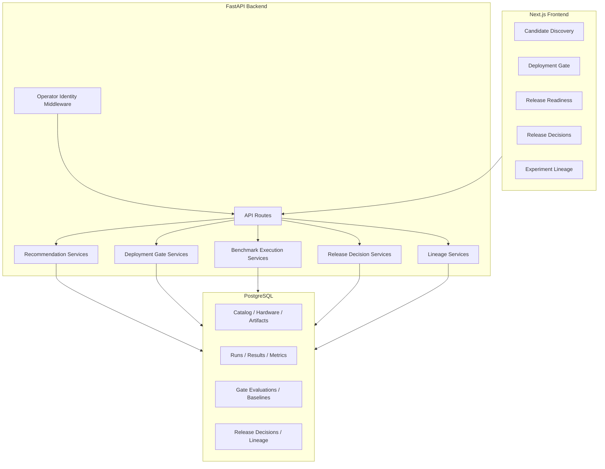

# Model Atlas 프로젝트 검토 문서

작성일: 2026-07-09

## 1. 한 줄 요약

Model Atlas는 로컬 AI 모델을 단순히 추천하는 도구가 아니라, 특정 로컬 배포 구성이 실제 업무 조건을 만족하는지 evidence 기반으로 평가하고, 승인/보류/차단/변경요청을 감사 가능한 기록으로 남기는 local-first EvalOps/MLOps 플랫폼이다.

기존의 토큰 수, VRAM, 사용자 하드웨어 조건 기반 추천은 "어떤 모델이 좋아 보이는가"를 답한다. Model Atlas의 현재 MVP는 한 단계 더 나아가 "이 모델 구성은 지금 이 업무에 배포해도 되는가", "누가 어떤 근거로 승인했는가", "승인 당시 evidence와 현재 evidence가 달라졌는가"를 답한다.

## 2. 왜 만들었는가

로컬 AI 모델 선택은 보통 다음 수준에서 멈춘다.

- 내 GPU VRAM에 올라가는가;
- context length가 충분한가;
- tokens/sec가 빠른가;
- benchmark 평균 점수가 높은가;
- 추천 리스트에서 상위권인가.

이 기준은 모델 후보를 좁히는 데는 유용하지만, 운영 배포 승인에는 부족하다. 실제 배포 판단에는 다음 질문이 남는다.

- 이 모델은 특정 업무 시나리오에서 검증되었는가;
- 평가 데이터가 synthetic demo인지 실제 운영/현장 캡처 데이터인지 구분되는가;
- critical case를 실패했는데 평균 점수만 높아서 통과되는 위험은 없는가;
- 정책 threshold, baseline, prompt 변경, judge label 상태가 함께 추적되는가;
- 승인 당시의 evidence가 나중에 재현 가능한가;
- 승인자는 누구이고, 그 승인자가 승인 권한을 갖고 있었는가;
- 승인 이후 현재 snapshot과 frozen snapshot이 달라졌는가.

Model Atlas는 이 공백을 메우기 위해 시작되었다. 목표는 "모델 랭킹 앱"이 아니라 "로컬 AI 배포 승인 게이트"다.

## 3. 해결하려는 문제

### 문제 1. 추천 점수와 배포 승인은 다르다

추천 점수는 후보 탐색에 적합하지만, 운영 승인에는 부적합하다. 배포 승인은 특정 deployment configuration, workload suite, acceptance policy에 대해 판단해야 한다.

Model Atlas는 Candidate Discovery와 Deployment Gate를 분리했다.

- Candidate Discovery: 후보 모델 artifact를 ranking한다.
- Deployment Gate: 특정 배포 구성이 업무 정책을 통과하는지 판정한다.

이 분리 덕분에 추천 점수가 높아도 gate evidence가 부족하면 배포 승인을 받을 수 없다.

### 문제 2. Synthetic demo evidence는 운영 근거가 될 수 없다

많은 포트폴리오/데모 프로젝트는 synthetic seed data만으로 "성능이 좋다"고 보여준다. 하지만 synthetic data는 UI와 API 흐름을 보여줄 수 있을 뿐, 실제 배포 readiness를 증명하지 못한다.

Model Atlas는 synthetic-only evidence가 `APPROVED` verdict를 만들 수 없도록 막는다. captured local case와 production-captured case import 경로를 따로 두어, 데모 데이터와 운영 근거를 구분한다.

### 문제 3. 승인 기록이 감사 가능하지 않다

운영 환경에서는 "누가 승인했는가"뿐 아니라 "무엇을 보고 승인했는가"가 중요하다. Model Atlas는 release decision을 생성할 때 readiness snapshot을 frozen JSON으로 저장하고, snapshot hash, signature hash, decision hash를 만든다.

또한 operator identity middleware와 role-based release approval policy를 추가했다. `APPROVE_RELEASE`와 `REJECT_RELEASE`는 verified identity와 승인 role을 요구한다.

### 문제 4. 시간이 지나면 evidence 상태가 변한다

승인 당시에는 안전해 보였더라도, baseline, judge review, prompt regression, lineage 상태가 이후 바뀔 수 있다. 그래서 release decision detail page는 frozen snapshot과 현재 재계산 snapshot의 diff를 보여준다.

이 기능은 "승인 당시 상태"와 "현재 상태"를 구분해 감사 리뷰를 가능하게 한다.

## 4. 대상 사용자와 페르소나

### Persona A. 로컬 AI 도입 담당자

관심사:

- RTX 4080 Super 같은 제한된 로컬 GPU에서 어떤 모델을 쓸지 고르고 싶다.
- 모델이 단순히 실행되는지보다, 실제 업무 품질과 지연시간 기준을 만족하는지 알고 싶다.

Model Atlas가 주는 가치:

- 후보 탐색과 배포 승인을 분리해준다.
- hardware, VRAM, latency, throughput, quality를 함께 본다.
- 로컬 런타임 LM Studio/Ollama/OpenAI-compatible endpoint로 실제 실행 evidence를 만들 수 있다.

### Persona B. MLOps / EvalOps 엔지니어

관심사:

- 평가 데이터, prompt version, benchmark run, deployment gate, baseline, release decision이 추적 가능해야 한다.
- synthetic data와 production-captured evidence를 분리해야 한다.
- approval flow가 재현 가능해야 한다.

Model Atlas가 주는 가치:

- append-only experiment lineage를 제공한다.
- deployment configuration, evaluation suite, acceptance policy를 first-class entity로 관리한다.
- gate report, release readiness snapshot, release decision record를 hash 기반으로 추적한다.

### Persona C. 평가자 / 면접관 / 리뷰어

관심사:

- 이 프로젝트가 단순 CRUD인지, 실제 문제를 구조화했는지 보고 싶다.
- 기술 선택과 코드 구조가 확장 가능한지 확인하고 싶다.
- MVP와 한계를 솔직하게 구분하는지 보고 싶다.

Model Atlas가 보여주는 역량:

- 추천 시스템, 평가 파이프라인, 정책 엔진, 감사 로그, UI workflow를 하나의 product flow로 묶었다.
- Docker, Alembic, FastAPI, Next.js, SQLAlchemy, 테스트, 문서화를 모두 포함한다.
- "모델 추천"에서 "배포 승인 체계"로 문제를 확장했다.

### Persona D. Release Manager / 거버넌스 담당자

관심사:

- 승인자는 누구인가;
- 승인 권한이 있는 사람인가;
- 승인 당시 어떤 snapshot을 봤는가;
- 승인 후 상태가 변했는가.

Model Atlas가 주는 가치:

- signer identity와 RBAC policy result를 release decision에 저장한다.
- frozen snapshot JSON과 current snapshot diff를 제공한다.
- signature hash와 decision hash로 audit fingerprint를 남긴다.

## 5. MVP 범위

현재 MVP는 "local AI deployment gate"의 핵심 골격을 검증하는 데 집중한다.

포함된 것:

- 모델/아티팩트/하드웨어 catalog;
- token, VRAM, latency, throughput, quality 기반 Candidate Discovery;
- workload contract, evaluation suite, acceptance policy;
- adapter-driven benchmark execution;
- mock adapter와 OpenAI-compatible local runtime adapter;
- deterministic scorer registry;
- Deployment Gate verdict;
- synthetic-only approval blocking;
- baseline promotion과 supersession;
- prompt regression review;
- judge label calibration review;
- experiment lineage timeline;
- release readiness snapshot;
- signed release decision;
- trusted operator identity middleware;
- role-based release approval policy;
- snapshot JSON export와 current snapshot diff;
- Markdown/PDF export 일부;
- Docker Compose 기반 PostgreSQL runtime;
- backend/frontend 테스트와 lint/build 검증.

명시적으로 제외된 것:

- 실제 모델 weight hosting;
- vLLM/SGLang orchestration;
- cloud deployment;
- agent runtime;
- RAG pipeline;
- Kafka/Spark/background worker;
- Hugging Face live registry integration;
- 완전한 SSO/OAuth/OIDC 인증 서버;
- 실시간 production monitoring.

## 6. 기존 token/hardware 기반 로컬 모델 추천 대비 장점

| 구분 | 기존 token/hardware 기반 추천 | Model Atlas |
|---|---|---|
| 핵심 질문 | 내 하드웨어에서 어떤 모델이 돌아가는가 | 이 구성이 특정 업무에 배포 가능한가 |
| 판단 단위 | 모델 또는 artifact | deployment configuration + workload suite + policy |
| 근거 | VRAM, context length, tokens/sec, 평균 점수 | benchmark evidence, policy rule, critical case, baseline, readiness |
| 데이터 신뢰성 | synthetic/demo 여부가 흐려질 수 있음 | synthetic-only approval blocking |
| 추천/승인 분리 | 보통 분리되지 않음 | Candidate Discovery와 Deployment Gate 분리 |
| 감사성 | 낮음 | snapshot hash, signature hash, decision hash |
| 승인자 검증 | 없음 | operator identity + RBAC policy |
| 변경 추적 | 제한적 | lineage timeline, baseline supersession, snapshot diff |
| 운영 확장성 | 추천 화면 중심 | MLOps/EvalOps 파이프라인 중심 |

핵심 장점은 추천 결과를 바로 승인으로 취급하지 않는다는 점이다. Model Atlas는 추천을 "후보 탐색"으로 제한하고, 배포 승인은 별도의 evidence gate를 통과하도록 만든다.

## 7. 전체 파이프라인

파이프라인 설명:

1. 모델 catalog와 hardware profile을 등록한다.
2. 특정 모델 artifact, runtime, hardware, prompt/generation config를 묶어 deployment configuration을 만든다.
3. workload profile과 evaluation suite가 업무 요구사항과 평가 case를 정의한다.
4. benchmark execution이 mock 또는 local OpenAI-compatible runtime으로 evidence를 생성한다.
5. scorer registry가 JSON, tool-call, grounded answer, text fallback 점수를 채운다.
6. Deployment Gate가 acceptance policy rule을 평가한다.
7. gate가 승인되면 active baseline으로 promote할 수 있다.
8. release readiness snapshot이 gate, baseline, judge calibration, prompt regression, lineage를 묶는다.
9. operator가 release decision을 서명한다.
10. signer identity, RBAC policy, snapshot hash, signature hash, decision hash가 저장된다.
11. frozen snapshot과 현재 snapshot diff를 비교해 drift를 검토한다.

## 8. 시스템 구조

### 주요 backend 코드

- `app/services/recommendations.py`: 추천 report orchestration.
- `app/services/recommendation_policy.py`: 후보 eligibility filter.
- `app/services/recommendation_scoring.py`: quality, latency, throughput, VRAM efficiency scoring.
- `app/services/deployment_gate/evaluator.py`: gate evaluation orchestration.
- `app/services/deployment_gate/policy.py`: threshold rule evaluation.
- `app/services/deployment_gate/metrics.py`: calculated metric과 critical case outcome.
- `app/services/deployment_gate/baselines.py`: baseline promotion과 supersession.
- `app/services/benchmark_execution.py`: adapter-driven benchmark execution.
- `app/services/result_scoring.py`: deterministic scorer registry.
- `app/services/release_readiness.py`: readiness snapshot 생성.
- `app/services/release_decisions.py`: release decision 생성, hash, snapshot diff.
- `app/services/release_approval_policy.py`: release approval RBAC.
- `app/services/operator_identity.py`: signer identity normalization.
- `app/middleware/operator_identity.py`: trusted header identity middleware.
- `app/services/experiment_lineage.py`: append-only lineage event.

### 주요 frontend 코드

- `app/recommendations/page.tsx`: Candidate Discovery.
- `app/deployment-gates/[id]/page.tsx`: gate report.
- `app/release-readiness/page.tsx`: release snapshot과 sign form.
- `components/ReleaseDecisionForm.tsx`: signer/policy-aware release decision form.
- `app/release-decisions/page.tsx`: signed decision history.
- `app/release-decisions/[id]/page.tsx`: frozen snapshot, signer identity, policy, hash, diff.
- `app/experiment-lineage/page.tsx`: operational timeline.
- `lib/releaseDecisionPresentation.ts`: decision label/tone/policy helper.

## 9. 데이터 모델 개요

핵심 entity:

- `Model`: 논리적 모델.
- `ModelArtifact`: 실제 배포 후보 artifact.
- `HardwareProfile`: GPU/VRAM 등 로컬 하드웨어 조건.
- `BenchmarkTask`: 평가 task.
- `PromptVersion`: prompt 변경 이력.
- `BenchmarkRun`: 실행 단위.
- `BenchmarkResult`: sample-level 결과.
- `InferenceMetric`: latency, tokens/sec, VRAM, token count.
- `WorkloadProfile`: 업무 요구사항.
- `EvaluationSuite`: versioned evaluation case 묶음.
- `AcceptancePolicy`: absolute threshold 기반 정책.
- `DeploymentConfiguration`: artifact + runtime + hardware + generation config.
- `GateEvaluation`: verdict, scorecard, evidence snapshot, decision hash.
- `DeploymentBaseline`: active baseline과 supersession.
- `ReleaseDecision`: frozen readiness snapshot, signer identity, policy, hashes.
- `ExperimentLineageEvent`: append-only operational timeline.

이 데이터 모델은 추천, 평가, 승인, 감사가 끊기지 않도록 설계되었다.

## 10. 작동 방식

### Candidate Discovery

Candidate Discovery는 모델 artifact를 scoring한다. quality, latency, throughput, VRAM efficiency를 조합하고, context length, tool calling, structured output, license/commercial 조건 등을 eligibility issue로 분리한다.

중요한 점은 Candidate Discovery가 배포를 승인하지 않는다는 것이다. 이 모듈은 "좋아 보이는 후보"를 찾는 용도다.

### Deployment Gate

Deployment Gate는 특정 deployment configuration이 versioned evaluation suite와 acceptance policy를 통과하는지 평가한다. verdict는 다음 중 하나다.

- `APPROVED`
- `CONDITIONAL`
- `BLOCKED`
- `INSUFFICIENT_EVIDENCE`

Synthetic-only evidence는 항상 approval을 막는다. Critical case 실패, insufficient sample size, policy threshold 실패도 gate verdict에 반영된다.

### Baseline

승인된 gate evaluation은 active baseline으로 promote할 수 있다. 이후 gate는 active baseline 대비 regression을 비교할 수 있다. baseline supersession history도 남긴다.

### Release Readiness

Release readiness snapshot은 gate verdict, baseline state, judge calibration, prompt regression, lineage를 한 번에 묶는다. 이것은 배포 승인 자체가 아니라 operator가 검토할 release review snapshot이다.

### Signed Release Decision

Operator가 release decision을 만들면 다음이 저장된다.

- decision: `APPROVE_RELEASE`, `REQUEST_CHANGES`, `REJECT_RELEASE`;
- signer identity;
- identity verification state;
- approval policy result;
- signature statement;
- frozen readiness snapshot JSON;
- snapshot hash;
- signature hash;
- decision hash.

`APPROVE_RELEASE`와 `REJECT_RELEASE`는 trusted header 기반 verified identity와 release role을 요구한다. `REQUEST_CHANGES`는 로컬 self-attested reviewer도 남길 수 있어, 인증 체계가 완성되기 전에도 follow-up 기록을 남길 수 있다.

### Snapshot Diff

Release decision detail은 frozen snapshot과 현재 readiness snapshot을 비교한다. `generated_at`처럼 매번 바뀌는 값은 제외하고, path-level `added`, `removed`, `changed` diff를 보여준다.

이 기능은 "승인 당시에는 안전했는가"와 "지금도 같은 상태인가"를 분리해서 검토하게 해준다.

## 11. 기술 스택

Backend:

- FastAPI
- Pydantic v2
- SQLAlchemy 2.x
- Alembic
- PostgreSQL
- pytest
- Ruff

Frontend:

- Next.js
- React
- TypeScript
- Tailwind CSS
- lucide-react

Runtime:

- Docker Compose
- PostgreSQL 16
- optional Ollama runtime profile
- OpenAI-compatible local endpoint adapter

## 12. 검증 상태

최근 검증 결과:

- Backend Ruff: passed
- Backend pytest: 57 passed, 1 warning
- Frontend typecheck: passed
- Frontend lint: passed
- Frontend build: passed
- Docker backend health: 200 OK
- Docker release decision detail page: 200 OK
- Docker snapshot JSON export: 200 OK
- Docker snapshot diff: 200 OK
- Docker backend pytest: 57 passed, 1 warning
- Docker frontend lint: passed

현재 Docker 실행 URL:

- Frontend: `http://localhost:3000`
- Backend: `http://localhost:8000`

## 13. 평가자가 볼 만한 시나리오

### 시나리오 1. 기존 추천 기능 확인

`/recommendations`에서 hardware와 task를 기준으로 후보 모델을 비교한다. 이 화면은 모델 ranking, eligibility issue, confidence-adjusted score, Pareto flag를 보여준다.

검토 포인트:

- 추천이 deterministic하게 설명 가능한가;
- 제외 사유가 사용자에게 보이는가;
- hardware/token 기반 추천이 어디까지 가능한지 드러나는가.

### 시나리오 2. Deployment Gate 확인

`/deployment-gates/[id]`에서 특정 gate report를 확인한다.

검토 포인트:

- verdict가 평균 점수 하나로만 만들어지지 않는가;
- rule result와 critical case outcome이 보이는가;
- synthetic-only evidence가 approval을 막는가;
- report export가 가능한가.

### 시나리오 3. Release Readiness 확인

`/release-readiness`에서 gate, baseline, judge review, prompt regression, lineage를 하나의 release snapshot으로 본다.

검토 포인트:

- 배포 전 검토해야 할 상태가 한 화면에 모이는가;
- sign-off form이 readiness 상태와 operator policy를 반영하는가.

### 시나리오 4. Release Decision 감사 확인

`/release-decisions/[id]`에서 signed decision을 확인한다.

검토 포인트:

- signer identity와 RBAC policy가 저장되는가;
- frozen snapshot hash와 signature hash가 보이는가;
- snapshot JSON export가 가능한가;
- current snapshot diff가 보이는가;
- release decision이 gate evidence를 변경하지 않는가.

### 시나리오 5. Experiment Lineage 확인

`/experiment-lineage`에서 prompt, benchmark run, gate, baseline, release sign-off를 하나의 timeline으로 본다.

검토 포인트:

- 운영 이벤트가 append-only 형태로 연결되는가;
- 배포 판단의 흐름이 나중에 추적 가능한가.

## 14. 제품 관점에서의 강점

1. 추천과 승인을 분리했다.

   모델 추천은 의사결정의 시작일 뿐이다. Model Atlas는 실제 approval을 Deployment Gate로 분리했다.

2. Evidence quality를 중요하게 다룬다.

   Synthetic demo data는 approval 근거가 될 수 없도록 막는다.

3. 감사 가능한 release sign-off를 제공한다.

   signer identity, approval policy, signature hash, decision hash, frozen snapshot을 저장한다.

4. 변경 추적이 가능하다.

   baseline supersession, lineage timeline, snapshot diff가 있다.

5. Local-first 현실성을 반영한다.

   로컬 GPU, Ollama/LM Studio/OpenAI-compatible endpoint, Docker Compose를 고려한다.

6. MVP 한계를 숨기지 않는다.

   cloud, SSO, live registry, production monitoring 등 아직 없는 것을 문서에 명확히 둔다.

## 15. 코드 구조 관점에서의 강점

- 서비스가 책임별로 분리되어 있다.
- recommendation, gate, release decision, lineage가 별도 service layer를 갖는다.
- DB migration이 Alembic으로 관리된다.
- API schema가 Pydantic으로 명시된다.
- frontend presentation helper가 decision 표시 로직을 공유한다.
- backend test가 API contract와 정책 실패 케이스를 검증한다.
- Docker runtime과 local test가 모두 동작한다.

## 16. 현재 한계와 리스크

현재 프로젝트는 MVP이며 다음 한계가 있다.

- seed benchmark는 synthetic demonstration data다.
- production-captured evidence는 import 경로가 있지만 실제 운영 데이터로 반복 검증해야 한다.
- trusted header middleware는 실제 SSO/OIDC 서버가 아니라 reverse proxy integration point다.
- model hosting 자체를 제공하지 않는다.
- 배포 후 monitoring, drift alert, live traffic feedback loop는 아직 없다.
- judge label calibration은 더 고도화할 수 있다.
- snapshot diff는 구조화된 JSON path diff지만 semantic diff는 아니다.

이 한계는 설계 실패라기보다 MVP 경계다. 현재 목적은 "local AI deployment approval workflow의 뼈대와 감사 가능성"을 검증하는 것이다.

## 17. 다음 개선 방향

우선순위가 높은 개선:

1. 실제 production-captured case로 반복 평가.
2. judge label calibration dashboard 고도화.
3. lineage event detail drawer 또는 상세 페이지.
4. reverse proxy 또는 SSO/OIDC 기반 실제 operator identity 연동.
5. 배포 후 runtime monitoring과 drift detection.
6. Hugging Face/local registry metadata import.
7. vLLM/SGLang 같은 serving backend adapter.
8. snapshot diff의 semantic grouping.

## 18. 결론

Model Atlas는 단순히 "로컬 모델을 추천하는 앱"이 아니다. 현재 구현은 로컬 AI 모델을 운영에 올리기 전, 후보 탐색, evidence 생성, 정책 판정, baseline 관리, release readiness, 승인자 검증, 감사 기록, snapshot drift 확인까지 이어지는 end-to-end EvalOps 흐름을 보여준다.

기존 token/hardware 기반 추천과 비교했을 때 가장 큰 차별점은 "추천 결과를 배포 승인으로 오해하지 않게 만든 것"이다. 이 프로젝트는 추천을 시작점으로 두고, 실제 승인은 evidence와 policy, role, frozen snapshot을 통과하게 만든다.

평가자 관점에서 이 프로젝트는 다음 역량을 보여준다.

- 문제를 제품 수준으로 재정의하는 능력;
- MLOps/EvalOps 흐름을 데이터 모델과 API로 구조화하는 능력;
- backend/frontend/Docker/test/documentation을 함께 완성하는 능력;
- MVP와 한계를 명확히 구분하는 판단력;
- 감사 가능성과 운영 리스크를 고려하는 설계 감각.

따라서 Model Atlas의 현재 상태는 "로컬 AI 모델 추천기"보다 높은 단계의 "로컬 AI 배포 승인 게이트 MVP"로 보는 것이 적절하다.
