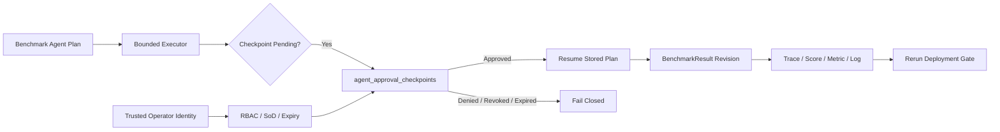

# Model Atlas Sprint 5C 구현 보고서

작성일: 2026-07-13  
범위: Agent Control Plane, bounded live replan, production Agent evidence import

## 1. 요약

Sprint 5C는 Sprint 5B의 요청 단위 승인 데이터를 실제로 재개 가능한 Agent 제어 상태로
전환했다. 이제 모델이 생성한 계획은 승인 대기 지점에서 멈추고, 별도 DB 레코드가 요청자,
정책, 만료, 승인자, 취소, 재개와 각 전이 해시를 보존한다.

핵심 결과는 다음과 같다.

- 검증된 운영자 신원과 역할 기반 checkpoint 승인;
- 요청자와 승인자를 분리하는 separation of duties;
- `pending -> approved/denied/revoked/expired/resumed` 영속 상태 전이;
- optimistic version과 row lock을 이용한 동시 변경 방지;
- 저장된 plan을 이용한 결과 revision 재개와 semantic replay;
- 한 번만 호출 가능한 live-replan provider 경계와 비용/지연/토큰 증거;
- 운영 Agent trace의 무결성, 신원, 중복, 범위를 검사하는 production import 계약;
- benchmark detail 화면의 Agent approval control panel.

Agent checkpoint는 Agent action 허용 증거일 뿐이다. 배포 승인은 여전히 Deployment Gate,
Release Readiness, Signed Release Decision을 통과해야 한다.

## 2. 해결한 문제

Sprint 5B에는 다음 한계가 있었다.

1. 승인 actor가 요청 body의 문자열이어서 인증 신원이 아니었다.
2. benchmark 요청이 종료되면 pending 상태를 별도 레코드로 재개할 수 없었다.
3. 승인 만료, 취소, 역할 범위, 직무분리 규칙이 없었다.
4. recovery branch는 원래 plan에 미리 포함된 fixture만 사용할 수 있었다.
5. 운영 환경에서 수집한 Agent trace를 안전하게 넣는 계약이 없었다.

5C는 이 다섯 문제를 기존 Agent trace, scorer, Gate metric, replay 경계 안에서 해결했다.

## 3. 구현 구조



주요 모듈:

- `app/models/entities.py`: `AgentApprovalCheckpoint`;
- `app/services/agent_approval_policy.py`: 승인, 재개, 취소, import RBAC;
- `app/services/agent_control_plane.py`: materialize, decide, expire, revoke, resume;
- `app/services/agent_execution.py`: persisted provenance와 live-replan callback;
- `app/services/agent_evidence_import.py`: production trace import;
- `app/api/v1/routes/agent_execution.py`: Agent control API;
- `frontend/components/AgentApprovalControlPanel.tsx`: 운영자 제어 UI.

## 4. 데이터와 마이그레이션

Alembic revision `202607130001`은 `agent_approval_checkpoints`를 추가한다.

주요 저장 증거:

- requester identity와 subject ID;
- checkpoint request snapshot과 `request_hash`;
- frozen RBAC policy와 `expires_at`;
- decision, approver identity, reason, `decision_hash`;
- revocation identity, reason, `revocation_hash`;
- resume identity와 `resume_hash`;
- positive integer `version`.

결과별 checkpoint key는 unique이며 run/result 삭제 시 cascade된다. DB enum을 추가하지 않아
기존 SQLite 테스트와 PostgreSQL 배포의 호환성을 유지했다.

## 5. 승인 정책

기본 정책은 다음과 같다.

| 항목 | 기본값 |
| --- | --- |
| Policy | `agent-control-approval-rbac-v1` |
| Identity | verified required |
| Separation of duties | enabled |
| Expiry | 3,600 seconds |
| Approver roles | Release Manager, ML Ops Lead, SRE Lead, Model Governance, Admin |
| Resume roles | Release Manager, ML Ops Lead, SRE Lead, Admin |

workload contract의 `approval_policy`와 `approval_policies.{checkpoint_id}`가 기본값을 더
좁게 조정할 수 있다. 만료는 read/mutation 시 lazy하게 반영된다.

## 6. API

| Method | Endpoint |
| --- | --- |
| `GET` | `/api/v1/agents/checkpoints` |
| `GET` | `/api/v1/agents/checkpoints/{id}` |
| `POST` | `/api/v1/agents/checkpoints/{id}/decision` |
| `POST` | `/api/v1/agents/checkpoints/{id}/revoke` |
| `POST` | `/api/v1/agents/checkpoints/{id}/resume` |
| `POST` | `/api/v1/agents/evidence/import` |

mutation 요청은 현재 record의 `expected_version`을 요구한다. 이미 resumed인 record에 대한
resume 재시도는 현재 revision을 반환해 HTTP retry idempotency를 제공한다.

## 7. 재개 동작

resume은 원래 inference adapter를 다시 호출하지 않는다. 저장된 `normalized_output` plan과
deployment configuration으로 `AgentPreparation`을 다시 만들고 DB에 저장된 decision만
주입한다.

재개 시 다음 항목을 갱신한다.

- Agent trace와 Agent score;
- executor latency와 retry count;
- execution logs;
- `agent_control_plane.result_revision`;
- consumed approval state;
- 이후에 새로 만난 pending checkpoint.

이 방식은 같은 run 안에서 result를 수정한다. 이전 Gate 또는 Release snapshot은 당시의
frozen record로 남지만 자동으로 stale 처리되지 않는다. resume 이후 Gate를 새로 실행해야
한다.

## 8. Live Replan

`AgentLiveReplanCallback`은 다음 조건에서만 한 번 호출된다.

- case가 replanning과 live replanning을 모두 허용한다;
- 실패 observation과 일치하는 predeclared branch가 없다;
- replan budget과 live model-call budget이 남아 있다.

callback 결과는 기존 action allowlist, expected recovery sequence, approval guard, recovery
step limit, total execution limit을 그대로 통과해야 한다.

trace에는 provider, provider version, model, prompt/completion tokens, model-call latency,
estimated cost, callback duration, response hash가 추가된다. 현재 bundled provider는
`mock_fixture` 테스트 구현이며 실제 외부 모델을 호출하지 않는다.

## 9. Production Agent Evidence Import

`production-agent-evidence-import-v1`은 이미 생성된 `production_captured` run에 운영 trace를
넣는 검증 경계다.

검증 항목:

- verified importer와 허용 역할;
- normalized trace SHA-256;
- run/suite/case/external-case 일치;
- step count와 replan/live-call hard limit;
- pending checkpoint 부재;
- approved checkpoint의 verified persisted provenance;
- production live replan의 non-fixture provider와 response hash;
- replay 가능한 plan JSON;
- unique sample ID와 source event ID.

통과한 envelope만 `BenchmarkResult`, `InferenceMetric`, `BenchmarkExecutionLog`로 저장되며
importer identity, collector metadata, source hash, evidence hash를 남긴다.

## 10. UI/UX

benchmark 생성 화면의 self-attested wildcard approval 입력을 제거했다. 실행 상세 화면은
각 checkpoint의 상태, 요청자, 만료, 정책, request hash, transition hash를 표시한다.

현재 operator identity가 정책을 만족할 때만 다음 버튼이 활성화된다.

- pending: Approve, Deny;
- approved: Resume, Revoke.

live replan recovery row는 model, token usage, latency, estimated cost를 함께 표시한다.

## 11. 검증 결과

```text
Backend pytest: 138 passed
Backend Ruff: passed
Frontend ESLint: passed
Frontend typecheck: passed
Frontend production build: passed
Alembic head: 202607130001
PostgreSQL static migration SQL: passed
Docker Compose config: exit 0
```

Starlette TestClient import 경로의 upstream deprecation warning 1개가 남아 있다. 테스트 결과와
애플리케이션 동작에는 영향을 주지 않는다.

현재 Codex 세션은 Docker Desktop named pipe 접근 권한이 없어 container 실행 검증은 다시
수행하지 못했다. `docker compose config --quiet`은 성공했으며 사용자 Docker config 파일에
대한 sandbox access warning만 출력했다.

## 12. 호환성과 정리

- 기존 `agent_approval_decisions` request 필드는 5B 회귀 테스트를 위해 유지했다.
- 현재 UI와 5C workflow는 inline decision을 사용하지 않는다.
- Agent trace/summary v2는 optional live-replan 필드를 additive하게 수용한다.
- 기존 route, Gate metric, snapshot v7, semantic replay 계약은 유지된다.
- 새 DB enum, 별도 Gate authority, 외부 secret 저장은 추가하지 않았다.

## 13. 남은 한계

- trusted header middleware는 OIDC/JWT verifier가 아니다;
- expiry background scheduler가 없다;
- resume evidence가 append-only child run이 아니다;
- 기존 Gate의 자동 stale/invalidation 처리가 없다;
- production live-replan model provider가 없다;
- production traffic 자동 collector가 없다;
- durable Agent memory, multi-agent coordination, irreversible production tools가 없다.

## 14. 다음 단계

Sprint 5D의 권장 순서는 다음과 같다.

1. resume을 append-only child run/revision으로 전환;
2. evidence revision 발생 시 Gate staleness 자동 표시;
3. durable asynchronous worker와 job lease 도입;
4. OIDC/JWT verification과 trusted proxy header hardening;
5. scheduled expiry/reconciliation worker;
6. production live-replan provider와 traffic collector 연결.
