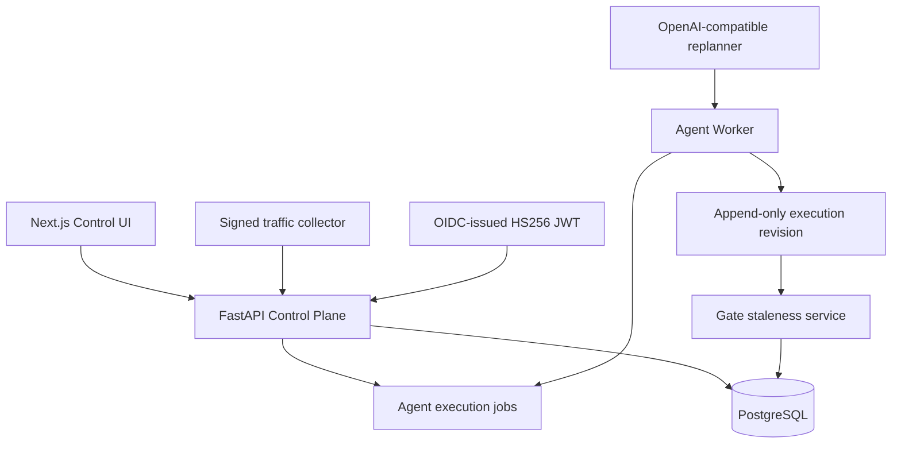

# Model Atlas Sprint 5D 구현 보고서

작성일: 2026-07-13  
범위: Agent Orchestration, Evidence Revision, Gate Staleness, Identity Boundary, Production Ingestion

## 1. 요약

Sprint 5D는 Sprint 5C에서 만든 영속적 Agent 승인 제어를 실제 운영 흐름에 가까운 비동기
오케스트레이션으로 확장했다. 핵심 변화는 기존 증거를 수정하지 않는 append-only 실행
리비전, PostgreSQL 기반 내구성 작업 큐, 증거 변경에 따른 Gate stale 처리, 검증된 JWT와
trusted proxy 경계, OpenAI 호환 live replan, 서명된 운영 트래픽 증거 수집이다.

이 결과 Model Atlas는 단순히 "어떤 로컬 모델이 하드웨어에서 실행 가능한가"를 추천하는
도구를 넘어 다음 질문에 답할 수 있다.

- 승인 이후 Agent 실행 증거가 어떻게 변경되었는가?
- 과거 Gate가 아직 현재 증거를 대표하는가?
- 재개와 운영 증거 수집이 HTTP 요청 종료 이후에도 안전하게 완료되는가?
- 누가 승인했고 그 identity assertion을 신뢰할 근거가 있는가?
- 외부 모델 재계획과 운영 트래픽 증거가 어떤 비용과 출처를 가졌는가?

## 2. 해결한 문제

5C는 checkpoint를 영속화했지만 운영 관점에서 다섯 가지 위험이 남아 있었다.

1. resume가 기존 result를 수정하면 승인 전후 증거를 독립적으로 감사하기 어렵다.
2. 동기 API 요청에 작업 수명이 묶이면 재시도와 장애 복구가 취약하다.
3. evidence가 바뀐 뒤에도 과거 Gate가 완료 상태로 남으면 잘못된 승인 근거가 된다.
4. trusted header만으로는 프록시를 우회한 identity spoofing을 충분히 차단하지 못한다.
5. fixture provider와 수동 import만으로는 production-shaped 통합을 검증하기 어렵다.

5D는 이 문제를 기존 EvalOps 소유 경계 안에서 해결했다. Worker는 실행만 담당하며 Gate나
Release Decision을 우회하지 않는다.

## 3. 핵심 설계 결정

| 영역 | 결정 | 효과 |
| --- | --- | --- |
| 실행 이력 | parent/root/revision 기반 child run/result 생성 | 원본 보존과 리비전 추적 |
| 비동기 처리 | DB job, dedupe, lease, retry, reconciliation | 요청 독립성과 장애 복구 |
| Gate | evidence revision hash, stale, superseded link | 오래된 승인 근거의 fail-closed 처리 |
| 인증 | bearer 우선, strict HS256 JWT, trusted CIDR | header spoofing 및 fallback 방지 |
| 재계획 | OpenAI-compatible 단일 호출, strict JSON | 공급자 교체 가능성과 비용 추적 |
| 운영 증거 | source별 HMAC batch와 원자적 import | 위변조·중복·부분 커밋 방지 |

## 4. 아키텍처



### 실행 리비전

resume는 parent record를 갱신하지 않는다. 새 `BenchmarkRun`, `BenchmarkResult`,
`InferenceMetric`을 생성하고 parent/root ID, revision number/reason, evidence hash를 기록한다.
checkpoint는 전환된 child run/result를 링크한다. Gate 집계는 root별 최신 result만 선택해
리비전 간 중복 합산을 막는다.

### 작업 큐

`agent_execution_jobs`는 resume, checkpoint/Gate reconciliation, traffic evidence import를
처리한다. unique dedupe key와 row lock을 사용하고 `queued`, `leased`, `running`, `completed`,
`failed`, `cancelled` 상태를 가진다. 기본 lease는 300초이며 만료 lease를 복구한다.
validation 오류는 즉시 실패하고 일시 오류는 제한된 backoff로 재시도한다.

### Gate stale

Gate evidence snapshot은 v8로 올라갔다. 현재 적용되는 root별 최신 evidence의 canonical
manifest로 `evidence_revision_hash`를 계산한다. 새 benchmark 완료, resume child, production
evidence import가 발생하면 같은 configuration/suite 범위의 Gate를 stale로 표시한다.
stale Gate는 Release Readiness에서 `BLOCKED`이며 baseline으로 승격할 수 없다. 새 Gate가
생성되면 이전 Gate에 superseding ID를 연결한다.

## 5. 보안 경계

### JWT

- 허용 알고리즘을 HS256으로 고정한다.
- `exp`를 필수로 하고 `nbf`, `iat`, leeway를 검증한다.
- 설정된 issuer와 audience를 검증한다.
- `kid` 기반 정적 key map과 configurable name/role claim을 지원한다.
- bearer가 존재하면 header identity로 fallback하지 않는다.
- 변조, 만료, 잘못된 issuer/audience token은 `401`이다.

이 구현은 OIDC provider가 발행한 JWT를 검증할 수 있는 정적-key 통합선이다. OIDC discovery,
JWKS 자동 회전, RS256/ES256 지원 자체를 구현한 것은 아니다.

### Trusted proxy

operator headers는 요청의 직접 client host가 `TRUSTED_PROXY_NETWORKS`의 exact host 또는
CIDR에 포함될 때만 인정된다. 신뢰되지 않은 client가 identity header를 보내면 익명 처리하지
않고 `401`로 거부한다.

### Traffic signature

운영 batch는 Pydantic으로 정규화한 canonical JSON에 HMAC-SHA256을 적용한다. secret은
환경 설정에만 존재하고 job에는 signature hash만 저장된다. source system, collector version,
event provenance가 모두 일치해야 한다.

## 6. Production Live Replan

새 provider는 OpenAI-compatible `/v1/chat/completions`를 사용한다. 호출은 한 번으로 제한되고
temperature 0, timeout 1~60초, max token 64~2048 경계를 가진다. 응답은 추가 설명 없이
`{"steps": [...]}` JSON이어야 하며 각 recovery step은 기존 allowlist, approval, tool, replan
budget 검사를 다시 통과한다.

trace에는 provider/model, prompt/completion token, latency, estimated cost, response hash가
기록된다. credential은 지정된 환경 변수에서 읽고 저장하지 않는다. semantic replay는 외부
provider를 다시 호출하지 않고 기록된 recovery step과 provenance를 사용한다.

## 7. UI/UX 변화

- checkpoint resume 버튼은 synchronous mutation 대신 job을 queue한다.
- UI는 job을 polling하고 상태 badge를 보여준다.
- 완료되면 child revision benchmark로 이동할 수 있다.
- benchmark detail은 revision과 parent run을 표시한다.
- Gate detail은 stale 이유와 재평가 동선을 표시한다.
- stale Gate의 baseline promotion은 비활성화된다.
- benchmark 실행 폼에서 disabled, mock fixture, OpenAI-compatible replan mode를 선택한다.

## 8. 주요 API

- `POST /api/v1/agents/checkpoints/{id}/resume-jobs`
- `POST /api/v1/agents/jobs/reconciliation`
- `GET /api/v1/agents/jobs`
- `GET /api/v1/agents/jobs/{id}`
- `POST /api/v1/agents/evidence/traffic-batches`
- 기존 synchronous resume와 production import API는 호환성을 위해 유지된다.

## 9. 데이터베이스 변경

Alembic `202607130002_agent_orchestration.py`는 다음을 추가한다.

- run/result parent, root, revision, evidence hash 필드;
- checkpoint transition run/result 링크;
- `agent_execution_jobs` 테이블과 조회/lease/dedupe index;
- Gate evidence hash, stale timestamp/reason, superseding Gate 링크;
- revision/status/attempt 관련 check constraint와 foreign key.

변경은 additive다. 기존 실행, Gate, Release Decision은 삭제하거나 덮어쓰지 않는다.

## 10. 검증 결과

최종 검증 기준:

```text
Backend pytest: 144 passed, 1 upstream deprecation warning
Backend container pytest: 144 passed, 1 upstream deprecation warning
Backend Ruff: passed
Frontend typecheck: passed
Frontend lint: passed
Frontend production build: passed
Frontend container lint: passed
Alembic head/static SQL generation: passed
Docker Compose build/configuration: passed
Docker db/backend/frontend/agent-worker: running; db/backend healthy
Docker migration 202607130002 and completed reconciliation jobs: verified
```

추가된 테스트는 append-only resume, stale Gate/readiness, lease 만료 복구, reconciliation,
JWT 변조/만료/proxy 경계, HMAC traffic queue/import/atomic rollback, OpenAI-compatible provider의
strict·metered·one-shot 동작을 다룬다.

## 11. 현재 한계

- worker는 PostgreSQL 기반 내구성을 제공하지만 Temporal/Celery 같은 분산 workflow engine은
  아니다.
- full OIDC discovery/JWKS rotation은 없다.
- traffic API는 Kafka나 실제 telemetry collector 배포를 포함하지 않는다.
- live provider transport가 production-shaped라는 사실과 해당 모델이 충분히 안전하다는
  평가는 별개다.
- memory write는 task-local simulation이고 production tool side effect는 없다.
- 과거 signed decision은 감사 기록으로 보존된다. stale 발생 시 외부 incident/notification
  시스템까지 자동 연동하지는 않는다.

## 12. 다음 권장 단계

Sprint 5E는 다음 순서가 적절하다.

1. OIDC discovery/JWKS RS256 key rotation과 실제 IdP 통합 테스트;
2. worker heartbeat/observability, dead-letter requeue, 운영 dashboard와 alert;
3. traffic collector reference implementation과 key rotation;
4. stale Gate에 연결된 release decision notification/revocation workflow;
5. production RAG/tool sandbox와 calibration dataset을 이용한 실제 품질 검증.

5D의 결과는 "모델 실행 가능성 추천"과 "운영 배포 승인" 사이에 필요한 증거 이력, 비동기
실행, stale 판단, identity 신뢰, 외부 provider provenance를 하나의 감사 가능한 흐름으로
연결했다는 데 의미가 있다.
