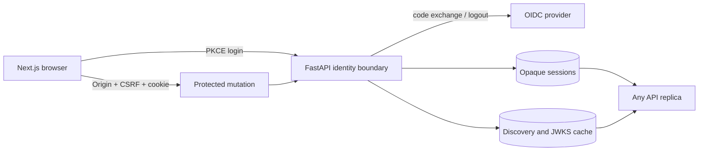

# Model Atlas Sprint 5H-C Implementation Report

Date: 2026-07-22

## Decision Summary

Sprint 5H-C replaces the browser's self-contained signed application session with a revocable,
PostgreSQL-backed opaque session. It adds an Origin-bound CSRF contract, RP-initiated OIDC logout,
strict rejection of forwarding headers from untrusted direct clients, and a horizontally shared
discovery/JWKS cache.

This closes the single-instance identity-state gap identified after Sprint 5H-B. It is an
operational hardening result, not a production identity certification. The live evidence uses the
repository's HTTP Keycloak development profile and test user.

## Problem Closed

The Sprint 5F browser flow correctly verified Authorization Code + PKCE, state, nonce, issuer,
audience, signature, and expiry. Four deployment gaps remained:

1. a signed session cookie could not be centrally revoked before expiry;
2. API replicas did not share browser sessions or provider-document cache state;
3. cookie-authenticated mutations had no explicit Origin and CSRF contract;
4. local logout did not terminate the provider SSO session.

Forwarding headers also needed an authentication-independent boundary so a bearer or browser
credential could not make spoofed proxy metadata acceptable.

## Implemented Scope

1. Opaque high-entropy browser session and CSRF tokens.
2. SHA-256-only storage of both browser secrets.
3. AES-GCM storage of the provider ID token required for logout.
4. Shared database session resolution and server-side revocation.
5. Exact Origin, cookie, header, and server-hash CSRF verification.
6. POST-only logout with local revocation before provider navigation.
7. OIDC `end_session_endpoint` discovery or explicit override.
8. Untrusted `Forwarded` and `X-Forwarded-*` rejection before identity selection.
9. Shared PostgreSQL discovery/JWKS cache with original-expiry preservation.
10. Unknown-key direct refresh without stale shared-cache reuse.
11. Sign-out loading state and automatic CSRF header attachment in the frontend.
12. Session/cache Prometheus metrics and Keycloak post-logout configuration.

## Architecture

The database is authoritative for browser session validity. Local verifier caches remain a
performance layer. Provider-document cache failures can fall back to a bounded provider fetch;
session-store failures fail closed because validity cannot be proven.

## Data And Migration

Alembic revision `202607220001` adds:

- `oidc_browser_sessions`;
- `oidc_cache_entries`;
- unique secret/audit hashes;
- subject, provider-session, expiry, last-seen, revocation, document-type, content-hash, and
  fetch/expiry indexes;
- expiry, revocation, type, and refresh-count constraints.

Stored browser-session fields include normalized identity, provider `sid`, authenticated/expiry
times, throttled last-seen time, revocation reason/time, and encrypted ID token. Raw session and
CSRF values are never inserted.

## API And UI Changes

| Surface | Sprint 5H-C behavior |
| --- | --- |
| `GET /browser-config` | Adds logout method, CSRF names, database store, and session expiry. |
| `GET /login` | Retains signed state/nonce/PKCE transaction. |
| `GET /callback` | Issues opaque session and CSRF cookies after ID-token verification. |
| `POST /logout` | Revokes the row, deletes cookies, and returns provider/local redirect JSON. |
| `GET /logout` | No state-changing handler; method is intentionally replaced. |
| Shell identity control | Uses a button with pending state and provider redirect handling. |
| Browser API helper | Adds configured CSRF header to unsafe methods. |

The application still supports bearer JWT and trusted-proxy identities. Existing release,
evidence, Gate, and model-validation contracts are unchanged.

## Security And Failure Semantics

- A stale, unknown, expired, or revoked opaque cookie returns `401`; it cannot downgrade to the
  permissive local identity.
- Browser mutations require an allowed Origin and equality across CSRF cookie, CSRF header, and
  server-side hash.
- Session revocation commits before a provider logout URL is returned.
- Provider logout failure cannot restore the local session.
- Provider ID-token decrypt failure after secret rotation degrades to local revocation rather
  than a server error.
- Return paths reject external URLs, scheme-relative paths, backslashes, and control characters.
- Provider URLs require HTTPS except under the explicit development override.
- Untrusted forwarding metadata is rejected before bearer, browser, or trusted-header selection.
- Shared cache readers inherit the original expiry rather than extending stale documents.
- Unknown signing keys force a provider refresh once and still fail if the key remains absent.

## Actual Docker And Keycloak Evidence

| Evidence | Result |
| --- | --- |
| Alembic | `202607220001 (head)` on PostgreSQL 16 |
| New tables | both session and cache tables present |
| Browser login | PKCE callback HTTP 302; `evaluator / ML Ops Lead` visible |
| Browser logout | CORS preflight 200; CSRF-protected POST 200 |
| Provider logout | Keycloak end-session navigation and frontend return succeeded |
| Session state after QA | active 0; revoked 2 |
| Secret storage | session and CSRF hash lengths 64 |
| ID-token storage | encrypted for both QA sessions |
| Shared cache | JWKS row persisted with source, content hash, expiry, and writer |
| Metrics | active/revoked session and fresh/stale cache gauges exported |

The first live logout exposed a missing Keycloak valid post-logout redirect. The realm definition
was corrected with `post.logout.redirect.uris=http://localhost:3000/*`, the current realm was
updated, and the complete login/logout flow was rerun successfully. This is valuable integration
evidence: the test caught an IdP contract omission rather than stopping at unit-level URL
generation.

## Verification

- Backend full host suite: `170 passed, 1 warning`.
- Backend Ruff: passed after final import/order checks.
- Frontend TypeScript: passed.
- Frontend ESLint: passed.
- Next.js production build: passed.
- Docker Compose config and backend/frontend image build: passed.
- PostgreSQL migration and schema inspection: passed.
- Live Keycloak discovery, PKCE login, role mapping, server session creation, POST logout,
  revocation, provider logout, and frontend return: passed.
- Desktop `1440 x 900` QA: passed.
- Mobile `390 x 844` page and navigation/auth control QA: passed.
- Final browser console: zero errors.

The warning is the existing upstream Starlette TestClient deprecation warning.

## Compatibility Decisions

- The database migration is additive.
- Bearer JWT, HS256 compatibility, RS256, trusted headers, and local mode remain.
- The legacy `BrowserSessionCodec` remains for direct compatibility tests, but the application
  runtime uses the database store.
- Browser status response changes are additive.
- Logout keeps the path but intentionally changes the state-changing method from GET to POST.
- Evidence, Gate, release, and model-validation schemas are untouched.

## Deliberate Non-Claims

- The bundled HTTP Keycloak realm and static test credentials are not production identity.
- This sprint does not implement provider back-channel logout or subject-wide administrator
  revocation.
- It does not provide a session-management UI, scheduled expired-row purge, or secret-rotation
  migration.
- PostgreSQL sharing proves replica consistency, not a measured multi-region availability SLO.
- No penetration test, external IdP certification, WAF policy, or production ingress validation
  was performed.
- Trust-source synchronization remains operator-triggered.
- Model evidence remains outside production readiness and release authorization.

## Recommended Next Work

1. Scheduled trust-source synchronization with a PostgreSQL lease, jitter, retry, and receipts.
2. Session retention cleanup plus subject/provider-session revocation operations.
3. Staging IdP over TLS with narrow ingress CIDRs and tested secret rotation.
4. Durable SLO retention, owned paging delivery, and authentication availability dashboards.
5. Target 7B GPU evidence and reviewed signed production capture.
6. Per-job OS or Kubernetes isolation with enforced egress and resource policy.

## References

- [Keycloak Server Administration Guide](https://www.keycloak.org/docs/latest/server_admin/)
- [OpenID Connect RP-Initiated Logout 1.0](https://openid.net/specs/openid-connect-rpinitiated-1_0.html)
