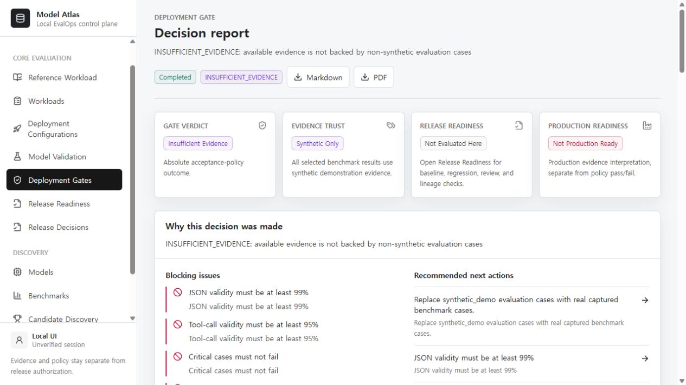
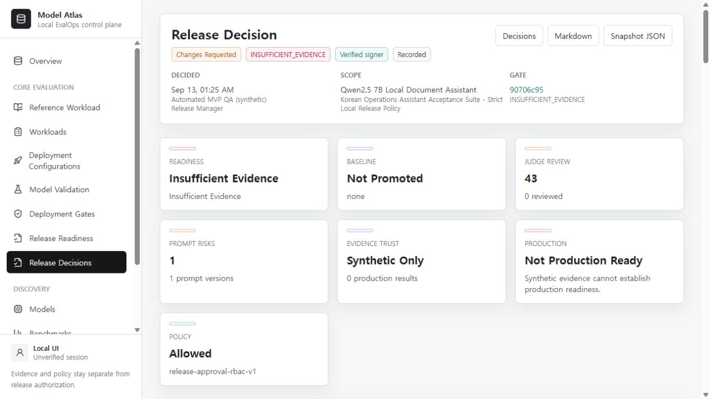

# Model Atlas MVP 기술 마감·외부 검토 준비 보고서

기준일: 2026-09-13. 범위: [MVP 완료 계약](../../MVP_SCOPE_KO.md).
처음 읽는 평가자는 [평가·사용·기술 안내](../../MVP_REVIEW_GUIDE_KO.md)부터 시작한다.

## 결론

평가 제출용 핵심 파이프라인을 별도 DB에서 재현하고 제출 경로를 정리했다.
새 모델 개발이나 추가 RAG 튜닝이 아니라, **동작하는 EvalOps MVP의 기능·추적성 검토 준비**다.
원래 실제 모델 평가는 BLOCKED로 유지하며 외부 사용 검토는 `external_review_pending`이다.

## 이번 변경

1. `MVP_SCOPE_KO.md`에 완료 기준 M1-M8과 중단 범위를 고정했다.
2. `deploy/mvp-review.compose.yml`에 별도 PostgreSQL과 localhost 13000/18010 평가 환경을 추가했다.
   기존 서비스·DB와 분리하며 자동 migration, health 의존성, 서버용 내부 API 주소를 지정했다.
3. `tools/verify_mvp_review.py`에 합성 실행·원문·지표·로그·preflight·Gate·변경 요청·export 검증을 추가했다.
   기존 기본 API 포트 및 외부 주소를 거부하고, 결과를 자동 QA로 명시한다.
4. 릴리스 상세에서 좁은 6열 배치와 raw enum 표시 때문에 상태명이 잘리는 문제를 수정했다.
   기존 `statusLabel`을 재사용하고 열 수를 줄였다. 공통 SummaryCard의 긴 설명도 줄바꿈한다.
5. 압축 스크립트의 Sprint 5H-H 이름과 고정된 186개 테스트 통과 주장을 제거했다.
   현재 검증 receipt를 hash로 연결하고 ONNX 등 가중치·개인 환경·캐시를 제외한다.
   실제 파일을 열어 확인하므로 포함되지 않은 가중치를 포함했다고 주장하지 않는다.
6. `tools/verify_mvp_package.py`와 9개 단위 테스트로 경로, 금지 파일, manifest, 변조 검출을 확인한다.
   ZIP 검증 후 새 디렉터리에 압축을 풀고 추출 파일 해시도 다시 검사한다.
7. 현재 평가 문서를 별도로 만들고 README와 제출 입구를 갱신했다.
   기존 corpus 원문 문서와 과거 연구 보고서는 승인 hash 보존을 위해 그대로 둔다.

## 확인 결과

| 기준 | 실제 확인 | 근거 |
| --- | --- | --- |
| M1 새 설치 | 별도 프로젝트·volume 생성, 두 seed 성공, migration `202609100002` head | 새 Compose와 Docker 실행 |
| M2 핵심 API | 33개 HTTP/불변조건 확인 통과, mock 3건, 변경 요청·snapshot·diff·보고서 조회 | `api-smoke.json` |
| M3 신뢰 분리 | synthetic_demo, INSUFFICIENT_EVIDENCE, not_production_ready, 실제 승인 0건 | API 및 화면 |
| M4 UI | Overview → 실행 → Gate → Readiness → 릴리스 상세 탐색, 실제 버튼 실행 | `ui-smoke.json`, 화면 캡처 |
| M5 회귀 | backend 901 passed, frontend 29 passed, helper 9 passed, 타입·Ruff·lint·빌드 성공 | JUnit 및 실행 결과 |
| M6 문서 | 목적·차별점·페르소나·설치·10분 시연·구조·한계·다음 검토 기준 | 현재 평가 안내 |
| M7 ZIP | 빌더 전체 manifest 검사 + 별도 검증기의 압축 해제 후 재검사 | ZIP에 동봉된 manifest, ZIP 옆 검증 receipt |
| M8 보존 | 공식 상태 불변, 보호 source 변경/추가/삭제 0, 승인 1.0.5 hash 유지 | before/after snapshot |

M7의 최종 ZIP 이름·해시·추출 검증 결과는 ZIP 옆 `.verification.json`을 따른다.
보고서 내부에 자신의 최종 ZIP 해시를 넣는 순환 참조는 만들지 않는다.
제공물은 소스 패키지이며 새 DB는 기존 실제 관측 384건의 복원본이 아니다.

## UI 검증 범위

데스크톱 핵심 흐름을 브라우저에서 실행했다. mock 실행 완료 후 결과 3, 지표 3, 로그 5를 확인했고,
Gate의 출처·사람 검토 부족 경고와 `INSUFFICIENT_EVIDENCE`를 확인했다.
새 결과 추가 후 이전 Gate가 stale이 되고 frozen snapshot과 현재 상태의 차이가 표시되는 것도 확인했다.
변경 요청은 `Automated MVP QA (synthetic)`, `MVP-AUTOMATED-QA`이며 실제 사람 서명이 아니다.

릴리스 상세 수정 후 데스크톱과 390×844 모바일 viewport에서 7개 요약 칸의 자식 텍스트 overflow가
없음을 측정했다. 모바일 문서 clientWidth/scrollWidth는 스크롤바를 제외한 375/375px다.
관측한 콘솔 오류·경고는 0건이다. 전체 앱의 모든 모바일 화면이나 접근성 전수 검사를 뜻하지 않는다.

모바일 화면은 `artifacts/mvp-closeout/2026-09-13/release-mobile.jpg`에 있다.

## 경고와 남은 한계

- backend 테스트에는 FastAPI/Starlette 테스트 클라이언트와 AnyIO 관련 deprecation 경고 2건이 있다.
- frontend lint는 오류 0, 기존 내부 페이지 이동 방식 관련 경고 4건이다.
  AgentApprovalControlPanel, JudgeLabelImportForm, ModelValidationConsole, ReleaseDecisionForm에 해당한다.
- frontend test 실행에는 Node type-stripping/module-type 관련 경고가 있다. 테스트 실패는 아니다.
- 최초 빌드는 네트워크가 필요하고 backend 의존성·Docker base tag의 완전 고정은 아직 아니다.
  이 설치 검증은 같은 Windows/Docker 호스트의 새 DB에서 수행했으며 타인 PC 설치 검증은 아니다.
- API 장애가 일부 화면에서 빈 결과로 표시될 수 있다. 연결 장애 UX는 알려진 후속 개선점이다.
- 영문 중심 UI와 일부 과거 Sprint 표시는 남아 있다. 운영 보안 감사나 인증 체계를 검증한 것은 아니다.
- optional 운영·IdP·paging·외부 모델 프로필의 전수 재검증은 이번 범위가 아니다.

## 실제 모델 평가와 연구 중단

공식 상태는 BLOCKED, critical failure 관측 110건, actual runtime 결과 384건,
목표 출력 사람 검토 0/30, `not_production_ready`로 유지했다.
이는 프로그램 테스트 통과와 무관하며, source case 64/64 승인도 출력 정확성을 보장하지 않는다.

보호 비교 hash:
`0a40188886cfb4201514ca627f29443e175500464eded3cf992d84a8ecfc427b`

보호 레코드 hash:
`22bea914a370b2420d320dd1381b0ffd694e410ddbaf8c934e128d1cab635fbc`

1.0.5 cases SHA-256:
`a48e25cbd07f6ee712e6f0188e2e9ed463224d706e77d237e8fb853b4b96b1fd`

논문 기반 비교에서 Cross-Encoder는 일반 8/22·critical 2/5, MMR은 6/22·1/5였다.
둘 다 사전 기준을 충족하지 못했다. 동일 데이터 반복 결과를 독립 holdout으로 포장하지 않았고
재학습·추가 가중치 탐색·공식 모델 교체는 하지 않았다. 상세는 2026-09-12 연구 보고서를 따른다.

## 다음 확인과 종료 조건

외부 평가자 1명에게 현재 ZIP과 `MVP_REVIEW_GUIDE_KO.md`를 전달한다.
설치, mock 3건 실행, 실패 근거 추적, 합성/실제/운영 준비도의 구분을 확인받는다.
막힌 단계·오류 문구·혼동한 상태를 기록하고 **시연 차단 문제만** 보완한다.
외부 검토가 끝나기 전에는 사용자 검증 완료라고 표기하지 않는다.
새 모델·데이터·GPU 투자와 운영 배포는 독립된 목표·비용·성공 기준으로 다시 결정한다.
