# Runtime Reliability Pack

Sprint 4D adds repeated-trial runtime evidence to the existing benchmark, Deployment Gate, release,
and audit flow. It answers a question that one successful inference cannot answer:

> Does this concrete runtime configuration remain successful, bounded, and stable across repeated
> trials, concurrency, high-context inputs, timeout conditions, and memory pressure?

## Scope

The pack implements:

- 1 to 20 trials per active evaluation case;
- bounded in-process concurrency from 1 to 16 workers;
- a 100 to 300,000 ms case timeout contract;
- separate `success`, `timeout`, `oom`, and `error` trial states;
- P50, P95, and P99 latency plus P50/P95 TTFT;
- mean throughput and mean per-case latency coefficient of variation;
- declared-versus-observed trial coverage;
- explicit high-context trial success;
- two-run runtime comparison;
- seven reliability-specific Deployment Gate metrics and rules.

## Execution Contract

`POST /api/v1/benchmark-executions` accepts four additive fields:

| Field | Default | Bounds | Meaning |
| --- | ---: | ---: | --- |
| `reliability_mode` | `false` | boolean | Enables failure capture and reliability traces. |
| `trials_per_case` | `1` | 1-20 | Repeats every selected active case. |
| `concurrency` | `1` | 1-16 | Maximum simultaneous adapter workers. |
| `case_timeout_ms` | `120000` | 100-300000 | Adapter timeout and trace threshold. |

`trials_per_case > 1` or `concurrency > 1` requires `reliability_mode=true`. Standard mode keeps the
previous one-case/one-result behavior.

Repeated samples use `<external_case_id>::trial-XX`. IDs are trimmed before the suffix when needed
to preserve the existing 120-character database limit.

## Execution Flow

```mermaid
flowchart LR
    A["Load immutable configuration and active cases"] --> B["Prepare RAG context on DB thread"]
    B --> C["Build detached adapter snapshots"]
    C --> D["Execute bounded worker pool"]
    D --> E["Capture success, timeout, OOM, or error"]
    E --> F["Attach RAG and tool traces"]
    F --> G["Score result"]
    G --> H["Attach reliability trial trace"]
    H --> I["Persist result, metric, and log"]
    I --> J["Summarize run and evaluate Gate"]
```



SQLAlchemy entities are never passed to worker threads. The orchestrator deep-copies adapter input,
reference context, generation settings, runtime settings, and model artifact identity into frozen
snapshots. Database writes and domain scoring remain on the request thread.

## Trial Status

Status precedence is deterministic:

1. `oom` when the metric reports OOM or `error_type` identifies out-of-memory;
2. `timeout` when `error_type` identifies timeout or observed latency exceeds the contract;
3. `error` for any other adapter error;
4. `success` otherwise.

Reliability mode converts per-case adapter exceptions into persisted failed trial evidence. Standard
mode preserves the previous fail-the-run behavior.

The OpenAI-compatible adapter passes `case_timeout_ms` to `urlopen`. A Python thread cannot safely
terminate arbitrary third-party code that ignores cancellation, so wall-clock interruption depends
on the adapter honoring its timeout. The bundled HTTP adapter and deterministic mock do so; a future
adapter must document equivalent behavior.

## Trace Contract

Every trial stores `runtime_reliability` in `BenchmarkResult.metadata_json` with schema version
`runtime-reliability-trace-v1`. The trace includes:

- benchmark run, external case, trial index/count, seed, and concurrency;
- timeout contract, status, success, and within-timeout flag;
- TTFT, end-to-end latency, throughput, prompt tokens, and completion tokens;
- GPU VRAM, peak memory, OOM flag, error type, and error message;
- context tokens, configured context window, utilization ratio, and stress flag.

Run summaries use `runtime-reliability-summary-v1`. Empty standard runs receive an additive empty
summary and no traces.

## Aggregate Metrics

| Gate metric | Calculation | Direction |
| --- | --- | --- |
| `reliability_success_rate` | successful trials / observed trials | higher |
| `reliability_timeout_rate` | timeout trials / observed trials | lower |
| `reliability_oom_rate` | OOM trials / observed trials | lower |
| `p99_end_to_end_latency_ms` | nearest-rank P99 over observed trials | lower |
| `latency_variation_coefficient` | mean per-case population SD / mean latency | lower |
| `trial_coverage_rate` | unique observed trials / declared trials | higher |
| `context_stress_success_rate` | successful stress trials / stress trials | higher |

Per-case variation is calculated before averaging so different workload sizes are not mislabeled as
runtime instability. Trial coverage is grouped by benchmark run and case, preventing multiple runs
in one Gate evidence bundle from inflating coverage.

## Runtime Comparison

`GET /api/v1/runtime-reliability/compare` accepts `left_run_id` and `right_run_id`. Runs must use the
same evaluation suite. The response returns each canonical summary, `right_minus_left` deltas, and a
winner selected in this order:

1. higher success rate;
2. lower timeout rate;
3. lower OOM rate;
4. lower P99 latency;
5. lower latency variation;
6. higher mean throughput.

If either run has no reliability trace, the result is `insufficient_evidence`. Exact equality is a
`tie`. The comparison is advisory; release authority remains with the Deployment Gate.

## Reproducible Pack

```bash
make seed
make seed-reliability
```

The seed creates:

- six locally authored cases and 30 expected trials at five trials per case;
- two high-context cases and ten expected stress trials;
- Runtime A with latency multiplier `1.0`;
- Runtime B with latency multiplier `1.25`;
- a seven-rule Runtime Reliability Policy.

Use **Reliability** mode, five trials, concurrency four, and a 2,000 ms timeout. The deterministic
success path is `APPROVED`. Injecting `timeout_trials` or `oom_trials` into a case fixture produces a
persisted failed trace and a `BLOCKED` Gate.

## APIs And UI

- `POST /api/v1/benchmark-executions`
- `GET /api/v1/benchmark-executions/{benchmark_run_id}`
- `GET /api/v1/runtime-reliability/compare`
- `/benchmark-executions/new`
- `/benchmark-executions/{benchmark_run_id}`
- `/runtime-reliability`

The execution detail presents trials in a scan-oriented table. Gate critical outcomes link back to
the originating reliability trace.

## Known Boundaries

- The bundled pack is deterministic `local_authored` evidence, not production traffic evidence.
- Mock latency and failure profiles validate orchestration and policy behavior, not hardware limits.
- Real context tokens depend on adapter usage reporting; seeded context pressure is declared fixture
  metadata.
- Memory evidence is only as accurate as the adapter/runtime telemetry supplied.
- Bounded concurrency is an in-process executor, not an arrival-rate load generator or distributed
  saturation test.
- No worker process termination, queue, autoscaling, GPU sampler, or production alerting is included.
