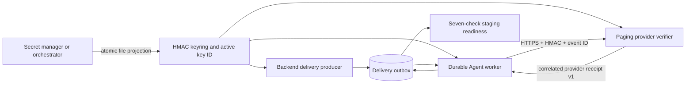

# Staging Paging Qualification

Updated: 2026-08-04, Sprint 5H-H

## Purpose

Sprint 5H-H closes the gap between a locally signed webhook demonstration and a staging-ready
paging contract. It is designed to answer four questions before an external on-call provider is
trusted:

1. Are signing credentials loaded from a runtime projection instead of copied into Compose or
   process environment configuration?
2. Can the active key rotate without restarting the sender or invalidating already queued work?
3. Does a successful HTTP response prove provider acceptance for the exact durable delivery?
4. Can an operator reproduce outage, dead-letter, requeue, and recovery behavior?

This qualification does not claim that the bundled sink is a production on-call provider. It
proves the integration boundary and provides executable checks for a real staging deployment.

## Runtime Flow



The sender reloads the projected keyring for every delivery. A delivery stores the key ID chosen
when it is queued, so a queued delivery can still use a retained key after the active key changes.
The receiver also reloads its projected keyring for every request. A temporary key or CA
projection outage remains retryable and does not permanently invalidate the delivery.

## Projected Secret Contract

The production-style settings are:

```dotenv
OPERATIONAL_PAGING_HMAC_KEYS_FILE=/var/run/secrets/model-atlas/paging-hmac-keys.json
OPERATIONAL_PAGING_ACTIVE_KEY_ID_FILE=/var/run/secrets/model-atlas/paging-active-key-id
OPERATIONAL_PAGING_CA_BUNDLE_PATH=/var/run/secrets/model-atlas/paging-ca.crt
OPERATIONAL_PAGING_PROVIDER=staging-paging-provider
OPERATIONAL_PAGING_REQUIRE_RECEIPT=true
OPERATIONAL_PAGING_RECEIPT_MAX_AGE_SECONDS=86400
```

`paging-hmac-keys.json` is a bounded UTF-8 JSON object whose keys and values are nonempty strings.
Blank entries and duplicate IDs after whitespace normalization fail closed. Every signing secret
must contain at least 32 characters. `paging-active-key-id` contains the single active ID and that
ID must exist in the keyring. Runtime projections should be readable by the application identity
only and replaced atomically by the external secret manager or orchestrator. If the receiver sees
an unreadable, malformed, or short-key projection during replacement, it returns HTTP 503 so the
durable sender retries instead of treating the request as accepted.

Environment keyrings and the legacy single secret remain backward-compatible, but the staging
readiness contract passes only for projected files with one active and at least one retained key.

## Rolling Rotation Procedure

1. Add the next key to the projected keyring while retaining the current active key.
2. Atomically replace the keyring file.
3. Atomically replace `paging-active-key-id` with the next key ID.
4. Send a test page and verify that the persisted delivery uses the new key ID.
5. Keep the previous key until all deliveries pinned to it have completed or expired.
6. Remove the retiring key in a later maintenance window and repeat qualification.

The local fixture exercises the same semantics without printing key material:

```powershell
make paging-key-rotate KEY_ID=2026-08-04-rotated
```

The initializer writes random secrets to the runtime-only `paging-secrets` volume with restrictive
file permissions. It reports only key IDs and key counts.

## Provider Receipt Contract

When `OPERATIONAL_PAGING_REQUIRE_RECEIPT=true`, HTTP 2xx alone is not delivery success. The response
must be a bounded JSON object with this shape:

```json
{
  "schema_version": "model-atlas-paging-provider-receipt-v1",
  "accepted": true,
  "provider": "staging-paging-provider",
  "provider_event_id": "<operational_alert_delivery UUID>",
  "receipt_id": "<provider-owned printable identifier>",
  "accepted_at": "2026-08-04T12:00:00Z"
}
```

The provider name must equal the configured provider, `provider_event_id` must equal the exact
delivery UUID, and `accepted_at` must be timezone-aware, recent, and not more than five minutes in
the future. The schema ID, acceptance flag, provider receipt ID, and bounded printable identifiers
are mandatory. An invalid or uncorrelated 2xx response is retryable and is never stored as a
successful delivery.

Successful correlation persists `provider_name`, `provider_event_id`, `provider_receipt_id`, and
`provider_accepted_at` on `operational_alert_deliveries`.

## Readiness Gate

`GET /api/v1/operations/reliability` returns
`model-atlas-operational-reliability-v3` and a `staging_readiness` object. Readiness requires all
seven checks:

| Check | Passing condition |
| --- | --- |
| `paging_enabled` | Durable paging is enabled |
| `secure_destination` | The destination is allowlisted HTTPS |
| `ca_verification` | System trust or a readable projected CA verifies TLS |
| `projected_keyring` | A valid projected keyring is active |
| `rolling_key_rotation` | At least two keys and a valid active ID exist |
| `provider_receipt_contract` | Strict correlated receipts are enabled |
| `recent_provider_receipt` | A recent end-to-end provider receipt is persisted |

Before the first test page, the final check is expected to fail. The verifier creates that evidence
and exits nonzero unless every check passes:

```powershell
.\.venv\Scripts\python.exe tools\verify_operational_staging.py
```

## Local Qualification Runbook

Start the complete profile, including the trust-source dependency that contributes to operational
health:

```powershell
make observability-up
```

Run the staging verifier, rotate keys without restarting the sender, and run the controlled outage
drill:

```powershell
make operational-staging-verify
make paging-key-rotate KEY_ID=2026-08-04-rotated
make operational-staging-verify
make operational-failure-drill
```

The failure drill stops the receiver, waits for the delivery job to exhaust its bounded attempts,
restarts the receiver in a `finally` block, performs a verified SRE requeue, and requires the same
job to complete with a correlated receipt. It then queues an operational capture and waits until
the transient failure incidents reconcile. Its JSON result records outage observation, recovery,
reconciliation job, health, open incidents, dead-letter count, staging readiness, job ID, and
latest receipt delivery ID.

## Qualification Evidence - 2026-08-04

- The missing trust-source fixture was restored and 26 historical failed sync jobs were requeued
  through the authenticated API. Three open operational incidents resolved and health returned to
  `healthy`.
- Database migration head reached `202608040001`.
- Backend tests passed: 186 tests, with one upstream Starlette TestClient warning.
- Both Agent workers, backend, frontend, PostgreSQL, paging sink, trust-source fixture, Prometheus,
  Alertmanager, and alert sink were running; initializer services exited successfully.
- The verifier passed 7 of 7 readiness checks with zero open incidents.
- A live no-restart rotation selected `2026-08-04-rotated`; the next delivery persisted that key ID
  and a matching provider event and receipt.
- A controlled sink outage reached dead letter, the audited requeue recovered the same job, and a
  final capture reconciled transient incidents. Health returned to `healthy`, open incidents and
  dead-letter count returned to zero, and readiness remained true.
- Desktop and 390 x 844 mobile Operations QA had no document-level overflow or console errors.

## External Staging Acceptance Checklist

- Replace the Docker secret initializer with Vault, cloud secret manager, Kubernetes Secrets Store
  CSI, or an equivalent managed projection.
- Replace the generated local CA with the organization's managed PKI or system trust chain.
- Configure a provider adapter that returns the v1 correlated receipt contract.
- Limit sender and receiver access to the minimum key material they require.
- Confirm atomic projection behavior and filesystem permissions in the target runtime.
- Run the verifier before and after rotation.
- Run the failure drill in an approved staging window and retain its JSON output with deployment
  evidence.
- Confirm provider-side event search using both `provider_event_id` and `receipt_id`.
- Define alert ownership, acknowledgement propagation, retention, and key-removal windows.

## Explicit Boundaries

The bundled `paging-sink` is an in-memory, single-process verifier. The Docker CA and runtime secret
volume are development fixtures. Sprint 5H-H does not connect Vault or a cloud secret manager, a
commercial paging service, production PKI, multi-region delivery, or provider-side acknowledgement
callbacks. Those integrations require target-environment credentials and are the next external
staging task, not evidence already claimed by this repository.
