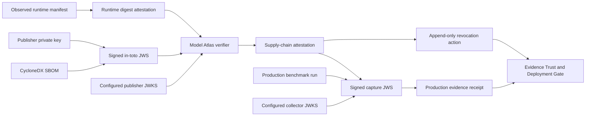

# Signed Supply-Chain And Production Evidence

Updated: 2026-07-20, Sprint 5H-A

## Purpose

Sprint 5F proved which digest a local Ollama server exposed. Sprint 5G adds a separate trust layer
for who signed the artifact provenance, which SBOM was signed, whether that statement was revoked,
and whether a production-labeled benchmark run came from a trusted capture source.

These are separate claims:

- runtime attestation: the Model Atlas server observed a model digest;
- supply-chain attestation: a configured publisher key signed that digest and SBOM;
- production receipt: a configured collector key signed the run identity, counts, capture window,
  artifact digest, and active attestation chain;
- release decision: an authorized operator approved or rejected a frozen readiness snapshot.

None of these records automatically authorizes a release.

## Trust Flow



## Signature Verification

`backend/app/services/signed_evidence.py` verifies compact JWS input against an operator-configured
JWKS file. Verification fails closed unless all of the following hold:

- a trust-store path, allowed issuer list, and allowed algorithm list are configured;
- `kid` resolves to exactly one signing JWK;
- JWK use and algorithm match the JWS header;
- the cryptographic signature is valid;
- `iss`, `iat`, and `jti` exist and satisfy issuer and age policy;
- `jti` has not been reused with different content.

The default reference profile allows `RS256`. The schema can represent `ES256` and `EdDSA`, but an
algorithm is accepted only when explicitly listed in configuration.

## Model Supply-Chain Statement

The signed payload uses `_type=https://in-toto.io/Statement/v1` and
`predicateType=https://model-atlas.dev/attestations/model-supply-chain/v1`.

Model Atlas verifies:

- one subject with a SHA-256 digest matching the runtime attestation;
- `artifact_attestation_hash` and `runtime_manifest_hash` matching stored evidence;
- a CycloneDX 1.4, 1.5, or 1.6 JSON SBOM with at least one component;
- the canonical SBOM SHA-256 hash matching the signed predicate;
- a verified maintenance operator recording the result.

The original compact JWS and SBOM are stored. API reads omit the compact JWS while exposing the
verified claims, key fingerprint, SBOM digest, and attestation hash.

## Revocation

Revocation never edits or deletes the signed attestation. A verified maintenance operator other
than the original Model Atlas verifier creates one append-only `revoked` action with a reason,
optional ticket, actor identity, timestamp, and action hash.

Any production receipt linked to a revoked supply-chain attestation stops contributing to verified
production trust. Historical evidence remains auditable.

## Production Capture Receipt

A production receipt JWS binds:

- benchmark run and deployment configuration IDs;
- runtime and supply-chain attestation IDs and hashes;
- artifact SHA-256 digest;
- capture start/end timestamps and source environment;
- exact stored result and metric counts.

The referenced run must already be completed and marked `production_captured`; every result in the
run must carry the same provenance. A label without an active signed receipt is classified as
`production_captured_unverified` and cannot satisfy production evidence thresholds.

## API

All routes below use `/api/v1`.

| Method | Route | Purpose |
| --- | --- | --- |
| `GET` | `/supply-chain/overview` | Trust configuration and evidence counts. |
| `GET` | `/supply-chain/model-attestations` | List effective signed attestation status. |
| `POST` | `/supply-chain/model-attestations` | Verify JWS, digest, manifest, and SBOM. |
| `POST` | `/supply-chain/model-attestations/{id}/revocations` | Append a separated revocation. |
| `GET` | `/supply-chain/production-receipts` | List verified capture receipts. |
| `POST` | `/supply-chain/production-receipts` | Verify and bind a production capture. |

## Configuration

```text
MODEL_PUBLISHER_JWKS_PATH=/artifacts/supply-chain/publisher-jwks.json
MODEL_PUBLISHER_ALLOWED_ISSUERS=model-atlas-demo-publisher
MODEL_PUBLISHER_ALLOWED_ALGORITHMS=RS256
PRODUCTION_EVIDENCE_JWKS_PATH=/artifacts/supply-chain/publisher-jwks.json
PRODUCTION_EVIDENCE_ALLOWED_ISSUERS=model-atlas-demo-collector
PRODUCTION_EVIDENCE_ALLOWED_ALGORITHMS=RS256
SIGNED_EVIDENCE_MAX_AGE_SECONDS=2592000
```

`python -m app.validation.supply_chain_bundle` generates development-only publisher or production
request bundles. Its private key remains under the git-ignored `artifacts/supply-chain` directory.
Sprint 5H-A preserves this path as a development fallback. Managed production trust is resolved
from the database registry documented in `trust_registry_transparency.md`.

## Verified Local Evidence

- Runtime attestation: `ffb3c1bb-4ac1-49bc-a50f-940d28ce6c47`.
- Supply-chain attestation: `4b8c6826-04e1-4d06-872f-90be73e5dda4`.
- Subject: `qwen2.5:0.5b` at digest
  `sha256:a8b0c51577010a279d933d14c2a8ab4b268079d44c5c8830c0a93900f1827c67`.
- SBOM: CycloneDX 1.6, digest
  `1b0317ce490d00add3b378827abfd8559b77df305b68b42bf49d2ada6047c20a`.
- Signature: RS256 with key ID `model-atlas-demo-2026`.
- Managed publisher root: `dfcd3aef-1d73-4aa3-8963-52e24fc09863`, development tier.
- Transparency proof: `a16fc052-27e5-42b4-b875-1126d7e7bec1`, signature and Merkle path valid,
  development tier.
- Production receipts: zero, because the verified Sprint 5F run is local-authored rather than a
  production capture.

## Limitations

- The bundled signer is a development key, not an independent model publisher or certificate
  authority.
- The local signed checkpoint is a development proof, not an independent transparency log. There
  is no timestamp authority, OCI registry integration, or online key revocation feed.
- SBOM validation checks the signed contract and required CycloneDX shape; it is not a complete
  CycloneDX semantic or vulnerability scan.
- Production receipts authenticate configured sources but do not prove that the source environment
  itself was uncompromised.
- Actual 7B GPU evidence, external publisher signatures, and production traffic remain future work.

## Sprint 5H-A Managed Trust

Static JWKS signatures remain visible but cannot establish production eligibility. A production
chain now requires active `internal_ca` or `external` roots for the publisher, transparency log,
and collector. Key rotation, retirement, expiry, or revocation is evaluated dynamically and can
remove historical receipts from trusted production counts without deleting source evidence.

See [Trust Registry And Transparency Evidence](trust_registry_transparency.md) for the complete
contract and verified local state.
