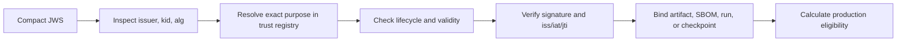

# Trust Registry And Transparency Evidence

Updated: 2026-07-21, Sprint 5H-B

## Purpose

Sprint 5G verified compact JWS evidence against configured local JWKS files. That established
cryptographic integrity, but a file alone could not answer whether a key was externally governed,
when it became valid, whether it had been rotated or revoked, or whether an attestation was
published to an independently verifiable log.

Sprint 5H-A adds a managed trust plane without promoting local evidence to production proof. It
separates four questions:

1. Is the signature mathematically valid?
2. Is the signing key registered for this exact purpose, issuer, algorithm, and key ID?
3. Is that key active at verification time and governed at an acceptable trust tier?
4. Does the supply-chain statement have a signed, Merkle-verifiable transparency inclusion proof?

Only a positive answer to all applicable questions can contribute to production evidence.

## Threat Model

The controls address:

- replacing a JWKS file with an ungoverned key;
- reusing a valid key for a different purpose;
- continuing to trust a retired, expired, or revoked key;
- registering private key material in the control plane;
- rewriting key lifecycle history;
- self-revoking a key without separation of duties;
- claiming log inclusion with a signed checkpoint but no valid Merkle path;
- replaying a proof ID with different content;
- treating development signatures as external publisher or production collector evidence.

The controls do not claim that the bundled development key is externally endorsed or that the
local one-leaf log is an independent public transparency service.

Sprint 5H-B additionally addresses stale copied keys, partial remote imports, unbounded/redirected
fetches, and missing source-to-root lineage. It does not claim that a configured endpoint proves
publisher identity or key custody.

## Trust Tiers

| Tier | Intended source | Cryptographically verified | Production eligible |
| --- | --- | ---: | ---: |
| `development` | Local test key | Yes | No |
| `internal_ca` | Organization-controlled CA or workload identity | Yes | Yes, while active |
| `external` | Publisher registry or transparency service | Yes | Yes, while active |

Production eligibility is never inferred from a source label. It requires a persisted trust root
whose public JWK, lifecycle, purpose, and tier were validated by the service.

## Trust Root Contract

`evidence_trust_roots` stores public key material and immutable registration metadata:

- purpose: `model_publisher`, `production_collector`, or `transparency_log`;
- issuer, key ID, and algorithm;
- canonical public JWK fingerprint;
- trust tier and source type;
- validity interval;
- optional predecessor for rotation;
- verified registrar identity and registration hash.

Private RSA, EC, OKP, or symmetric key fields are rejected. The registry supports `RS256`, `ES256`,
and `EdDSA` public signing keys.

The effective state is derived rather than overwritten:

```text
scheduled -> active -> rotated|retired
                   -> revoked
active    -> expired when valid_until is reached
retired   -> revoked when compromise is discovered later
```

Lifecycle events are append-only rows in `evidence_trust_root_actions`. Registering a replacement
with `supersedes_trust_root_id` atomically records a `rotated` event on the predecessor. Revocation
must be performed by a verified governance operator other than the original registrar.

## Signed Evidence Resolution

The verifier first inspects the untrusted JWS header and issuer only to locate a candidate key. It
then verifies the signature and required claims with that exact public JWK.



If an issuer/key pair is registered for a different purpose, verification fails rather than
falling back to a static JWKS file. Static configured JWKS remains available only for legacy local
evidence and is recorded at the `development` tier.

## Transparency Contract

A transparency request contains:

- a supply-chain attestation ID;
- a compact JWS checkpoint signed by a managed `transparency_log` key;
- a canonical entry JSON object;
- a zero-based log index;
- an ordered SHA-256 inclusion path.

The entry schema is `model-atlas-transparency-entry-v1` and binds:

- supply-chain attestation ID and hash;
- in-toto statement ID;
- model subject digest.

The checkpoint schema is `model-atlas-transparency-checkpoint-v1` and binds:

- log ID;
- tree size;
- RFC 6962-style leaf and root hashes;
- integration timestamp;
- unique `jti`, issuer, and issued-at timestamp.

Leaf and node hashes use domain separation:

```text
leaf = SHA256(0x00 || canonical_json(entry))
node = SHA256(0x01 || left_hash || right_hash)
```

The service reconstructs the root from the leaf, log position, tree size, and inclusion path. A
signed checkpoint with an incomplete or mismatched path is rejected. Proof IDs and log positions
are replay protected.

## Production Eligibility

A supply-chain attestation is production eligible only when:

```text
attestation signature and operator identity are verified
AND attestation is not revoked
AND publisher trust root is active
AND publisher trust tier is internal_ca or external
AND at least one transparency proof is signature-valid
AND its log trust root is active and internal_ca or external
```

A production receipt is eligible only when the supply-chain condition above is true and its
collector key is also active and `internal_ca` or `external`.

Development proofs are reported as `transparency_status=development`. They demonstrate the
verification mechanics but cannot satisfy a Gate or production threshold. Revoking or rotating any
required key dynamically removes existing receipts from trusted production run IDs without
rewriting the original evidence rows.

## Remote JWKS Trust Sources

Sprint 5H-B adds `evidence_trust_sources` and append-only `evidence_trust_source_syncs`. A source
binds one endpoint to one purpose, issuer, trust tier, algorithm allowlist, and freshness window.
Preview validates and classifies a fetched snapshot without changing roots. Apply imports the
complete candidate set atomically and records source/sync lineage on every new root.

Remote fetches require an allowlisted host, HTTPS, no credentials/query/fragment, no redirects,
bounded time and size, a JSON/JWKS content type, and public signing keys only. Development HTTP
requires both source and server overrides; production-tier HTTP is always rejected.

Source states are `unsynced`, `healthy`, `degraded`, `stale`, `failed`, and `disabled`. A newer
failed attempt is degraded only while the prior Apply remains fresh. A source-backed production
key must be present in the latest successful Apply snapshot; removed or stale keys fail closed.
Manual Sprint 5H-A roots retain their existing lifecycle behavior.

## API

All paths use `/api/v1`.

| Method | Path | Purpose |
| --- | --- | --- |
| `GET` | `/trust-registry/overview` | Root, proof, and eligibility counts. |
| `GET` | `/trust-registry/roots` | Effective key lifecycle state. |
| `POST` | `/trust-registry/roots` | Register or rotate a public signing key. |
| `POST` | `/trust-registry/roots/{id}/actions` | Append retirement or revocation. |
| `GET` | `/trust-registry/sources` | Source status, freshness, and current-key counts. |
| `POST` | `/trust-registry/sources` | Register an idempotent remote JWKS source. |
| `POST` | `/trust-registry/sources/{id}/sync` | Preview or atomically Apply a snapshot. |
| `GET` | `/trust-registry/source-syncs` | Append-only synchronization attempt history. |
| `GET` | `/trust-registry/transparency-proofs` | Inspect verified inclusion evidence. |
| `POST` | `/trust-registry/transparency-proofs` | Verify checkpoint signature and Merkle path. |

The Supply Chain, Model Validation v4, Operations, Gate, and release-readiness paths consume the
same dynamic eligibility functions.

## Roles

- Trust root registration, rotation, retirement: `Admin`, `Model Governance`, or `ML Ops Lead`.
- Trust root revocation: same roles, with registrar/revoker separation.
- Transparency proof verification: governance roles or `SRE Lead`.

All writes require a verified operator identity. Public key possession alone is insufficient.

## Development Bundle

The reproducible helper creates three development root requests and a signed single-leaf
transparency request:

```bash
make trust-registry-demo \
  SUPPLY_CHAIN_ATTESTATION_ID=<uuid> \
  SUPPLY_CHAIN_ATTESTATION_HASH=<sha256> \
  SUPPLY_CHAIN_STATEMENT_ID=<jti> \
  ARTIFACT_DIGEST=<sha256:digest>
```

Generated private material remains under the git-ignored `artifacts/supply-chain` directory. The
request files explicitly use `trust_tier=development`.

## Verified Local State

The current Docker database contains:

- four active development roots: three manually registered roots plus one remote-source root;
- one healthy development JWKS source with one current key;
- one managed model attestation;
- one signature-valid single-leaf transparency proof;
- zero production-eligible roots, proofs, attestations, or receipts;
- zero signed production receipts;
- Model Validation v4 status `validated`, with release authorization false.

Evidence identifiers:

- publisher root: `dfcd3aef-1d73-4aa3-8963-52e24fc09863`;
- collector root: `830f775f-d6c6-4d43-9624-ed9786362408`;
- transparency root: `c92b14f2-1912-40cd-861a-e8cf14bb7453`;
- transparency proof: `a16fc052-27e5-42b4-b875-1126d7e7bec1`;
- proof leaf hash: `05e0545d1f3b0f953a4e782a24618fcf742fa246f8e7fb5532abc38e838b3fc3`.
- trust source: `ebd9e582-78d7-4e39-8a57-0de2248eae56`;
- source-backed root: `095ed9e0-b171-4c1f-8f44-4f0498f2c7e1`.

## Sprint 5H-A Acceptance Criteria

- Public-only key registration and purpose isolation: implemented and tested.
- Idempotent registration, append-only rotation, retirement, and revocation: implemented.
- Registrar/revoker separation: implemented and tested.
- Signed checkpoint and Merkle inclusion verification: implemented and tested.
- Replay and content binding: implemented.
- Dynamic invalidation after key lifecycle changes: implemented and tested.
- Development evidence excluded from production trust: verified through the live API.
- Desktop and `390 x 844` mobile Trust Registry layouts: verified with document-level horizontal
  overflow absent and table overflow contained locally.
- External CA, registry, or public transparency endorsement: not yet available.

## Remaining Boundaries

- No external publisher, internal production CA, OCI registry, Rekor instance, or timestamp
  authority was available for this local run.
- Remote JWKS fetching is implemented; certificate-chain, mTLS, OCI signature, and transparency
  service adapters remain future work.
- Sprint 5H-D adds scheduled remote synchronization through PostgreSQL schedule and execution
  leases; this document's Sprint 5H-A trust and transparency boundaries remain unchanged.
- The development one-leaf proof tests the cryptographic contract but is not an independently
  operated transparency log.
- Shared JWKS cache, durable browser sessions, SLO retention, owned paging, and Kubernetes per-job
  isolation remain later work.

## Sprint 5H-B Acceptance Criteria

- HTTPS-by-default allowlisted JWKS fetch with redirect and payload bounds: implemented and tested.
- Non-mutating Preview and atomic Apply with append-only receipts: implemented and tested.
- Private-key, malformed-set, transport, and key-collision failure audit: implemented and tested.
- Source/sync lineage and snapshot-aware key rotation: implemented and tested.
- Freshness-aware degraded/stale fail-closed eligibility: implemented and tested.
- Source metrics, alerts, operator UI, and Compose fixture: implemented.
- Live Preview/Apply through the Docker network: verified with one development source-backed key.
- External publisher or internal CA endorsement: not available and not claimed.
