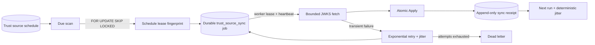

# Scheduled Trust Source Synchronization

Updated: 2026-07-23, Sprint 5H-D

## Purpose

Sprint 5H-B made remote JWKS synchronization explicit and auditable, but an operator still had to
press Preview or Apply before a fresh snapshot expired. Sprint 5H-D adds automatic Apply without
creating a second execution system. A mutable scheduling policy selects when work is due; the
existing PostgreSQL durable-job queue owns execution leases, heartbeats, retries, and dead letters;
the existing append-only sync ledger remains the evidence record.

Automatic synchronization improves freshness operations. It does not make a source trustworthy.
The endpoint allowlist, HTTPS policy, public-key validation, source tier, current-key check, root
lifecycle, and production-eligibility rules are unchanged.

## Architecture

There are two related leases:

- the schedule lease prevents two schedulers from creating work for the same due run;
- the existing Agent job lease prevents two workers from executing one queued job.

Every worker may run the due scan. PostgreSQL row locking with `SKIP LOCKED`, one schedule row per
source, a monotonic `run_sequence`, and a unique job dedupe key make the scan horizontally safe.
The schedule lease stores only a SHA-256 fingerprint. The original random nonce is discarded, and
execution authority remains the non-exported durable-job lease token.

## Data Contract

Alembic revision `202607230001` adds `evidence_trust_source_schedules` with:

- one-to-one `trust_source_id`;
- enabled state, interval, schedule jitter, and next-run timestamp;
- maximum attempts plus retry base, ceiling, and jitter;
- last enqueue/completion, job and sync pointers, and run sequence;
- consecutive failure count;
- schedule lease owner, fingerprint, and expiry;
- verified configurator identity and stable policy hash.

`evidence_trust_source_syncs` remains append-only and gains additive execution lineage:

- `trigger`: `manual` or `scheduled`;
- nullable schedule and job IDs;
- attempt number and scheduled-for timestamp.

Manual Preview/Apply produces `trigger=manual` with null schedule/job lineage. Scheduled work always
uses Apply and records the executing System Worker identity from the active durable-job lease.

## Scheduling Semantics

1. A verified governance operator creates or updates a policy.
2. `run_immediately=true` makes the policy due; otherwise the first run uses interval plus jitter.
3. Every worker scans due, enabled policies whose schedule lease is absent or expired.
4. PostgreSQL locks each candidate row with `FOR UPDATE SKIP LOCKED`.
5. The winner increments `run_sequence`, writes the schedule lease, and inserts one
   `trust_source_sync` durable job in the same transaction.
6. A worker claims the job through the existing heartbeat-aware execution lease.
7. Success clears the schedule lease and computes the next run from completion time, interval, and
   deterministic jitter.
8. A transient failure writes a failed sync receipt and requeues the same job with exponential
   backoff plus deterministic jitter.
9. A non-retryable validation failure dead-letters immediately. A transient failure dead-letters
   after `max_attempts`. Both advance the policy to its next normal interval.

Transient retry codes are `transport_error`, `http_error`, and `database_conflict`. Malformed or
private JWKS data, key collisions, and unsupported policy input are non-retryable. Each failed
network attempt remains independently visible in the sync ledger.

Execution is at-least-once. If a process exits after Apply commits but before the job is marked
complete, lease recovery can execute the job again. Apply is idempotent at the key level, so the
second receipt reports unchanged keys rather than duplicating roots.

## API

All paths use `/api/v1`.

| Method | Path | Purpose |
| --- | --- | --- |
| `GET` | `/trust-registry/source-schedules` | List policy, lease, failure, and last-job state. |
| `PUT` | `/trust-registry/sources/{id}/schedule` | Create or replace one source policy. |
| `POST` | `/trust-registry/sources/{id}/schedule/run` | Make an enabled policy due now. |
| `GET` | `/trust-registry/source-syncs` | Read manual and scheduled attempt receipts. |
| `GET` | `/agents/jobs` | Inspect durable `trust_source_sync` jobs. |
| `GET` | `/trust-registry/overview` | Read v3 source and automation counts. |

Policy writes and Run now require verified `Admin`, `Model Governance`, or `ML Ops Lead` identity.
A queued job is cancelled when its policy changes. A leased or running job must finish before the
policy can change.

## Configuration

| Setting | Purpose | Default |
| --- | --- | --- |
| `TRUST_SOURCE_SCHEDULER_ENABLED` | Enables worker due scans. | `true` |
| `TRUST_SOURCE_SCHEDULER_BATCH_SIZE` | Maximum due policies locked per scan. | `20` |
| `TRUST_SOURCE_SCHEDULE_LEASE_SECONDS` | Schedule enqueue lease duration. | `900` |
| `TRUST_SOURCE_ALLOWED_HOSTS` | Remote destination allowlist. | application local defaults |
| `TRUST_SOURCE_ALLOW_INSECURE_HTTP` | Development-only HTTP override. | `false` |
| `TRUST_SOURCE_HTTP_TIMEOUT_SECONDS` | Per-attempt fetch timeout. | `5` |
| `TRUST_SOURCE_MAX_JWKS_BYTES` | Maximum response body. | `1048576` |

The trust-source transport settings must be identical in backend and worker containers. Compose
now passes the same values to both services.

## Operations And UX

Trust Registry shows policy status, interval, next run, last job, run sequence, and consecutive
failures next to each source. Governance operators can edit interval/jitter/retry fields or queue a
run. Sync History distinguishes manual and scheduled attempts and exposes attempt/job lineage.

The JSON and Prometheus surfaces add:

- `model_atlas_trust_source_schedule_enabled`;
- `model_atlas_trust_source_schedule_due`;
- `model_atlas_trust_source_schedule_retrying`;
- `model_atlas_trust_source_schedule_failed`.

Retrying policies produce a warning. Policies that exhaust retries produce a critical derived
alert in addition to the durable-job dead-letter signal.

## Recovery Runbook

1. Inspect Trust Registry source status and the latest scheduled receipt.
2. Inspect the linked Agent job for attempt count, last error, and dead-letter state.
3. Correct transport allowlists, source availability, or invalid publisher content.
4. Use the existing audited Agent job requeue only when replaying the same run is intended.
5. Use schedule Run now to start a new run sequence after the source is healthy.
6. Do not delete failed receipts or old roots; they are audit evidence.

## Deliberate Boundaries

- This is a PostgreSQL-backed scheduler, not a distributed workflow engine.
- It does not provide cron expressions, calendars, dependency graphs, or multi-region consensus.
- The bundled JWKS server is development HTTP and proves execution behavior, not publisher trust.
- No mTLS source, OCI signature registry, independent transparency service, or online revocation
  distribution is included.
- Trust-source schedule metrics remain current-state gauges. Sprint 5H-F now retains shared
  control-plane snapshots and owns paging delivery, but it does not turn each source schedule into
  a separate long-term SLO.
