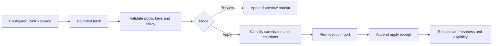

# Remote Trust Source Synchronization

Updated: 2026-07-23, Sprint 5H-D

## Purpose

Sprint 5H-A governed public keys after they were manually registered. Sprint 5H-B adds the
missing ingestion boundary: an operator can configure a remote JWKS source, inspect a fetched
snapshot, and atomically apply it to the managed trust registry.

The feature does not turn a URL into trust. Production eligibility requires all of the following:

1. a verified governance operator registered the source;
2. the source uses an allowed host and HTTPS;
3. the source tier is `internal_ca` or `external`;
4. the latest successful Apply is inside the configured freshness window;
5. the key fingerprint is present in that latest applied snapshot;
6. the imported root remains active under the existing lifecycle policy.

The Compose fixture intentionally uses development HTTP and therefore cannot establish
production trust.

## Source Contract

`evidence_trust_sources` stores immutable source configuration and registration provenance:

- source kind: `jwks`;
- purpose: `model_publisher`, `production_collector`, or `transparency_log`;
- issuer and trust tier;
- endpoint URL and allowed signing algorithms;
- freshness window and enabled state;
- verified registrar identity and stable configuration hash.

`evidence_trust_source_syncs` is an append-only attempt ledger. Each row records:

- `preview` or `apply` mode;
- success or failure;
- fetch and completion timestamps plus HTTP status;
- canonical payload hash;
- observed, candidate, imported, unchanged, and rejected key counts;
- bounded observed-key metadata or an error code/message;
- manual or scheduled trigger, optional schedule/job lineage, attempt number, and due timestamp;
- verified actor identity and stable sync hash.

Imported `evidence_trust_roots` retain both source and Apply receipt IDs. This lineage is never
inferred later from a matching URL.

## Secure Fetch Policy

The fetcher enforces the following before parsing keys:

- only configured allowlist hosts, including explicit wildcard suffixes;
- HTTPS by default;
- no URL credentials, query string, or fragment;
- no redirects;
- bounded connect/read timeout and payload size;
- JSON or JWKS content type;
- one JSON object with a bounded `keys` array;
- public signing JWKs only;
- unique non-empty `kid` values;
- exact algorithm allowlist matching.

HTTP is accepted only when the source is `development`, its `allow_insecure_http` flag is true,
and the server-wide development override is also true. A production-tier HTTP source is rejected
at registration even when the global override is enabled.

## Preview And Apply



Preview records what would change but never creates a trust root. Apply uses one database
transaction. Any malformed/private key or issuer/purpose/key-ID collision fails the complete
snapshot and records a failed receipt; no partial key set becomes trusted.

Remote rotation is snapshot-based. A previously imported key that is absent from the latest
successful Apply remains an immutable root record but reports `source_key_current=false` and is
ineligible for source-backed production trust.

Sprint 5H-D can invoke the same Apply path from a governed schedule. The scheduler never bypasses
URL, transport, public-JWK, collision, freshness, or root-lifecycle checks. Every retry creates its
own failed receipt before the durable job is requeued.

## Status Model

| Status | Meaning | Source-backed production keys |
| --- | --- | --- |
| `unsynced` | No successful Apply exists. | Ineligible |
| `healthy` | Latest Apply is fresh and no newer failure exists. | Eligible if all other rules pass |
| `degraded` | A newer attempt failed but the prior Apply remains fresh. | Temporarily retain eligibility |
| `stale` | Last successful Apply is outside freshness policy. | Ineligible |
| `failed` | Attempts failed and no successful Apply exists. | Ineligible |
| `disabled` | Source is administratively disabled. | Ineligible |

Failure is fail-closed once the last successful snapshot is stale. A degraded source therefore
provides a bounded recovery window, not indefinite trust.

Existing manually registered roots keep their Sprint 5H-A behavior for backward compatibility.
They are not silently relabeled as source-backed roots when a later source exposes the same key.

## API

All paths use `/api/v1`.

| Method | Path | Purpose |
| --- | --- | --- |
| `GET` | `/trust-registry/sources` | List source state and freshness. |
| `POST` | `/trust-registry/sources` | Register an idempotent source configuration. |
| `POST` | `/trust-registry/sources/{id}/sync` | Run `preview` or atomic `apply`. |
| `GET` | `/trust-registry/source-schedules` | List automatic policy and lease state. |
| `PUT` | `/trust-registry/sources/{id}/schedule` | Create or update automatic policy. |
| `POST` | `/trust-registry/sources/{id}/schedule/run` | Queue a new run sequence now. |
| `GET` | `/trust-registry/source-syncs` | Read append-only attempt history. |
| `GET` | `/trust-registry/roots` | Read source lineage, status, and key currency. |
| `GET` | `/trust-registry/overview` | Read v3 source, automation, and root counts. |

All writes require `Admin`, `Model Governance`, or `ML Ops Lead` from a verified identity source.

## Configuration

| Setting | Purpose | Default |
| --- | --- | --- |
| `TRUST_SOURCE_ALLOWED_HOSTS` | Comma-separated destination allowlist. | empty in application config |
| `TRUST_SOURCE_ALLOW_INSECURE_HTTP` | Global development HTTP override. | `false` |
| `TRUST_SOURCE_HTTP_TIMEOUT_SECONDS` | Bounded remote fetch timeout. | `5` |
| `TRUST_SOURCE_MAX_JWKS_BYTES` | Maximum response body. | `1048576` |
| `TRUST_SOURCE_SCHEDULER_ENABLED` | Enables worker due scans. | `true` |
| `TRUST_SOURCE_SCHEDULER_BATCH_SIZE` | Maximum policies per due scan. | `20` |
| `TRUST_SOURCE_SCHEDULE_LEASE_SECONDS` | Enqueue lease duration. | `900` |

Docker Compose sets a local-only allowlist and HTTP override for `trust-source-fixture`. These are
development defaults in that deployment file, not application production defaults.

## Local Reproduction

Start the application and development JWKS server:

```bash
make trust-source-up
```

The fixture endpoint is available to the backend at:

```text
http://trust-source-fixture:8081/publisher-jwks.json
```

Register it with `trust_tier=development`, `allow_insecure_http=true`, Preview it, then Apply it
from the Trust Registry page or API. The UI separates source registration, manual root
registration, and transparency proof verification into distinct modes.

Configure automatic Apply from the source row. Multiple `agent-worker` replicas may run the scan;
PostgreSQL row locks and schedule/job leases select one enqueue and one executor per run sequence.

## Operational Signals

The shared JSON/Prometheus aggregation exports:

- `model_atlas_trust_source_registered`;
- `model_atlas_trust_source_healthy`;
- `model_atlas_trust_source_degraded`;
- `model_atlas_trust_source_stale`;
- `model_atlas_trust_source_failed`;
- `model_atlas_trust_source_unsynced`;
- `model_atlas_trust_source_schedule_enabled`;
- `model_atlas_trust_source_schedule_due`;
- `model_atlas_trust_source_schedule_retrying`;
- `model_atlas_trust_source_schedule_failed`.

Derived alerts exist for failed, stale, degraded, and unsynced sources. Source health is visible
in Trust Registry, while Operations remains the cross-control-plane alert view.

## Verified Local State

On 2026-07-21 the Compose fixture completed one Preview and one Apply:

- trust source: `ebd9e582-78d7-4e39-8a57-0de2248eae56`;
- source status: `healthy`;
- Preview: one candidate, zero imports;
- Apply: one import, zero rejected keys;
- imported root: `095ed9e0-b171-4c1f-8f44-4f0498f2c7e1`;
- root source state: `healthy` and `source_key_current=true`;
- source metrics: one registered, one healthy, zero source alerts;
- production eligibility: false because the source is development-scoped.
- desktop and `390 x 844` browser QA: passed with no document or form-control overflow and no
  final console warnings/errors.

## Sprint 5H-D Verified State

On 2026-07-23, two worker replicas scanned one immediately due policy:

- one schedule run sequence produced exactly one durable job and one scheduled receipt;
- the fixture returned one key, which was unchanged and not duplicated;
- the job completed on attempt 1 and cleared both execution and schedule leases;
- the next run used the configured interval plus deterministic jitter;
- authenticated Run now passed OIDC Origin/CSRF enforcement and produced another linked receipt;
- enabled/due/retrying/failed schedule metrics were `1/0/0/0` after completion;
- desktop and mobile policy-editor QA passed with zero final console errors.

## Remaining Boundaries

- No external publisher, internal CA, OCI registry, or independent transparency service was
  available for this run.
- The adapter supports JWKS over HTTPS; certificate-chain, mTLS, OCI signature, and transparency
  log adapters are not implemented.
- Automatic synchronization uses PostgreSQL row and lease coordination, but it is not a general
  distributed workflow engine or multi-region consensus service.
- Status is calculated from the database clock and latest receipts; long-term SLO retention still
  requires an external metrics system.
- Long-term job/SLO retention and owned external paging remain separate operational work.
